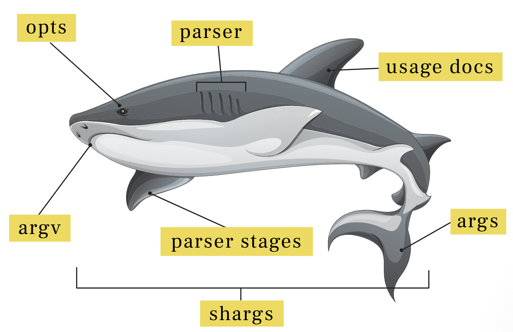

<p align="center">

</p>

🦈 shargs (**sh**ell **args**) is a highly customizable command-line arguments parser and usage documentation generator.

[![node version][shield-node]][node]
[![npm version][shield-npm]][npm-package]
[![license][shield-license]][license]
[![PRs Welcome][shield-prs]][contribute]
[![linux unit tests status][shield-unit-tests-linux]][actions]
[![macos unit tests status][shield-unit-tests-macos]][actions]
[![windows unit tests status][shield-unit-tests-windows]][actions]

## Installation

<pre>
npm install --save <a href="https://github.com/Yord/shargs">shargs</a>
npm install --save <a href="https://github.com/Yord/shargs-opts">shargs-opts</a>   # opt-in to type functions for <a href="#command-line-options">command-line options</a>
npm install --save <a href="https://github.com/Yord/shargs-parser">shargs-parser</a> # opt-in to a standard library of <a href="#command-line-parsers">parser functions</a>
npm install --save <a href="https://github.com/Yord/shargs-usage">shargs-usage</a>  # opt-in to a standard library of <a href="#automatic-usage-documentation-generation">usage functions</a>
</pre>

## Features

Shargs **gives developers as much control over [command-line parsing](#command-line-parsers) as possible**.
The advantages are:

+   You get exactly the parser you need, without unnecessary features.
+   You are able to mix in your own problem-specific parser functions.
+   There is no magic going on in the background, everything is explicit.

Following the same approach, shargs offers
[automatic usage documentation generation](#automatic-usage-documentation-generation).
The advantages are:

+   You get exactly the usage documentation you need, no unnecessary extras.
+   You have fine-grained control over the documentation layout if you need that.
+   You can write your own layout functions and combine them with existing ones.

Shargs also has general qualities:

+   It has a synchronous as well as an asynchronous mode based on Promises.
+   It is well documented, extensively tested, modular, and highly extensible.
+   It has Typescript type declarations, and zero runtime dependencies.

Shargs' flexibility and adaptability sets it apart from
[other command-line parser libraries](#comparison-to-related-libraries).

## Getting Started

<details>
<summary>
Describe your command and its options:

<p>

```js
const opts = [
  stringPos('question', {desc: 'Ask a question.', required: true}),
  number('answer', ['-a', '--answer'], {desc: 'The answer.', defaultValues: [42]}),
  flag('help', ['-h', '--help'], {desc: 'Print this help message and exit.'})
]

const deepThought = command('deepThought', opts, {desc: 'Ask the Ultimate Question.'})
```

</p>
</summary>

The `deepThought` command should have three command-line options:

1.  A `required` string positional argument named `question`.
2.  An `answer` number option specified with `-a` or `--answer` that should default to `42` if not given.
3.  A `help` command-line flag given by `-h` or `--help`.

You may use the `shargs-opts` module to get a nice DSL for describing our options.
However, you could have also written them out as objects yourself or could have used a different DSL.

Read up on the details in the [command-line options](#command-line-options) section.

</details>

<details>
<summary>
Declare a parser by composing parser stages:

<p>

```js
const parser = parserSync({
  argv: [splitShortOpts],
  opts: [setDefaultValues, requireOpts, cast],
  args: [flagsAsBools]
})
```

</p>
</summary>

Shargs gives you fine-grained control over how the options are parsed.
By using the `shargs` and `shargs-parser` modules, we have build the following `parser`:

1.  Short option groups like `-cvzf` are transformed to `-c -v -z -f`.
2.  Options with default values that were not provided are set.
3.  It is verified that all required options have been given.
4.  Strings are cast to other types, like numbers or booleans.
5.  Command-line flags are transformed to booleans.

Note that you did not tell `parser` how exactly to do those things.
Everything is nice and declarative, and the details are hidden away in the parser stages.

The [parser function](#the-parserSync-function)
and [command-line parsers](#command-line-parsers) sections have all the details.

</details>

<details>
<summary>
Layout a usage documentation:

<p>

```js
const docs = usage([
  synopsis,
  space,
  optsList,
  space,
  desc
])
```

</p>
</summary>

You may use `shargs-usage` to automatically generate a usage documentation based on a command definition
(e.g. `deepThought` from before).
The module provides components generally found in usage documentations of popular tools, like:

1.  A `synopsis`, summarizing available options: e.g. `deepThought (<question>) [-a|--answer] [-h|--help]`.
2.  An options list (`optsList`), describing option details in a tabular format.

Note that `shargs-usage` is declarative:
You only specify what components our usage documentation should have.
The details on how exactly those components transform command-line options into text is hidden away.

See the [automatic usage documentation generation](#automatic-usage-documentation-generation) section.

</details>

<details>
<summary>
Style the usage documentation:

<p>

```js
const style = {
  line: [{width: 80}],
  cols: [{width: 25}, {width: 55}]
}
```

</p>
</summary>

You can fine-tune how each documentation component is printed to the screen
by providing column widths and paddings.

The [style](#style) section provides more details.

</details>

<details>
<summary>
Use the parser and the usage documentation in your program:

<p>

```js
const argv = process.argv.slice(2)

const {errs, args} = parser(deepThought)(argv)

if (args.help) {
  const help = docs(deepThought)(style)
  console.log(help)
} else if (errs.length > 0) {
  errs.forEach(({code, msg}) => console.log(`${code}: ${msg}`))
} else {
  console.log(JSON.stringify(args, null, 2))
}
```

</p>
</summary>

The command-line option DSL, the parser DSL, and the usage documentation DSL combined
give you a very flexible way to write command-line programs.

Find out more in the [writing programs with shargs](#writing-programs-with-shargs) section.

</details>

<details>
<summary>
Run your command with <code>node ./deepThought --help</code>:

<p>

```bash
deepThought (<question>) [-a|--answer] [-h|--help]                              
                                                                                
<question>               Ask a question. [required]                             
-a, --answer=<number>    The answer. [default: 42]                              
-h, --help               Print this help message and exit.                      
                                                                                
Ask the Ultimate Question.                                                      
```

</p>
</summary>

The [automatic usage documentation generation](#automatic-usage-documentation-generation)
and [writing programs with shargs](#writing-programs-with-shargs) sections have more.

</details>

<details>
<summary>
Run your command with <code>node ./deepThought "What is the meaning of Life, the Universe, and Everything?"</code>:

<p>

```js
{
  errs: [],
  args: {
    _: [],
    answer: 42,
    question: 'What is the meaning of Life, the Universe, and Everything?'
  }
}
```

</p>
</summary>

Read the [parser function](#the-parserSync-function) and [writing programs with shargs](#writing-programs-with-shargs) 
sections for more.

</details>

<details>
<summary>
Run your command with <code>node ./deepThought -a 23</code>:

<p>

```bash
Required option is missing: An option that is marked as required has not been provided.
```

</p>
</summary>

See the [error codes](#error-codes) sections for a reference of all error codes.

</details>

### More Examples

+   [shargs-example-async][shargs-example-async]
+   [shargs-example-deepthought][shargs-example-deepthought]

## Documentation

This documentation encompasses the following shargs modules:

1.  [`shargs-opts`][shargs-opts] is documented in [Command-line Options](#command-line-options).
2.  [`shargs`][shargs] is documented in [The `parser` Function](#the-parserSync-function).
3.  [`shargs-parser`][shargs-parser] is documented in [Command-line Parsers](#command-line-parsers).
4.  [`shargs-usage`][shargs-usage] is documented in [Automatic Usage Documentation Generation](#automatic-usage-documentation-generation).

### Command-line Options

Command-line options are the most important concept in shargs.
They are the basis for its two main features:
[Command-line parsers](#command-line-parsers)
and [automatic usage documentation generation](#automatic-usage-documentation-generation).

Shargs defines many different types of command-line options represented by objects with the following interfaces:

<table>
<tr>
<th>&nbsp;&nbsp;&nbsp;&nbsp;&nbsp;&nbsp;&nbsp;&nbsp;&nbsp;&nbsp;&nbsp;&nbsp;&nbsp;&nbsp;&nbsp;&nbsp;&nbsp;&nbsp;&nbsp;&nbsp;&nbsp;&nbsp;&nbsp;&nbsp;&nbsp;&nbsp;Type&nbsp;&nbsp;&nbsp;&nbsp;&nbsp;&nbsp;&nbsp;&nbsp;&nbsp;&nbsp;&nbsp;&nbsp;&nbsp;&nbsp;&nbsp;&nbsp;&nbsp;&nbsp;&nbsp;&nbsp;&nbsp;&nbsp;&nbsp;&nbsp;&nbsp;&nbsp;</th>
<th>&nbsp;&nbsp;&nbsp;&nbsp;&nbsp;&nbsp;&nbsp;&nbsp;&nbsp;&nbsp;&nbsp;&nbsp;&nbsp;&nbsp;&nbsp;&nbsp;&nbsp;&nbsp;&nbsp;&nbsp;&nbsp;&nbsp;&nbsp;&nbsp;&nbsp;&nbsp;&nbsp;&nbsp;Interface&nbsp;&nbsp;&nbsp;&nbsp;&nbsp;&nbsp;&nbsp;&nbsp;&nbsp;&nbsp;&nbsp;&nbsp;&nbsp;&nbsp;&nbsp;&nbsp;&nbsp;&nbsp;&nbsp;&nbsp;&nbsp;&nbsp;&nbsp;&nbsp;&nbsp;&nbsp;&nbsp;&nbsp;</th>
<th>Description</th>
</tr>
<tr name="flag-option">
<td><a href="#flag-option">Flag Option</a></td>
<td><code>{<a href="#key">key</a>, <a href="#args">args</a>, <a href="#types">types</a>: []}</code></td>
<td>A present or absent value.</td>
</tr>
<tr name="primitive-option">
<td><a href="#primitive-option">Primitive Option</a></td>
<td><code>{<a href="#key">key</a>, <a href="#args">args</a>, <a href="#types">types</a>: [_]}</code></td>
<td>A unary value given by argument.</td>
</tr>
<tr name="array-option">
<td><a href="#array-option">Array Option</a></td>
<td><code>{<a href="#key">key</a>, <a href="#args">args</a>, <a href="#types">types</a>: [_, _, ...]}</code></td>
<td>An array of length n given by argument.</td>
</tr>
<tr name="variadic-option">
<td><a href="#variadic-option">Variadic Option</a></td>
<td><code>{<a href="#key">key</a>, <a href="#args">args</a>}</code></td>
<td>A variable length array given by argument.</td>
</tr>
<tr name="subcommand-option">
<td><a href="#subcommand-option">Subcommand Option</a></td>
<td><code>{<a href="#key">key</a>, <a href="#args">args</a>, <a href="#opts">opts</a>}</code></td>
<td>An option group given by argument.</td>
</tr>
<tr name="primitive-pos-arg">
<td><a href="#primitive-pos-arg">Primitive Positional Argument</a></td>
<td><code>{<a href="#key">key</a>, <a href="#types">types</a>: [_]}</code></td>
<td>A unary value given by position.</td>
</tr>
<tr name="array-pos-arg">
<td><a href="#array-pos-arg">Array Positional Argument</a></td>
<td><code>{<a href="#key">key</a>, <a href="#types">types</a>: [_, _, ...]}</code></td>
<td>An array of length n given by position.</td>
</tr>
<tr name="variadic-pos-arg">
<td><a href="#variadic-pos-arg">Variadic Positional Argument</a></td>
<td><code>{<a href="#key">key</a>}</code></td>
<td>A variable length array given by position.</td>
</tr>
<tr name="command-pos-arg">
<td><a href="#command-pos-arg">Command Positional Argument</a></td>
<td><code>{<a href="#key">key</a>, <a href="#opts">opts</a>}</code></td>
<td>An option group given by position.</td>
</tr>
<tr name="rest">
<td><a href="#rest">Rest</a></td>
<td><code>{<a href="#values">values</a>}</code></td>
<td>An argument value of unknown type.</td>
</tr>
</table>

Since writing objects following these interfaces by hand can be tedious,
[`shargs-opts`][shargs-opts] gives you a simple type-based DSL for defining valid command-line options:

```js
const {subcommand, command, flag, number} = require('shargs-opts')

const opts = [
  subcommand(askOpts)('ask', ['ask'], {required: true, desc: 'Ask a question.'}),
  number('answer', ['-a', '--answer'], {defaultValues: [42], desc: 'The answer.'}),
  flag('help', ['-h', '--help'], {desc: 'Print this help message and exit.'})
]

const deepThought = command('deepThought', opts, {
  desc: 'Deep Thought was created to come up with the Answer to ' +
        'The Ultimate Question of Life, the Universe, and Everything.'
})
```

In the example, using the type functions [`subcommand`](#subcommand), [`number`](#number), [`flag`](#flag),
and [`command`](#command) guarantees the generation of valid objects.

#### Type Functions

The following type functions are available:

<table>
<tr>
<th>&nbsp;&nbsp;&nbsp;&nbsp;&nbsp;&nbsp;&nbsp;&nbsp;&nbsp;&nbsp;&nbsp;&nbsp;&nbsp;&nbsp;&nbsp;&nbsp;&nbsp;&nbsp;&nbsp;&nbsp;&nbsp;&nbsp;&nbsp;&nbsp;&nbsp;&nbsp;&nbsp;&nbsp;Type&nbsp;Function&nbsp;&nbsp;&nbsp;&nbsp;&nbsp;&nbsp;&nbsp;&nbsp;&nbsp;&nbsp;&nbsp;&nbsp;&nbsp;&nbsp;&nbsp;&nbsp;&nbsp;&nbsp;&nbsp;&nbsp;&nbsp;&nbsp;&nbsp;&nbsp;&nbsp;&nbsp;&nbsp;&nbsp;</th>
<th>Description</th>
</tr>
<tr name="array">
<td>
<code name="arrayPos"><a href="#array">array</a>(types)(key, args, fields)</code><br />
<code><a href="#arrayPos">arrayPos</a>(types)(key, fields)</code>
</td>
<td>
<details>
<summary>
<code>array</code> generates an <a href="#array-option">array option</a>,
while <code>arrayPos</code> generates an <a href="#array-pos-arg">array positional argument</a>,
representing arrays whose length is known in advance.
</summary>

<br />

The closely related <code><a href="#variadic">variadic</a></code>
and <code><a href="#variadicPos">variadicPos</a></code> represent arrays with unknown lengths.

<br />

`array` returns the following object:

```js
const array = types => (key, args, fields) => ({
  key, args, types, ...fields
})
```

`arrayPos` returns the following object:

```js
const arrayPos = types => (key, fields) => ({
  key, types, ...fields
})
```

</details>
</td>
</tr>
<tr name="bool">
<td>
<code name="boolPos"><a href="#bool">bool</a>(key, args, fields)</code><br />
<code><a href="#boolPos">boolPos</a>(key, fields)</code>
</td>
<td>
<details>
<summary>
<code>bool</code> generates a <a href="#primitive-option">primitive option</a>,
while <code>boolPos</code> generates a <a href="#primitive-pos-arg">primitive positional argument</a>,
representing the boolean values <code>'true'</code> and <code>'false'</code>.
</summary>

<br />

Note that the values are represented as strings and you may want to <code><a href="#cast">cast</a></code> them.
If you need more values representing <code>'true'</code> (e.g. <code>'t'</code>, <code>'yes'</code>)
or <code>'false'</code> (e.g. <code>'F'</code>, <code>'no'</code>),
have a look at <code><a href="#broadenBools">broadenBools</a></code>.
If you want to treat a value as its <code><a href="#reverse">reverse</a></code>,
see <code><a href="#reverseBools">reverseBools</a></code>.
If you need <code><a href="#flag">flag</a></code>s instead of <code>bool</code>s, have a look at the
<code><a href="#boolAsFlag">boolAsFlag</a></code> and <code><a href="#boolsAsFlags">boolsAsFlags</a></code> 
parser stages.

<br />

`bool` returns the following object:

```js
const bool = (key, args, fields) => ({
  key, args, types: ['bool'], ...fields
})
```

`boolPos` returns the following object:

```js
const boolPos = (key, fields) => ({
  key, types: ['bool'], ...fields
})
```

</details>
</td>
</tr>
<tr name="subcommand">
<td>
<code name="command"><a href="#subcommand">subcommand</a>(opts)(key, args, fields)</code><br />
<code><a href="#command">command</a>(key, opts, fields)</code>
</td>
<td>
<details>
<summary>
<code>subcommand</code> generates a <a href="#subcommand-option">subcommand option</a>,
while <code>command</code> generates a <a href="#command-pos-arg">command positional argument</a>.
Combined, they enable commands to do multiple things like <code>git init</code>, <code>git commit</code>, and <code>git push</code>.
</summary>

<br />

<code>subcommand</code>'s and <code>command</code>'s <code><a href="#opts">opts</a></code> fields
are arrays of command-line options used to parse their <code><a href="#values">values</a></code>.
Subcommands may have their own <a href="#parsers">command-specific parsers</a>
or are parsed by <code>command</code>'s parser.
<code>command</code> or <code>subcommand</code> values are either terminated by the end of the input
or by <code>--</code>.

<br />

`subcommand` returns the following object:

```js
const subcommand = opts => (key, args, fields) => ({
  key, args, opts, ...fields
})
```

`command` returns the following object:

```js
const command = (key, opts, fields) => ({
  key, opts, ...fields
})
```

</details>
</td>
</tr>
<tr name="flag">
<td><code><a href="#flag">flag</a>(key, args, fields)</code></td>
<td>
<details>
<summary>
<code>flag</code> generates a <a href="#flag-option">flag option</a>,
representing command-line options that take no value.
</summary>

<br />

Shargs counts the number of times a <code>flag</code> occurs, so a <code>flag</code> may be amplified by repeating it.
If you don't need counts and prefer numbers or boolean values, have a look at the
<code><a href="#flagAsBool">flagAsBool</a></code>, <code><a href="#flagAsNumber">flagAsNumber</a></code>,
<code><a href="#flagsAsBools">flagsAsBools</a></code> and <code><a href="#flagsAsNumbers">flagsAsNumbers</a></code> 
parser stages.
If you need the presence of a <code>flag</code> to imply negativity (e.g. <code>--no-fun</code>),
see <code><a href="#complement">complement</a></code>,
<code><a href="#reverse">reverse</a></code> and <code><a href="#reverseFlags">reverseFlags</a></code>.

<br />

`flag` returns the following object:

```js
const flag = (key, args, fields) => ({
  key, args, types: [], ...fields
})
```

</details>
</td>
</tr>
<tr name="number">
<td>
<code name="numberPos"><a href="#number">number</a>(key, args, fields)</code><br />
<code><a href="#numberPos">numberPos</a>(key, fields)</code>
</td>
<td>
<details>
<summary>
<code>number</code> generates a <a href="#primitive-option">primitive option</a>,
while <code>numberPos</code> generates a <a href="#primitive-pos-arg">primitive positional argument</a>,
representing JavaScript numbers.
</summary>

<br />

Numbers are represented as strings and you may want to <code><a href="#cast">cast</a></code> them.
If you need <code><a href="#flag">flag</a></code>s instead of <code>number</code>s, have a look at the
<code><a href="#numberAsFlag">numberAsFlag</a></code> and <code><a href="#numbersAsFlags">numbersAsFlags</a></code> 
parser stages.

<br />

`number` returns the following object:

```js
const number = (key, args, fields) => ({
  key, args, types: ['number'], ...fields
})
```

`numberPos` returns the following object:

```js
const numberPos = (key, fields) => ({
  key, types: ['number'], ...fields
})
```

</details>
</td>
</tr>
<tr name="string">
<td>
<code name="stringPos"><a href="#string">string</a>(key, args, fields)</code><br />
<code><a href="#stringPos">stringPos</a>(key, fields)</code>
</td>
<td>
<details>
<summary>
<code>string</code> generates a <a href="#primitive-option">primitive option</a>,
while <code>stringPos</code> generates a <a href="#primitive-pos-arg">primitive positional argument</a>,
representing strings.
</summary>

<br />

`string` returns the following object:

```js
const string = (key, args, fields) => ({
  key, args, types: ['string'], ...fields
})
```

`stringPos` returns the following object:

```js
const stringPos = (key, fields) => ({
  key, types: ['string'], ...fields
})
```

</details>
</td>
</tr>
<tr name="variadic">
<td>
<code name="variadicPos"><a href="#variadic">variadic</a>(key, args, fields)</code><br />
<code><a href="#variadicPos">variadicPos</a>(key, fields)</code>
</td>
<td>
<details>
<summary>
<code>variadic</code> generates a <a href="#variadic-option">variadic option</a>,
while <code>variadicPos</code> generates a <a href="#variadic-pos-arg">variadic positional argument</a>.
These types represent arrays whose length is not known in advance.
</summary>

<br />

An <code>opts</code> array can have at most one <a href="#variadic-pos-arg">variadic positional argument</a>
and no other positional arguments (<code>*Pos</code>) may be defined after it.
The closely related <code><a href="#array">array</a></code>
and <code><a href="#arrayPos">arrayPos</a></code> represent arrays with known lengths
and <code><a href="#command">command</a></code> is essentially
a <code>variadic</code> with an <code><a href="#opts">opts</a></code> field.
A <code>variadic</code>'s or <code>variadicPos</code>' values are either terminated by the end of the input
or by <code>--</code>.

<br />

`variadic` returns the following object:

```js
const variadic = (key, args, fields) => ({
  key, args, ...fields
})
```

`variadicPos` returns the following object:

```js
const variadicPos = (key, fields) => ({
  key, ...fields
})
```

</details>
</td>
</tr>
</table>

If you wish to write out command-line options by hand, or write your own DSLs for creating them, feel free:

```js
const askOpts = [
  {key: 'format', args: ['--format'], types: ['string'], only: ['json', 'xml'], defaultValues: ['json'],
   desc: 'Respond either with json or xml.'},
  {key: 'html', args: ['--no-html'], types: [], reverse: true, desc: 'Remove HTML tags.'},
  {key: 'help', args: ['-h', '--help'], types: [], desc: 'Print this help message and exit.'},
  {key: 'question', types: ['string'], required: true, desc: 'State your question.'}
]
```

Apart from [`key`](#key), [`args`](#args), [`types`](#types), [`opts`](#opts), and [`values`](#values)
that we have already seen and that determine an option's type,
command-line option objects may be given any other <code>fields</code>,
that may be used to provide information to parser stages
(e.g. [`defaultValues`](#defaultValues), [`only`](#only)),
or to provide descriptions for usage documentation generation
(e.g. <code><a href="#desc">desc</a></code>, <code><a href="#descArg">descArg</a></code>).
If you write your own parser stages, you may also define your own fields.

#### Option Fields

The following fields are used by [`shargs`][shargs], [`shargs-parser`][shargs-parser] stages
or [`shargs-usage`][shargs-usage] functions:

<table>
<tr>
<th>Field</th>
<th>&nbsp;&nbsp;&nbsp;&nbsp;&nbsp;Type&nbsp;&nbsp;&nbsp;&nbsp;&nbsp;</th>
<th>Description</th>
</tr>

<tr name="args">
<td><code><a href="#args">args</a></code></td>
<td><code>string[]</code></td>
<td>
<details>
<summary>
<code>args</code> defines argument names for command-line options (e.g. <code>['-h', '--help']</code>).
</summary>

<br />

Argument names have no restrictions and can be any string.
E.g. <code>['-h', '--help']</code> could be used for a help <code><a href="#flag">flag</a></code>
or <code>['ask']</code> could be used for a <code><a href="#command">command</a></code>.
Positional arguments must not have an <code>args</code> field,
as they are not given by argument, but by their position.

</details>
</td>
</tr>
<tr name="contradicts">
<td><code><a href="#contradicts">contradicts</a></code></td>
<td><code><a href="#key">key</a>[]</code></td>
<td>
<details>
<summary>
<code>contradicts</code> defines what <code><a href="#key">key</a></code>s an option is incompatible with.
</summary>

<br />

This information is used by the <code><a href="#contradictOpts">contradictOpts</a></code> parser stage
to report errors if incompatible options are used together.
Note that <code>contradicts</code> is unidirectional and not transitive
(e.g. if <code>a</code> contradicts <code>b</code> and <code>b</code> contradicts <code>c</code>,
<code>a</code> does not contradict <code>c</code>, and thus <code>a</code> and <code>c</code> are compatible).
Only two <code><a href="#key">key</a></code>s that each contradict the other <code><a href="#key">key</a></code>
are mutually exclusive.

</details>
</td>
</tr>
<tr name="defaultValues">
<td><code><a href="#defaultValues">defaultValues</a></code></td>
<td>*</td>
<td>
<details>
<summary>
<code>defaultValues</code> defines default <code><a href="#values">values</a></code> for command-line options.
</summary>

<br />

They are used by the <code><a href="#setDefaultValues">setDefaultValues</a></code> parser stage
that sets the <code>values</code> field if no <code><a href="#values">values</a></code> are supplied.
The <code>defaultValues</code>' type depends on the command-line option type:
<a href="#subcommand-pos-args">Subcommands</a> takes the same array of options as <code><a href="#opts">opts</a></code>.
<a href="#flag-option">Flag options</a>' values have to be a number.
All other options take an array of values,
that must have the same length as their <code><a href="#types">types</a></code> field.

</details>
</td>
</tr>
<tr name="desc">
<td><code><a href="#desc">desc</a></code></td>
<td><code>string</code></td>
<td>
<details>
<summary>
<code>desc</code> defines an option description used by various usage functions.
</summary>

<br />

More specifically, <code>desc</code> is used by
<code><a href="#usage-desc">desc</a></code>, <code><a href="#optsList">optsList</a></code>,
<code><a href="#optsLists">optsLists</a></code>, <code><a href="#optsDef">optsDef</a></code>,
and <code><a href="#optsDefs">optsDefs</a></code> and their <code>*With</code> versions.

</details>
</td>
</tr>
<tr name="descArg">
<td><code><a href="#descArg">descArg</a></code></td>
<td><code>string</code></td>
<td>
<details>
<summary>
<code>descArg</code> defines a description for an argument value
(e.g. <code>{descArg: 'format'}</code> would print <code>--format=&lt;format&gt;</code>
instead of <code>--format=&lt;string&gt;</code>).
</summary>

<br />

It is used by the <code><a href="#optsList">optsList</a></code>, <code><a href="#optsLists">optsLists</a></code>,
<code><a href="#optsDef">optsDef</a></code>, and <code><a href="#optsDefs">optsDefs</a></code> usage functions
and their <code>*With</code> versions.
<code><a href="#only">only</a></code>, <code><a href="#types">types</a></code>, and <code><a href="#key">key</a></code> 
are other fields that change the argument value description.
These fields are applied in the following order (highest priority first):
<code>descArg</code>, <code><a href="#only">only</a></code>, <code><a href="#types">types</a></code>,
and <code><a href="#key">key</a></code>.
If <code>descArg</code> is an empty string, no argument value description is displayed.

</details>
</td>
</tr>
<tr name="implies">
<td><code><a href="#implies">implies</a></code></td>
<td><code><a href="#key">key</a>[]</code></td>
<td>
<details>
<summary>
<code>implies</code> defines what <code><a href="#key">key</a></code>s an option must be defined with.
</summary>

<br />

This information is used by the <code><a href="#implyOpts">implyOpts</a></code> parser stage
to report errors if mandatory options are missing.
Note that <code>implies</code> is unidirectional
(e.g. if <code>a</code> implies <code>b</code> and <code>a</code> is present, <code>b</code> must be present as well,
but if <code>b</code> is present, <code>a</code> does not have to be present)
and transitive
(e.g. if <code>a</code> implies <code>b</code> and <code>b</code> implies <code>c</code>,
<code>a</code> also implies <code>c</code>,
and thus if <code>a</code> is present, <code>c</code> must also be present).
Only two <code><a href="#key">key</a></code>s that each imply the other <code><a href="#key">key</a></code>
are mutually inclusive.

</details>
</td>
</tr>
<tr name="key">
<td><code><a href="#key">key</a></code></td>
<td><code>string</code></td>
<td>
<details>
<summary>
<code>key</code> defines the name of a command-line option.
</summary>

<br />

It is used by the <code><a href="#the-parserSync-function">parser</a></code> function
as a field name for the parsed values in the resulting <code>args</code> object.
Most command-line options should have a unique <code>key</code> to avoid collisions with other options.
However, if two different options describe the same result field, it may make sense to give them a shared key.
See <code><a href="#complement">complement</a></code> for an example.
A <code>key</code> must not be named <code>_</code>.
It is also used by the
<code><a href="#optsList">optsList</a></code>, <code><a href="#optsLists">optsLists</a></code>,
<code><a href="#optsDef">optsDef</a></code>, <code><a href="#optsDefs">optsDefs</a></code>,
<code><a href="#synopses">synopses</a></code>, and <code><a href="#synopsis">synopsis</a></code> usage functions
and their <code>*With</code> versions to describe argument values (e.g. <code>--format=&lt;format&gt;</code>).
<code><a href="#descArg">descArg</a></code>, <code><a href="#only">only</a></code>,
and <code><a href="#types">types</a></code> are other fields that change the argument value description.
These fields are applied in the following order (highest priority first):
<code><a href="#descArg">descArg</a></code>, <code><a href="#only">only</a></code>,
<code><a href="#types">types</a></code>, and <code>key</code>.

</details>
</td>
</tr>
<tr name="only">
<td><code><a href="#only">only</a></code></td>
<td><code>any[]</code></td>
<td>
<details>
<summary>
<code>only</code> defines valid values of an option.
</summary>

<br />

It is used by the <code><a href="#restrictToOnly">restrictToOnly</a></code> parser stage to validate user input.
<code>only</code> may be used to <a href="#can-i-use-enums">implement enumerations</a>.
It is also used by the <code><a href="#optsList">optsList</a></code>, <code><a href="#optsLists">optsLists</a></code>,
<code><a href="#optsDef">optsDef</a></code>, and <code><a href="#optsDefs">optsDefs</a></code> usage functions
and their <code>*With</code> versions to describe argument values (e.g. <code>--format=&lt;json|xml&gt;</code>).
<code><a href="#descArg">descArg</a></code>, <code><a href="#types">types</a></code>,
and <code><a href="#key">key</a></code> are other fields that change the argument value description.
These fields are applied in the following order (highest priority first):
<code><a href="#descArg">descArg</a></code>, <code>only</code>, <code><a href="#types">types</a></code>,
and <code><a href="#key">key</a></code>.

</details>
</td>
</tr>
<tr name="opts">
<td><code><a href="#opts">opts</a></code></td>
<td><code><a href="#command-line-options">option</a>[]</code></td>
<td>
<code>opts</code> defines the command-line options of <code><a href="#command">command</a></code>s
and <code><a href="#program">program</a></code>s.
</td>
</tr>
<tr name="required">
<td><code><a href="#required">required</a></code></td>
<td><code>boolean</code></td>
<td>
<details>
<summary>
<code>required</code> defines whether a command-line option has to be present or not.
</summary>

<br />

It is used by the <code><a href="#requireOpts">requireOpts</a></code> stage that reports an error
if a <code>required</code> option does not have <code><a href="#values">values</a></code>.
A positional argument (<code>*Pos</code>) can only be <code>required</code>,
if all previously defined positional arguments are <code>required</code> as well.
The <code><a href="#synopsis">synopsis</a></code>, <code><a href="#synopses">synopses</a></code>,
<code><a href="#optsList">optsList</a></code>, <code><a href="#optsLists">optsLists</a></code>,
<code><a href="#optsDef">optsDef</a></code>, and <code><a href="#optsDefs">optsDefs</a></code> usage functions
and their <code>*With</code> versions mark <code>required</code> options.

</details>
</td>
</tr>
<tr name="reverse">
<td><code><a href="#reverse">reverse</a></code></td>
<td><code>boolean</code></td>
<td>
<code>reverse</code> defines whether the <code><a href="#values">values</a></code> of a given option should be reversed by
the <code><a href="#reverseBools">reverseBools</a></code> or <code><a href="#reverseFlags">reverseFlags</a></code>
parser stages.
</td>
</tr>
<tr name="types">
<td><code><a href="#types">types</a></code></td>
<td><code>string[]</code></td>
<td>
<details>
<summary>
<code>types</code> defines what user input a command-line option takes.
</summary>

<br />

<a href="#flag-option">Flag options</a>' <code>types</code> must be <code>[]</code>.
<a href="#primitive-option">Primitive options</a>' and <a href="#primitive-pos-arg">primitive positional arguments</a>'
<code>types</code> must be <code>[_]</code>,
and <a href="#array-option">array options</a>' and <a href="#array-pos-arg">array positional arguments</a>'
<code>types</code> must be <code>[_, _, ...]</code>,
where <code>_</code> is the name of a type given as a string.
<a href="#variadic-option">Variadic options</a>, <a href="#variadic-pos-arg">variadic positional arguments</a>,
<a href="#subcommand-option">subcommand options</a>, and <a href="#command-pos-arg">command positional arguments</a>
must not have a <code>types</code> field.
<code>types</code> is also used by the
<code><a href="#optsList">optsList</a></code>, <code><a href="#optsLists">optsLists</a></code>,
<code><a href="#optsDef">optsDef</a></code>, and <code><a href="#optsDefs">optsDefs</a></code> usage functions
and their <code>*With</code> versions to describe argument values
(e.g. <code>--format=&lt;bool&gt;</code> for a <code><a href="#bool">bool</a></code> option).
<code><a href="#descArg">descArg</a></code>, <code><a href="#only">only</a></code>,
and <code><a href="#key">key</a></code> are other fields that change the argument value description.
These fields are applied in the following order (highest priority first):
<code><a href="#descArg">descArg</a></code>, <code><a href="#only">only</a></code>, <code>types</code>,
and <code><a href="#key">key</a></code>.

</details>
</td>
</tr>
<tr name="values">
<td><code><a href="#values">values</a></code></td>
<td><code>any[]</code></td>
<td>
<details>
<summary>
<b>This field should only be set by parser stages and never manually.</b>
<code>values</code> holds arguments provided by the user.
If default values are needed, see <code><a href="#defaultValues">defaultValues</a></code>.
</summary>

<br />

The length of a <code>values</code>' array depends on the command-line option type:
<a href="#flag-option">Flag options</a>, <a href="#primitive-option">primitive options</a>,
<a href="#primitive-pos-arg">primitive positional arguments</a>, and <a href="#rest">rest</a>
must each have <code>values</code> of length <code>1</code>.
<a href="#array-option">Array options</a>' and <a href="#array-pos-arg">array positional arguments</a>'
<code>values</code> field must match their <code><a href="#types">types</a></code> in length.
A , <a href="#subcommand-option">subcommand option</a>'s, <a href="#command-pos-arg">command positional argument</a>'s,
<a href="#variadic-option">variadic option</a>'s, and <a href="#variadic-pos-arg">variadic positional argument</a>'s
<code>values</code> may have any number of entries.

</details>
</td>
</tr>
</table>

#### Option Decorators

Certain changes to options are so frequent, [`shargs-opts`][shargs-opts] provides decorators for them.
You may think of decorators as recurring patterns that are provided as functions.

[`shargs-opts`][shargs-opts] provides the following decorators:

<table>
<tr>
<th>&nbsp;&nbsp;&nbsp;&nbsp;&nbsp;&nbsp;&nbsp;&nbsp;&nbsp;&nbsp;&nbsp;&nbsp;&nbsp;&nbsp;&nbsp;&nbsp;&nbsp;&nbsp;Decorator&nbsp;&nbsp;&nbsp;&nbsp;&nbsp;&nbsp;&nbsp;&nbsp;&nbsp;&nbsp;&nbsp;&nbsp;&nbsp;&nbsp;&nbsp;&nbsp;&nbsp;&nbsp;</th>
<th>Description</th>
</tr>
<tr name="complement">
<td><code><a href="#complement">complement</a>(prefix)(opt)</code></td>
<td>
<details>
<summary>
<code>complement</code> transforms a <code><a href="#bool">bool</a></code> or <code><a href="#flag">flag</a></code> 
option into a complementary option prefixed with a given string
(e.g. <code>--no-html</code> if used on <code>--html</code>).
</summary>

<br />

The complementary option has the same <code><a href="#key">key</a></code> as the original option,
but <code><a href="#reverse">reverses</a></code> its value.
If <code>complement</code> is used, either the <code><a href="#reverseBools">reverseBools</a></code>
or <code><a href="#reverseFlags">reverseFlags</a></code>, or both parser stages must be used.

<br />

Example:

```js
const {flag, complement} = require('shargs-opts')

const no = complement('--no-')

const html = flag('html', ['-H', '--html'], {defaultValues: ['false']})
const noHtml = no(html)
```

Is the same as:

```js
const {flag} = require('shargs-opts')

const html = flag('html', ['-H', '--html'], {defaultValues: ['false']})
const noHtml = flag('html', ['--no-H', '--no-html'], {reverse: true})
```

</details>
</td>
</tr>
<tr name="posArgToOpt">
<td><code><a href="#posArgToOpt">posArgToOpt</a>(args)(opt)</code></td>
<td>
<details>
<summary>
<code>posArgToOpt</code> transforms a positional argument into an option
by adding <code><a href="#args">args</a></code>.
</summary>

<br />

Example:

```js
const {command, stringPos} = require('shargs-opts')

const opts = [stringPos('question')]

const args = ['deepThought', 'D']

const deepThought = command('deepThought', opts)

posArgToOpt(args)(deepThought)
```

Is the same as:

```js
const {subcommand} = require('shargs-opts')

subcommand(opts)('deepThought', args)
```

</details>
</td>
</tr>
</table>

### The `parserSync` Function

The `parserSync` function is [`shargs`][shargs]' core abstraction.
It may be used without [`shargs-opts`][shargs-opts] and [`shargs-parser`][shargs-parser],
e.g. with manually written option objects and parser stages, or with other option DSL or parser stage libraries.
We have already seen some of the things, `parserSync` does, this section fills the gaps:

```js
const {parserSync} = require('shargs')
const {cast, flagsAsBools, requireOpts, restrictToOnly} = require('shargs-parser')
const {reverseFlags, setDefaultValues, splitShortOpts} = require('shargs-parser')

const stages = {
  argv: [splitShortOpts],
  opts: [setDefaultValues, requireOpts, reverseFlags, cast],
  args: [flagsAsBools]
}

const substages = {
  ask: [...stages, restrictToOnly]
}

const parser = parserSync(stages, substages)
```

`parserSync` takes two parameters:

1.  A `stages` object that takes [parser stages](#command-line-parsers)
    and defines what transformations should be applied in which order.
2.  An optional `substages` object that defines subcommand-specific `opts` parser stages.

#### `stages`

Shargs has seven different processing steps that are applied in order to transform argument values (`process.argv`)
to command-line options (`opts`) and finally to arguments (`args`):

<table>
<tr>
<th>Step</th>
<th>Field</th>
<th>Function&nbsp;Signature</th>
</tr>
<tr name="toArgv-stages">
<td align="right">1</td>
<td><code><a href="#toArgv-stages">toArgv</a></code></td>
<td>
<details>
<summary>
<code>&nbsp;&nbsp;&nbsp;&nbsp;&nbsp;&nbsp;&nbsp;&nbsp;&nbsp;&nbsp;&nbsp;&nbsp;&nbsp;&nbsp;&nbsp;&nbsp;&nbsp;&nbsp;&nbsp;&nbsp;&nbsp;&nbsp;&nbsp;&nbsp;&nbsp;&nbsp;&nbsp;&nbsp;&nbsp;&nbsp;&nbsp;&nbsp;&nbsp;&nbsp;&nbsp;&nbsp;any => {errs, argv}&nbsp;&nbsp;&nbsp;&nbsp;&nbsp;&nbsp;&nbsp;&nbsp;&nbsp;&nbsp;&nbsp;&nbsp;&nbsp;&nbsp;&nbsp;&nbsp;&nbsp;&nbsp;&nbsp;&nbsp;&nbsp;&nbsp;&nbsp;&nbsp;&nbsp;&nbsp;&nbsp;</code>
</summary>

<br />

Transforms a value into command-line argument values syntax:

```js
['-p', 'commit', '-a', '-m', 'First commit']
```

</details>
</td>
</tr>
<tr name="argv-stages">
<td align="right">2</td>
<td><code><a href="#argv-stages">argv</a></code></td>
<td>
<details>
<summary>
<code>&nbsp;&nbsp;&nbsp;&nbsp;&nbsp;&nbsp;&nbsp;&nbsp;&nbsp;&nbsp;&nbsp;&nbsp;&nbsp;&nbsp;&nbsp;&nbsp;&nbsp;&nbsp;&nbsp;&nbsp;&nbsp;Array<{errs, argv} => {errs, argv}>&nbsp;&nbsp;&nbsp;&nbsp;&nbsp;&nbsp;&nbsp;&nbsp;&nbsp;&nbsp;&nbsp;&nbsp;&nbsp;&nbsp;&nbsp;&nbsp;&nbsp;&nbsp;&nbsp;&nbsp;&nbsp;&nbsp;&nbsp;&nbsp;&nbsp;&nbsp;</code>
</summary>

<br />

Several stages that modify command-line argument values:

```js
['-p', 'commit', '-a', '-m', 'First commit']
```

</details>
</td>
</tr>
<tr name="toOpts-stages">
<td align="right">3</td>
<td><code><a href="#toOpts-stages">toOpts</a></code></td>
<td>
<details>
<summary>
<code>&nbsp;&nbsp;&nbsp;&nbsp;&nbsp;&nbsp;&nbsp;&nbsp;&nbsp;&nbsp;&nbsp;&nbsp;&nbsp;&nbsp;&nbsp;&nbsp;command => {errs, argv} => {errs, opts}&nbsp;&nbsp;&nbsp;&nbsp;&nbsp;&nbsp;&nbsp;&nbsp;&nbsp;&nbsp;&nbsp;&nbsp;&nbsp;&nbsp;&nbsp;&nbsp;&nbsp;&nbsp;&nbsp;&nbsp;&nbsp;&nbsp;&nbsp;&nbsp;&nbsp;&nbsp;&nbsp;</code>
</summary>

<br />

Transforms argument values into command-line options:

```js
['-p', 'commit', '-a', '-m', 'First commit']
```

is transformed to

```js
[
  {key: 'paginate', args: ['-p'], types: [], values: [1]},
  {key: 'commit', args: ['commit'], opts: [...], values: [
    {key: 'all', args: ['-a'], types: [], values: [1]},
    {key: 'message', args: ['-m'], types: ['string'], values: ['First commit']},
    ...
  ]},
  ...
]
```

</details>
</td>
</tr>
<tr name="opts-stages">
<td align="right">4</td>
<td><code><a href="#opts-stages">opts</a></code></td>
<td>
<details>
<summary>
<code>&nbsp;&nbsp;&nbsp;&nbsp;&nbsp;&nbsp;&nbsp;&nbsp;&nbsp;&nbsp;&nbsp;&nbsp;&nbsp;&nbsp;&nbsp;&nbsp;&nbsp;&nbsp;&nbsp;&nbsp;&nbsp;Array<{errs, opts} => {errs, opts}>&nbsp;&nbsp;&nbsp;&nbsp;&nbsp;&nbsp;&nbsp;&nbsp;&nbsp;&nbsp;&nbsp;&nbsp;&nbsp;&nbsp;&nbsp;&nbsp;&nbsp;&nbsp;&nbsp;&nbsp;&nbsp;&nbsp;&nbsp;&nbsp;&nbsp;&nbsp;</code>
</summary>

<br />

Several stages that modify command-line options:

```js
[
  {key: 'paginate', args: ['-p'], types: [], values: [1]},
  {key: 'commit', args: ['commit'], opts: [...], values: [
    {key: 'all', args: ['-a'], types: [], values: [1]},
    {key: 'message', args: ['-m'], types: ['string'], values: ['First commit']},
    ...
  ]},
  ...
]
```

</details>
</td>
</tr>
<tr name="toArgs-stages">
<td align="right">5</td>
<td><code><a href="#toArgs-stages">toArgs</a></code></td>
<td>
<details>
<summary>
<code>&nbsp;&nbsp;&nbsp;&nbsp;&nbsp;&nbsp;&nbsp;&nbsp;&nbsp;&nbsp;&nbsp;&nbsp;&nbsp;&nbsp;&nbsp;&nbsp;&nbsp;&nbsp;&nbsp;&nbsp;&nbsp;&nbsp;&nbsp;&nbsp;&nbsp;&nbsp;&nbsp;{errs, opts} => {errs, args}&nbsp;&nbsp;&nbsp;&nbsp;&nbsp;&nbsp;&nbsp;&nbsp;&nbsp;&nbsp;&nbsp;&nbsp;&nbsp;&nbsp;&nbsp;&nbsp;&nbsp;&nbsp;&nbsp;&nbsp;&nbsp;&nbsp;&nbsp;&nbsp;&nbsp;&nbsp;&nbsp;</code>
</summary>

<br />

Transforms command-line options into arguments object arrays.

```js
[
  {key: 'paginate', args: ['-p'], types: [], values: [1]},
  {key: 'commit', args: ['commit'], opts: [...], values: [
    {key: 'all', args: ['-a'], types: [], values: [1]},
    {key: 'message', args: ['-m'], types: ['string'], values: ['First commit']},
    ...
  ]},
  ...
]
```

is transformed to

```js
[
  {_: [], paginate: {type: 'flag', count: 1}},
  {commit: {
    {_: [], all: {type: 'flag', count: 1}, message: 'First commit'}
  }}
]
```

</details>
</td>
</tr>
<tr name="args-stages">
<td align="right">6</td>
<td><code><a href="#args-stages">args</a></code></td>
<td>
<details>
<summary>
<code>&nbsp;&nbsp;&nbsp;&nbsp;&nbsp;&nbsp;&nbsp;&nbsp;&nbsp;&nbsp;&nbsp;&nbsp;&nbsp;&nbsp;&nbsp;&nbsp;&nbsp;&nbsp;&nbsp;&nbsp;&nbsp;Array<{errs, args} => {errs, args}>&nbsp;&nbsp;&nbsp;&nbsp;&nbsp;&nbsp;&nbsp;&nbsp;&nbsp;&nbsp;&nbsp;&nbsp;&nbsp;&nbsp;&nbsp;&nbsp;&nbsp;&nbsp;&nbsp;&nbsp;&nbsp;&nbsp;&nbsp;&nbsp;&nbsp;&nbsp;</code>
</summary>

<br />

Several stages that modify arguments object arrays:

```js
[
  {_: [], paginate: {type: 'flag', count: 1}},
  {commit: {
    {_: [], all: {type: 'flag', count: 1}, message: 'First commit'}
  }}
]
```

</details>
</td>
</tr>
<tr name="fromArgs-stages">
<td align="right">7</td>
<td><code><a href="#fromArgs-stages">fromArgs</a></code></td>
<td>
<details>
<summary>
<code>&nbsp;&nbsp;&nbsp;&nbsp;&nbsp;&nbsp;&nbsp;&nbsp;&nbsp;&nbsp;&nbsp;&nbsp;&nbsp;&nbsp;&nbsp;&nbsp;&nbsp;&nbsp;&nbsp;&nbsp;&nbsp;&nbsp;&nbsp;&nbsp;&nbsp;&nbsp;&nbsp;{errs, args} => any&nbsp;&nbsp;&nbsp;&nbsp;&nbsp;&nbsp;&nbsp;&nbsp;&nbsp;&nbsp;&nbsp;&nbsp;&nbsp;&nbsp;&nbsp;&nbsp;&nbsp;&nbsp;&nbsp;&nbsp;&nbsp;&nbsp;&nbsp;&nbsp;&nbsp;&nbsp;&nbsp;&nbsp;&nbsp;&nbsp;&nbsp;&nbsp;&nbsp;&nbsp;&nbsp;&nbsp;</code>
</summary>

<br />

Transforms argument object arrays into any result value:

```js
[
  {_: [], paginate: {type: 'flag', count: 1}},
  {commit: [
    {_: [], all: {type: 'flag', count: 1}, message: 'First commit'}
  ]}
]
```

is transformed to

```js
{
  _: [],
  paginate: {type: 'flag', count: 1},
  commit: [
    {_: [], all: {type: 'flag', count: 1}, message: 'First commit'}
  ]
}
```

</details>
</td>
</tr>
</table>

The [`toOps`](#toOpts-stages) and [`toArgs`](#toArgs-stages) stages
define the core behavior of [`parserSync`](#the-parserSync-function) and should not have to be changed in most use cases.
However, if you do have a use case that needs adjustments to those stages, you may carefully swap them out.
The [`argv`](#argv-stages), [`opts`](#opts-stages), and [`args`](#args-stages) steps
are the actual developer-facing API for defining a parser's behavior using parser stages.

If you read the function signatures from top to bottom, you get a good impression of what `parserSync` does.

#### `substages`

`substages` define custom `opts` stages for subcommands.
That means, while some command-line arguments are parsed using the `opts` defined in `stages`,
others (e.g. the ones that belong to the `ask` command) are parsed using the `opts` defined under the `ask` [`key`](#key).

Keys may be deeply nested to account for [`subcommand`](#subcommand)s of [`subcommand`](#subcommand)s:
E.g. if `ask` had a subcommand with the `question` [`key`](#key), `{ask: {question: [...stages, restrictToOnly]}}` would assign custom `opts` to `question`.

The `_` [`key`](#key) is special in `substages`:
It is a wildcard that is used by any [`subcommand`](#subcommand) that is not given explicitly by [`key`](#key).
E.g. `{ask: {_: [...stages, restrictToOnly]}}` and `{_: {_: [...stages, restrictToOnly]}}` both work for `question`.

#### Async Parsers

The `parserSync` function has an asynchronous alternative called `parser`.
It is used exactly like `parserSync`, but also works with stages returning
[JavaScript Promises](https://developer.mozilla.org/docs/Web/JavaScript/Reference/Global_Objects/Promise)
and returns a Promise itself:

```js
const {parser} = require('shargs')

// stages, substages, deepThought, argv are taken from the Getting Started section

const asyncParser = parser(stages, substages)

const parse = asyncParser(deepThought)

const {errs, args} = await parse(argv)
```

`parser`'s [`stages`](#stages) and [`substages`](#substages) parameters also take parser stages that return Promises:

<table>
<tr>
<th>Step</th>
<th>Field</th>
<th>Function&nbsp;Signature</th>
</tr>
<tr name="toArgv-stages">
<td align="right">1</td>
<td><code><a href="#toArgv-stages">toArgv</a></code></td>
<td>
<details>
<summary>
<code>&nbsp;&nbsp;&nbsp;&nbsp;&nbsp;&nbsp;&nbsp;&nbsp;&nbsp;&nbsp;&nbsp;&nbsp;&nbsp;&nbsp;&nbsp;&nbsp;&nbsp;&nbsp;&nbsp;&nbsp;&nbsp;&nbsp;&nbsp;&nbsp;&nbsp;&nbsp;&nbsp;&nbsp;&nbsp;&nbsp;&nbsp;any => &nbsp;&nbsp;&nbsp;&nbsp;&nbsp;&nbsp;&nbsp;&nbsp;{errs, argv}&nbsp;&nbsp;&nbsp;&nbsp;&nbsp;&nbsp;&nbsp;&nbsp;&nbsp;&nbsp;&nbsp;&nbsp;&nbsp;&nbsp;&nbsp;&nbsp;&nbsp;&nbsp;&nbsp;&nbsp;&nbsp;&nbsp;&nbsp;&nbsp;</code><br />
&nbsp;<code>&nbsp;&nbsp;&nbsp;&nbsp;&nbsp;&nbsp;&nbsp;&nbsp;&nbsp;&nbsp;&nbsp;&nbsp;&nbsp;&nbsp;&nbsp;&nbsp;&nbsp;&nbsp;&nbsp;&nbsp;&nbsp;&nbsp;&nbsp;&nbsp;&nbsp;&nbsp;&nbsp;&nbsp;&nbsp;&nbsp;&nbsp;&nbsp;&nbsp;any => Promise<{errs, argv}>&nbsp;&nbsp;&nbsp;&nbsp;&nbsp;&nbsp;&nbsp;&nbsp;&nbsp;&nbsp;&nbsp;&nbsp;&nbsp;&nbsp;&nbsp;&nbsp;&nbsp;&nbsp;&nbsp;&nbsp;&nbsp;&nbsp;&nbsp;</code>
</summary>

<br />

Transforms a value into command-line argument values syntax:

```js
['-p', 'commit', '-a', '-m', 'First commit']
```

</details>
</td>
</tr>
<tr name="argv-stages">
<td align="right">2</td>
<td><code><a href="#argv-stages">argv</a></code></td>
<td>
<details>
<summary>
<code>&nbsp;&nbsp;&nbsp;&nbsp;&nbsp;&nbsp;&nbsp;&nbsp;&nbsp;&nbsp;&nbsp;&nbsp;&nbsp;&nbsp;&nbsp;&nbsp;Array<{errs, argv} => &nbsp;&nbsp;&nbsp;&nbsp;&nbsp;&nbsp;&nbsp;&nbsp;{errs, argv}>&nbsp;&nbsp;&nbsp;&nbsp;&nbsp;&nbsp;&nbsp;&nbsp;&nbsp;&nbsp;&nbsp;&nbsp;&nbsp;&nbsp;&nbsp;&nbsp;&nbsp;&nbsp;&nbsp;&nbsp;&nbsp;&nbsp;&nbsp;</code><br />
&nbsp;<code>&nbsp;&nbsp;&nbsp;&nbsp;&nbsp;&nbsp;&nbsp;&nbsp;&nbsp;&nbsp;&nbsp;&nbsp;&nbsp;&nbsp;&nbsp;&nbsp;&nbsp;&nbsp;Array<{errs, argv} => Promise<{errs, argv}>>&nbsp;&nbsp;&nbsp;&nbsp;&nbsp;&nbsp;&nbsp;&nbsp;&nbsp;&nbsp;&nbsp;&nbsp;&nbsp;&nbsp;&nbsp;&nbsp;&nbsp;&nbsp;&nbsp;&nbsp;&nbsp;&nbsp;</code>
</summary>

<br />

Several stages that modify command-line argument values:

```js
['-p', 'commit', '-a', '-m', 'First commit']
```

</details>
</td>
</tr>
<tr name="toOpts-stages">
<td align="right">3</td>
<td><code><a href="#toOpts-stages">toOpts</a></code></td>
<td>
<details>
<summary>
<code>&nbsp;&nbsp;&nbsp;&nbsp;&nbsp;&nbsp;&nbsp;&nbsp;&nbsp;&nbsp;&nbsp;command => {errs, argv} => &nbsp;&nbsp;&nbsp;&nbsp;&nbsp;&nbsp;&nbsp;&nbsp;{errs, opts}&nbsp;&nbsp;&nbsp;&nbsp;&nbsp;&nbsp;&nbsp;&nbsp;&nbsp;&nbsp;&nbsp;&nbsp;&nbsp;&nbsp;&nbsp;&nbsp;&nbsp;&nbsp;&nbsp;&nbsp;&nbsp;&nbsp;&nbsp;&nbsp;</code><br />
&nbsp;<code>&nbsp;&nbsp;&nbsp;&nbsp;&nbsp;&nbsp;&nbsp;&nbsp;&nbsp;&nbsp;&nbsp;&nbsp;&nbsp;command => {errs, argv} => Promise<{errs, opts}>&nbsp;&nbsp;&nbsp;&nbsp;&nbsp;&nbsp;&nbsp;&nbsp;&nbsp;&nbsp;&nbsp;&nbsp;&nbsp;&nbsp;&nbsp;&nbsp;&nbsp;&nbsp;&nbsp;&nbsp;&nbsp;&nbsp;&nbsp;</code>
</summary>

<br />

Transforms argument values into command-line options:

```js
['-p', 'commit', '-a', '-m', 'First commit']
```

is transformed to

```js
[
  {key: 'paginate', args: ['-p'], types: [], values: [1]},
  {key: 'commit', args: ['commit'], opts: [...], values: [
    {key: 'all', args: ['-a'], types: [], values: [1]},
    {key: 'message', args: ['-m'], types: ['string'], values: ['First commit']},
    ...
  ]},
  ...
]
```

</details>
</td>
</tr>
<tr name="opts-stages">
<td align="right">4</td>
<td><code><a href="#opts-stages">opts</a></code></td>
<td>
<details>
<summary>
<code>&nbsp;&nbsp;&nbsp;&nbsp;&nbsp;&nbsp;&nbsp;&nbsp;&nbsp;&nbsp;&nbsp;&nbsp;&nbsp;&nbsp;&nbsp;&nbsp;Array<{errs, opts} => &nbsp;&nbsp;&nbsp;&nbsp;&nbsp;&nbsp;&nbsp;&nbsp;{errs, opts}>&nbsp;&nbsp;&nbsp;&nbsp;&nbsp;&nbsp;&nbsp;&nbsp;&nbsp;&nbsp;&nbsp;&nbsp;&nbsp;&nbsp;&nbsp;&nbsp;&nbsp;&nbsp;&nbsp;&nbsp;&nbsp;&nbsp;&nbsp;</code><br />
&nbsp;<code>&nbsp;&nbsp;&nbsp;&nbsp;&nbsp;&nbsp;&nbsp;&nbsp;&nbsp;&nbsp;&nbsp;&nbsp;&nbsp;&nbsp;&nbsp;&nbsp;&nbsp;&nbsp;Array<{errs, opts} => Promise<{errs, opts}>>&nbsp;&nbsp;&nbsp;&nbsp;&nbsp;&nbsp;&nbsp;&nbsp;&nbsp;&nbsp;&nbsp;&nbsp;&nbsp;&nbsp;&nbsp;&nbsp;&nbsp;&nbsp;&nbsp;&nbsp;&nbsp;&nbsp;</code>
</summary>

<br />

Several stages that modify command-line options:

```js
[
  {key: 'paginate', args: ['-p'], types: [], values: [1]},
  {key: 'commit', args: ['commit'], opts: [...], values: [
    {key: 'all', args: ['-a'], types: [], values: [1]},
    {key: 'message', args: ['-m'], types: ['string'], values: ['First commit']},
    ...
  ]},
  ...
]
```

</details>
</td>
</tr>
<tr name="toArgs-stages">
<td align="right">5</td>
<td><code><a href="#toArgs-stages">toArgs</a></code></td>
<td>
<details>
<summary>
<code>&nbsp;&nbsp;&nbsp;&nbsp;&nbsp;&nbsp;&nbsp;&nbsp;&nbsp;&nbsp;&nbsp;&nbsp;&nbsp;&nbsp;&nbsp;&nbsp;&nbsp;&nbsp;&nbsp;&nbsp;&nbsp;&nbsp;{errs, opts} => &nbsp;&nbsp;&nbsp;&nbsp;&nbsp;&nbsp;&nbsp;&nbsp;{errs, args}&nbsp;&nbsp;&nbsp;&nbsp;&nbsp;&nbsp;&nbsp;&nbsp;&nbsp;&nbsp;&nbsp;&nbsp;&nbsp;&nbsp;&nbsp;&nbsp;&nbsp;&nbsp;&nbsp;&nbsp;&nbsp;&nbsp;&nbsp;&nbsp;</code><br />
&nbsp;<code>&nbsp;&nbsp;&nbsp;&nbsp;&nbsp;&nbsp;&nbsp;&nbsp;&nbsp;&nbsp;&nbsp;&nbsp;&nbsp;&nbsp;&nbsp;&nbsp;&nbsp;&nbsp;&nbsp;&nbsp;&nbsp;&nbsp;&nbsp;&nbsp;{errs, opts} => Promise<{errs, args}>&nbsp;&nbsp;&nbsp;&nbsp;&nbsp;&nbsp;&nbsp;&nbsp;&nbsp;&nbsp;&nbsp;&nbsp;&nbsp;&nbsp;&nbsp;&nbsp;&nbsp;&nbsp;&nbsp;&nbsp;&nbsp;&nbsp;&nbsp;</code>
</summary>

<br />

Transforms command-line options into arguments object arrays.

```js
[
  {key: 'paginate', args: ['-p'], types: [], values: [1]},
  {key: 'commit', args: ['commit'], opts: [...], values: [
    {key: 'all', args: ['-a'], types: [], values: [1]},
    {key: 'message', args: ['-m'], types: ['string'], values: ['First commit']},
    ...
  ]},
  ...
]
```

is transformed to

```js
[
  {_: [], paginate: {type: 'flag', count: 1}},
  {commit: {
    {_: [], all: {type: 'flag', count: 1}, message: 'First commit'}
  }}
]
```

</details>
</td>
</tr>
<tr name="args-stages">
<td align="right">6</td>
<td><code><a href="#args-stages">args</a></code></td>
<td>
<details>
<summary>
<code>&nbsp;&nbsp;&nbsp;&nbsp;&nbsp;&nbsp;&nbsp;&nbsp;&nbsp;&nbsp;&nbsp;&nbsp;&nbsp;&nbsp;&nbsp;&nbsp;Array<{errs, args} => &nbsp;&nbsp;&nbsp;&nbsp;&nbsp;&nbsp;&nbsp;&nbsp;{errs, args}>&nbsp;&nbsp;&nbsp;&nbsp;&nbsp;&nbsp;&nbsp;&nbsp;&nbsp;&nbsp;&nbsp;&nbsp;&nbsp;&nbsp;&nbsp;&nbsp;&nbsp;&nbsp;&nbsp;&nbsp;&nbsp;&nbsp;&nbsp;</code><br />
&nbsp;<code>&nbsp;&nbsp;&nbsp;&nbsp;&nbsp;&nbsp;&nbsp;&nbsp;&nbsp;&nbsp;&nbsp;&nbsp;&nbsp;&nbsp;&nbsp;&nbsp;&nbsp;&nbsp;Array<{errs, args} => Promise<{errs, args}>>&nbsp;&nbsp;&nbsp;&nbsp;&nbsp;&nbsp;&nbsp;&nbsp;&nbsp;&nbsp;&nbsp;&nbsp;&nbsp;&nbsp;&nbsp;&nbsp;&nbsp;&nbsp;&nbsp;&nbsp;&nbsp;&nbsp;</code>
</summary>

<br />

Several stages that modify arguments object arrays:

```js
[
  {_: [], paginate: {type: 'flag', count: 1}},
  {commit: {
    {_: [], all: {type: 'flag', count: 1}, message: 'First commit'}
  }}
]
```

</details>
</td>
</tr>
<tr name="fromArgs-stages">
<td align="right">7</td>
<td><code><a href="#fromArgs-stages">fromArgs</a></code></td>
<td>
<details>
<summary>
<code>&nbsp;&nbsp;&nbsp;&nbsp;&nbsp;&nbsp;&nbsp;&nbsp;&nbsp;&nbsp;&nbsp;&nbsp;&nbsp;&nbsp;&nbsp;&nbsp;&nbsp;&nbsp;&nbsp;&nbsp;&nbsp;&nbsp;{errs, args} => &nbsp;&nbsp;&nbsp;&nbsp;&nbsp;&nbsp;&nbsp;&nbsp;any&nbsp;&nbsp;&nbsp;&nbsp;&nbsp;&nbsp;&nbsp;&nbsp;&nbsp;&nbsp;&nbsp;&nbsp;&nbsp;&nbsp;&nbsp;&nbsp;&nbsp;&nbsp;&nbsp;&nbsp;&nbsp;&nbsp;&nbsp;&nbsp;&nbsp;&nbsp;&nbsp;&nbsp;&nbsp;&nbsp;&nbsp;&nbsp;&nbsp;</code><br />
&nbsp;<code>&nbsp;&nbsp;&nbsp;&nbsp;&nbsp;&nbsp;&nbsp;&nbsp;&nbsp;&nbsp;&nbsp;&nbsp;&nbsp;&nbsp;&nbsp;&nbsp;&nbsp;&nbsp;&nbsp;&nbsp;&nbsp;&nbsp;&nbsp;&nbsp;{errs, args} => Promise&lt;any&gt;&nbsp;&nbsp;&nbsp;&nbsp;&nbsp;&nbsp;&nbsp;&nbsp;&nbsp;&nbsp;&nbsp;&nbsp;&nbsp;&nbsp;&nbsp;&nbsp;&nbsp;&nbsp;&nbsp;&nbsp;&nbsp;&nbsp;&nbsp;&nbsp;&nbsp;&nbsp;&nbsp;&nbsp;&nbsp;&nbsp;&nbsp;&nbsp;</code>
</summary>

<br />

Transforms argument object arrays into any result value:

```js
[
  {_: [], paginate: {type: 'flag', count: 1}},
  {commit: [
    {_: [], all: {type: 'flag', count: 1}, message: 'First commit'}
  ]}
]
```

is transformed to

```js
{
  _: [],
  paginate: {type: 'flag', count: 1},
  commit: [
    {_: [], all: {type: 'flag', count: 1}, message: 'First commit'}
  ]
}
```

</details>
</td>
</tr>
</table>

If you read the stages' function signatures from top to bottom, you get a good impression of what an asynchronous parser does.
Internally, an asynchronous shargs parser really differs only in one major way from a synchronous parser:
Instead of using function composition, it uses [Promise.prototype.then][then] to chain parser stages.

### Command-line Parsers

You do not have to write parser stages by yourself.
The [`shargs-parser`][shargs-parser] library offers a large collection of common parser stages, you can choose from.

The parser stages presented here are split into *checks* and *stages*.
While *checks* only report errors, *stages* also transform their `argv`, `opts`, or `args`.
Usually, *checks* are used before *stages*.

#### `argv` Checks

<table>
<tr>
<th>&nbsp;&nbsp;&nbsp;&nbsp;&nbsp;&nbsp;&nbsp;&nbsp;&nbsp;&nbsp;&nbsp;&nbsp;&nbsp;&nbsp;&nbsp;&nbsp;&nbsp;&nbsp;&nbsp;&nbsp;&nbsp;&nbsp;&nbsp;&nbsp;&nbsp;&nbsp;&nbsp;&nbsp;&nbsp;&nbsp;&nbsp;&nbsp;&nbsp;&nbsp;&nbsp;&nbsp;&nbsp;&nbsp;&nbsp;&nbsp;&nbsp;&nbsp;&nbsp;&nbsp;&nbsp;&nbsp;&nbsp;&nbsp;&nbsp;&nbsp;&nbsp;&nbsp;&nbsp;&nbsp;&nbsp;&nbsp;&nbsp;&nbsp;&nbsp;&nbsp;&nbsp;&nbsp;&nbsp;&nbsp;&nbsp;&nbsp;&nbsp;&nbsp;&nbsp;&nbsp;&nbsp;&nbsp;&nbsp;&nbsp;&nbsp;</th>
<th>Description</th>
</tr>
<tr name="verifyArgv">
<td><code><a href="#verifyArgv">verifyArgv</a>(rules)({errs, argv})</code></td>
<td>
<details>
<summary>
<code>verifyArgv</code> checks, whether the <code>argv</code> adhere to the passed <code>rules</code> predicate.
</summary>

<br />

If `rules` returns `false`, it reports a [`FalseArgvRules`](#FalseArgvRules) error.
If `rules` is not a function, it reports a [`WrongArgvRulesType`](#WrongArgvRulesType) error.

<br />

Example:

```js
const {verifyArgv} = require('shargs-parser')

const rules = argv => (
  argv.some(_ => _ === '--question') &&
  argv.some(_ => _ === '--answer')
)

const argv = ['--answer', '42']

verifyArgv(rules)({argv})
```

Result:

```js
{
  errs: [
    {
      code: 'FalseArgvRules',
      msg:  'Your argv rules returned false...',
      info: {...}
    }
  ]
}
```

</details>
</td>
</tr>
</table>

#### `argv` Stages

<table>
<tr>
<th>&nbsp;&nbsp;&nbsp;&nbsp;&nbsp;&nbsp;&nbsp;&nbsp;&nbsp;&nbsp;&nbsp;&nbsp;&nbsp;&nbsp;&nbsp;&nbsp;&nbsp;&nbsp;&nbsp;&nbsp;&nbsp;&nbsp;&nbsp;&nbsp;&nbsp;&nbsp;&nbsp;&nbsp;&nbsp;&nbsp;&nbsp;&nbsp;&nbsp;&nbsp;&nbsp;&nbsp;&nbsp;&nbsp;&nbsp;&nbsp;&nbsp;&nbsp;&nbsp;&nbsp;&nbsp;&nbsp;&nbsp;&nbsp;&nbsp;&nbsp;&nbsp;&nbsp;&nbsp;&nbsp;&nbsp;&nbsp;&nbsp;&nbsp;&nbsp;&nbsp;&nbsp;&nbsp;&nbsp;&nbsp;&nbsp;&nbsp;&nbsp;&nbsp;&nbsp;&nbsp;&nbsp;&nbsp;&nbsp;&nbsp;&nbsp;</th>
<th>Description</th>
</tr>
<tr name="equalsSignAsSpace">
<td><code><a href="#equalsSignAsSpace">equalsSignAsSpace</a>({errs, argv})</code></td>
<td>
<details>
<summary>
<code>equalsSignAsSpace</code> transforms arguments of the form <code>['--answer=42']</code>
into <code>['--answer', '42']</code>.
</summary>

<br />

It only removes the first `=`,
so `['--question=1+2=3?']` is transformed into `['--question', '1+2=3?']`.

<br />

Example:

```js
const {equalsSignAsSpace} = require('shargs-parser')

const argv = ['--answer=42']

equalsSignAsSpace({argv})
```

Result:

```js
{
  argv: ['--answer', '42']
}
```

</details>
</td>
</tr>
<tr name="shortOptsNoSpace">
<td><code><a href="#shortOptsNoSpace">shortOptsNoSpace</a>({errs, argv})</code></td>
<td>
<details>
<summary>
<code>shortOptsNoSpace</code> transforms arguments like <code>['-a42']</code> into <code>['-a', '42']</code>.
It cannot be used together with <code><a href="#splitShortOpts">splitShortOpts</a></code> in the same parser.
</summary>

<br />

Example:

```js
const {shortOptsNoSpace} = require('shargs-parser')

const argv = ['-a42']

shortOptsNoSpace({argv})
```

Result:

```js
{
  argv: ['-a', '42']
}
```

</details>
</td>
</tr>
<tr name="splitShortOpts">
<td><code><a href="#splitShortOpts">splitShortOpts</a>({errs, argv})</code></td>
<td>
<details>
<summary>
<code>splitShortOpts</code> transforms arguments like <code>['-vh']</code> into <code>['-v', '-h']</code>.
It cannot be used together with <code><a href="#shortOptsNoSpace">shortOptsNoSpace</a></code> in the same parser.
</summary>

<br />

Example:

```js
const {splitShortOpts} = require('shargs-parser')

const argv = ['-ha', '42']

splitShortOpts({argv})
```

Result:

```js
{
  argv: ['-h', '-a', '42']
}
```

</details>
</td>
</tr>
<tr name="traverseArgv">
<td><code><a href="#traverseArgv">traverseArgv</a>(p)(f)({errs,argv})</code></td>
<td>
<details>
<summary>
<code>traverseArgv</code> transforms arguments by applying a function <code>f</code>
to each argument satisfying a predicate <code>p</code>.
</summary>

<br />

While `p`'s signature is `arg => true|false`,
`f`'s signature must be `(arg, index, argv) => ({errs = [], argv = []})`.
Many other `argv` checks and stages are defined in terms of `traverseArgv`
and it is of great help for writing custom `argv` stages.

<br />

Example:

```js
const {traverseArgv} = require('shargs-parser')

const argv = [
  '--answer=42',
  '--help'
]

const hasEqualsSign = arg => arg.indexOf('=') > -1

const replaceFirstEqualsSign = arg => ({
  argv: [
    arg.slice(0, arg.indexOf('=')),
    arg.slice(arg.indexOf('=') + 1)
  ]
})

traverseArgv(hasEqualsSign)(replaceFirstEqualsSign)({argv})
```

Result:

```js
{
  argv: [
    '--answer', '42',
    '--help'
  ]
}
```

</details>
</td>
</tr>
</table>

#### `opts` Checks

<table>
<tr>
<th>&nbsp;&nbsp;&nbsp;&nbsp;&nbsp;&nbsp;&nbsp;&nbsp;&nbsp;&nbsp;&nbsp;&nbsp;&nbsp;&nbsp;&nbsp;&nbsp;&nbsp;&nbsp;&nbsp;&nbsp;&nbsp;&nbsp;&nbsp;&nbsp;&nbsp;&nbsp;&nbsp;&nbsp;&nbsp;&nbsp;&nbsp;&nbsp;&nbsp;&nbsp;&nbsp;&nbsp;&nbsp;&nbsp;&nbsp;&nbsp;&nbsp;&nbsp;&nbsp;&nbsp;&nbsp;&nbsp;&nbsp;&nbsp;&nbsp;&nbsp;&nbsp;&nbsp;&nbsp;&nbsp;&nbsp;&nbsp;&nbsp;&nbsp;&nbsp;&nbsp;&nbsp;&nbsp;&nbsp;&nbsp;&nbsp;&nbsp;&nbsp;&nbsp;&nbsp;&nbsp;&nbsp;&nbsp;&nbsp;&nbsp;&nbsp;</th>
<th>Description</th>
</tr>
<tr name="contradictOpts">
<td><code><a href="#contradictOpts">contradictOpts</a>({errs, opts})</code></td>
<td>
<details>
<summary>
<code>contradictOpts</code> checks, if options with a <code><a href="#contradicts">contradicts</a></code> list
violate their constraints.
</summary>

<br />

This is the case, if both, the option
and an option from its [`contradicts`](#contradicts) list, have [`values`](#values).
In case of a violation, a [`ContradictionDetected`](#ContradictionDetected) error is reported.
If [`contradicts`](#contradicts) is not a list,
it reports a [`WrongContradictsType`](#WrongContradictsType) error.

<br />

Example:

```js
const {contradictOpts} = require('shargs-parser')
const {number, string} = require('shargs-opts')

const opts = [
  number('age', ['-a'], {
    values: ['27']
  }),
  string('birthday', ['-b'], {
    contradicts: ['age'],
    values: ['27.7.1927']
  })
]

contradictOpts({opts})
```

Result:

```js
{
  errs: [
    {
      code: 'ContradictionDetected',
      msg:  'Some given keys contradict each other.',
      info: {...}
    }
  ]
}
```

</details>
</td>
</tr>
<tr name="demandASubcommand">
<td><code><a href="#demandASubcommand">demandASubcommand</a>({errs, opts})</code></td>
<td>
<details>
<summary>
<code>demandASubcommand</code> checks, whether at least one <code><a href="#subcommand">subcommand</a></code>
has <code><a href="#values">values</a></code>.
</summary>

<br />

If that is not the case, a [`SubcommandRequired`](#SubcommandRequired) error is reported.

<br />

Example:

```js
const {demandASubcommand} = require('shargs-parser')
const {flag, number, subcommand} = require('shargs-opts')

const opts = [
  subcommand([])('ask', ['ask'], {desc: 'Ask a question.'}),
  number('answer', ['-a', '--answer'], {
    values: ['42'],
    desc: 'The answer.'
  }),
  flag('help', ['-h', '--help'], {
    desc: 'Print this help message and exit.'
  })
]

demandASubcommand({opts})
```

Result:

```js
{
  errs: [
    {
      code: 'SubcommandRequired',
      msg:  'No subcommand found. Please use at least one subcommand!',
      info: {...}
    }
  ]
}
```

</details>
</td>
</tr>
<tr name="implyOpts">
<td><code><a href="#implyOpts">implyOpts</a>({errs, opts})</code></td>
<td>
<details>
<summary>
<code>implyOpts</code> checks, if options with an <code><a href="#implies">implies</a></code> list
violate their constraints.
</summary>

<br />

This is the case, if the option has [`values`](#values),
but an option from its [`implies`](#implies) list has not.
In case of a violation, a [`ImplicationViolated`](#ImplicationViolated) error is reported.
If [`implies`](#implies) is not a list, it reports a [`WrongImpliesType`](#WrongImpliesType) error.

<br />

Example:

```js
const {implyOpts} = require('shargs-parser')
const {number, string} = require('shargs-opts')

const opts = [
  number('answer', ['-a']),
  string('question', ['-q'], {
    implies: ['answer'],
    values: ['How much is the fish?']
  })
]

implyOpts({opts})
```

Result:

```js
{
  errs: [
    {
      code: 'ImplicationViolated',
      msg:  'Some given keys that imply...',
      info: {...}
    }
  ]
}
```

</details>
</td>
</tr>
<tr name="requireOpts">
<td><code><a href="#requireOpts">requireOpts</a>({errs, opts})</code></td>
<td>
<details>
<summary>
<code>requireOpts</code> checks,
if all options whose <code><a href="#required">required</a></code> field is <code>true</code> have
<code><a href="#values">values</a></code>.
</summary>

<br />

For each missing [`required`](#required) option, a [`RequiredOptionMissing`](#RequiredOptionMissing) error is reported.
If [`values`](#values) is not an array, it reports a [`RequiredOptionFormat`](#RequiredOptionFormat) error.

<br />

Example:

```js
const {requireOpts} = require('shargs-parser')
const {string} = require('shargs-opts')

const opts = [
  string('question', ['--question'], {required: true})
]

requireOpts({opts})
```

Result:

```js
{
  errs: [
    {
      code: 'RequiredOptionIsMissing',
      msg:  'A required option has not been provided.',
      info: {...}
    }
  ]
}
```

</details>
</td>
</tr>
<tr name="suggestOpts">
<td><code><a href="#suggestOpts">suggestOpts</a>({errs, opts})</code></td>
<td>
<details>
<summary>
<code>suggestOpts</code> checks all <a href="#rest">rest</a> <code><a href="#values">values</a></code>,
assuming they are in the <a href="#rest">rest</a> category because of spelling mistakes.
</summary>

<br />

It collects all command-line options' [`args`](#args)
and computes a distance metric (currently Levenshtein distance) between each arg and each [`rest`](#rest).
It reports the results in a [`DidYouMean`](#DidYouMean) error,
suggesting probable [`args`](#args) replacements for spelling mistakes
[`rest`](#rest) [`values`](#values).

<br />

Example:

```js
const {suggestOpts} = require('shargs-parser')
const {number} = require('shargs-opts')

const opts = [
  number('answer', ['-a', '--ans']),
  {values: ['--asn']}
]

suggestOpts({opts})
```

Result:

```js
{
  errs: [
    {
      code: 'DidYouMean',
      msg:  'An unknown command-line argument...',
      info: {
        argv: '--asn',
        options: [
          [],
          [],
          [{'--ans': number('answer', ['-a', '--ans'])}],
          [{'-a': number('answer', ['-a', '--ans'])}]
        ]
      }
    }
  ]
}
```

The `options` array looks a little bit strange, so an explanation is in order.
The array's index is the cost necessary to transform the unknown option in the arguments, represented as keys.
Because of this, you can conveniently work with the results, e.g. by only using the most probable ones:

```js
'Did you mean: ' + (
  options
  .slice(0, 3)
  .reduce((a, b) => a.concat(b))
  .flatMap(Object.keys)
  .join(', ')
)
```

Results in:

```bash
Did you mean: --age
```

</details>
</td>
</tr>
<tr name="validatePosArgs">
<td><code><a href="#validatePosArgs">validatePosArgs</a>({errs, opts})</code></td>
<td>
<details>
<summary>
<code>validatePosArgs</code> checks, if defined positional arguments (<code>*Pos</code>) violate their rules for the
<code><a href="#required">required</a></code> field
or the position of <code><a href="#variadicPos">variadicPos</a></code>.
</summary>

<br />

If a positional argument is [`required`](#required),
all previously defined positional arguments must be [`required`](#required), as well,
and no other positional arguments can be defined after a [`variadicPos`](#variadicPos).
If rule one is violated, an [`InvalidRequiredPositionalArgument`](#InvalidRequiredPositionalArgument) error is reported,
and in case of a violation of the second rule, `validatePosArgs` reports an
[`InvalidVariadicPositionalArgument`](#InvalidVariadicPositionalArgument) error.

<br />

Example:

```js
const {validatePosArgs} = require('shargs-parser')
const {stringPos, variadicPos} = require('shargs-opts')

const opts = [
  stringPos('name1', {required: true, values: ['Arthur']}),
  stringPos('name2', {required: false, values: ['Ford']}),
  stringPos('name3', {required: true, values: ['Trillian']}),
  variadicPos('names', {values: ['Zaphod', 'Marvin']}),
  stringPos('name4', {values: ['Douglas']})
]

validatePosArgs({opts})
```

Result:

```js
{
  errs: [
    {
      code: 'InvalidRequiredPositionalArgument',
      msg:  'If a positional argument is required, all prev...',
      info: {...}
    },
    {
      code: 'InvalidVariadicPositionalArgument',
      msg:  'Only the last positional argument may be variadic.',
      info: {...}
    }
  ]
}
```

</details>
</td>
</tr>
<tr name="verifyOpts">
<td><code><a href="#verifyOpts">verifyOpts</a>(rules)({errs, opts})</code></td>
<td>
<details>
<summary>
<code>verifyOpts</code> checks, whether the <code>opts</code> array adheres to the <code>rules</code> predicate.
<code>rules</code> must have the following function signature: <code>opt => true|false</code>.
</summary>

<br />

For each `opt` that returns `false`, a [`FalseOptsRules`](#FalseOptsRules) error is reported.
If `rules` is not a function, `verifyOpts` reports a [`WrongOptsRulesType`](#WrongOptsRulesType) error.

<br />

Example:

```js
const {verifyOpts} = require('shargs-parser')
const {string} = require('shargs-opts')

const implies = (p, q) => !p || q

const rules = opts => implies(
  opts.some(_ => _.key === 'question' && _.values),
  opts.some(_ => _.key === 'answer' && _.values)
)

const opts = [
  string('question', ['--question'], {
    values: ['How much is the fish?']
  }),
  number('answer', ['-a'])
]

verifyOpts(rules)({opts})
```

Result:

```js
{
  errs: [
    {
      code: 'FalseOptsRules',
      msg:  'Your opts rules returned false...',
      info: {...}
    }
  ]
}
```

</details>
</td>
</tr>
<tr name="verifyValuesArity">
<td><code><a href="#verifyValuesArity">verifyValuesArity</a>({errs, opts})</code></td>
<td>
<details>
<summary>
<code>verifyValuesArity</code> checks, whether <code>opts</code>'
<code><a href="#values">values</a></code> fit their <code><a href="#types">types</a></code>.
</summary>

<br />

See the [`values`](#values) documentations for the exact rules.
If the lengths of [`values`](#values) and [`types`](#types) do not match,
an [`InvalidArity`](#InvalidArity) error is reported.
If the [`types`](#types) field has an invalid value, an [`InvalidTypes`](#InvalidTypes) error is reported
and `verifyValuesArity` reports an [`InvalidValues`](#InvalidValues) error in case of invalid [`values`](#values).

<br />

Example:

```js
const {verifyValuesArity} = require('shargs-parser')
const {number} = require('shargs-opts')

const opts = [
  number('answer', ['--answer'], {values: ['42', '23']})
]

verifyValuesArity({opts})
```

Result:

```js
{
  errs: [
    {
      code: 'InvalidArity',
      msg:  "An option's types arity does not match...",
      info: {...}
    }
  ]
}
```

</details>
</td>
</tr>
</table>

#### `opts` Stages

<table>
<tr>
<th>&nbsp;&nbsp;&nbsp;&nbsp;&nbsp;&nbsp;&nbsp;&nbsp;&nbsp;&nbsp;&nbsp;&nbsp;&nbsp;&nbsp;&nbsp;&nbsp;&nbsp;&nbsp;&nbsp;&nbsp;&nbsp;&nbsp;&nbsp;&nbsp;&nbsp;&nbsp;&nbsp;&nbsp;&nbsp;&nbsp;&nbsp;&nbsp;&nbsp;&nbsp;&nbsp;&nbsp;&nbsp;&nbsp;&nbsp;&nbsp;&nbsp;&nbsp;&nbsp;&nbsp;&nbsp;&nbsp;&nbsp;&nbsp;&nbsp;&nbsp;&nbsp;&nbsp;&nbsp;&nbsp;&nbsp;&nbsp;&nbsp;&nbsp;&nbsp;&nbsp;&nbsp;&nbsp;&nbsp;&nbsp;&nbsp;&nbsp;&nbsp;&nbsp;&nbsp;&nbsp;&nbsp;&nbsp;&nbsp;&nbsp;&nbsp;</th>
<th>Description</th>
</tr>
<tr name="arrayOnRepeat">
<td><code><a href="#arrayOnRepeat">arrayOnRepeat</a>({errs, opts})</code></td>
<td>
<details>
<summary>
<code>arrayOnRepeat</code> transforms <code>opts</code>
by collecting the <code><a href="#values">values</a></code> of repeated <code><a href="#key">key</a></code>s in an array,
instead of taking only the first mention of a <code><a href="#key">key</a></code> while ignoring the rest.
</summary>

<br />

Example:

```js
const {arrayOnRepeat} = require('shargs-parser')
const {number, string} = require('shargs-opts')

const opts = [
  string('answer', ['-a'], {values: ['42']}),
  number('answer', ['-a'], {values: [42]})
]

arrayOnRepeat({opts})
```

Result:

```js
{
  opts: [
    array(['string', 'number'])('answer', ['-a'], {
      values: ['42', 42]
    })
  ]
}
```

</details>
</td>
</tr>
<tr name="bestGuessOpts">
<td><code><a href="#bestGuessOpts">bestGuessOpts</a>({errs, opts})</code></td>
<td>
<details>
<summary>
<code>bestGuessOpts</code> transforms <a href="#rest">rest</a> options
(e.g. <code>{values: ['--version']}</code>)
into new command-line options that are introduced
based on the <a href="#rest">rest</a> <code><a href="#values">values</a></code>
(e.g. <code>{key: 'version', types: [], values: [1]}</code>).
</summary>

<br />

It transforms single [`rest`](#rest) options into a [`flag`](#flag)
and two consecutive [`rest`](#rest) options into a [`string`](#string)
(e.g. `[{values: ['--not']}, {values: ['panic']}]` would become
`{key: 'not', types: ['string'], args: ['--not'], values: ['panic']}`).
It only assumes [`rest`](#rest) [`values`](#values)
to be [`string`](#string)s if the first [`rest`](#rest) is in short option format
(one minus with a single character, e.g. `-h`, `-v`)
or in long option format (two minuses with any more characters, e.g. `--help`, `--verbose`).
[`bestGuessArgs`](#bestGuessArgs) is very similar to `bestGuessOpts`,
but also considers non-consecutive rest [`values`](#values).

<br />

Example:

```js
const {bestGuessOpts} = require('shargs-parser')
const {flag, string} = require('shargs-opts')

const opts = [
  string('age', ['--age'], {values: ['unknown']}),
  {values: ['--paranoid']},
  {values: ['--name']},
  {values: ['Marvin']},
  {values: ['foo']}
]

bestGuessOpts({opts})
```

Result:

```js
{
  opts: [
    string('age', ['--age'], {values: ['unknown']}),
    flag('paranoid', [], {values: [1]}),
    string('name', [], {values: ['Marvin']}),
    {values: ['foo']}
  ]
}
```

</details>
</td>
</tr>
<tr name="broadenBools">
<td><code><a href="#broadenBools">broadenBools</a>(alt)({errs, opts})</code></td>
<td>
<details>
<summary>
<code>broadenBools</code> transforms <code><a href="#bool">bool</a></code>s with
<code><a href="#values">values</a></code> like <code>['yes']</code> or <code>['no']</code> into
<code><a href="#bool">bool</a></code>s with <code>['true']</code> or <code>['false']</code>
<code><a href="#values">values</a></code> according to an <code>alt</code> mapping
(e.g. <code>{true: ['yes'], false: ['no']}</code>).
</summary>

<br />

Example:

```js
const {broadenBools} = require('shargs-parser')
const {bool, number} = require('shargs-opts')

const opts = [
  number('answer', ['-a', '--answer'], {values: ['42']}),
  bool('verbose', ['--verbose'], {values: ['no']})
]

const alt = {
  true: ['yes'],
  false: ['no', 'f']
}

broadenBools(alt)({opts})
```

Result:

```js
{
  opts: [
    number('answer', ['-a', '--answer'], {values: ['42']}),
    bool('verbose', ['--verbose'], {values: ['false']})
  ]
}
```

</details>
</td>
</tr>
<tr name="cast">
<td><code><a href="#cast">cast</a>({errs, opts})</code></td>
<td>
<details>
<summary>
<code>cast</code> transforms string <code><a href="#values">values</a></code>
into other JavaScript types (e.g. numbers, booleans)
according to the command-line options' <code><a href="#types">types</a></code>
(e.g. <code>{key: 'answer', types: ['number'], values: ['42']}</code> is transformed to
<code>{key: 'answer', types: ['number'], values: [42]}</code>).
</summary>

<br />

If [`types`](#types) contains `'number'`, but [`values`](#values)
cannot be cast into a number, an [`ArgumentIsNotANumber`](#ArgumentIsNotANumber) error is reported.
If [`types`](#types) contains `'bool'`, but [`values`](#values)
is not `['true']` or `['false']`, it reports an [`ArgumentIsNotABool`](#ArgumentIsNotABool) error.

<br />

Example:

```js
const {cast} = require('shargs-parser')
const {bool, number} = require('shargs-opts')

const opts = [
  number('answer', ['-a', '--answer'], {values: ['42']}),
  bool('verbose', ['--verbose'], {defaultValues: ['false']})
]

cast({opts})
```

Result:

```js
{
  opts: [
    number('answer', ['-a', '--answer'], {values: [42]}),
    bool('verbose', ['--verbose'], {defaultValues: [false]})
  ]
}
```

</details>
</td>
</tr>
<tr name="restrictToOnly">
<td><code><a href="#restrictToOnly">restrictToOnly</a>({errs, opts})</code></td>
<td>
<details>
<summary>
<code>restrictToOnly</code> checks for each command-line option with both, <code><a href="#only">only</a></code>
and <code><a href="#values">values</a></code> fields, if all values in <code><a href="#values">values</a></code>
are also contained in <code><a href="#only">only</a></code>.
</summary>

<br />

If values are not found in [`only`](#only),
a [`ValueRestrictionsViolated`](#ValueRestrictionsViolated) error is reported for each value
and the [`values`](#values) field is removed from the option.

<br />

Example:

```js
const {restrictToOnly} = require('shargs-parser')
const {number} = require('shargs-opts')

const opts = [
  number('answer', ['--answer'], {only: ['42'], values: ['23']})
]

restrictToOnly({opts})
```

Result:

```js
{
  errs: [
    {
      code: 'ValueRestrictionViolated',
      msg:  'A value lies outside the allowed values...',
      info: {...}
    }
  ],
  opts: [
    number('answer', ['--answer'], {only: ['42']})
  ]
}
```

</details>
</td>
</tr>
<tr name="reverseBools">
<td><code><a href="#reverseBools">reverseBools</a>({errs, opts})</code></td>
<td>
<details>
<summary>
<code>reverseBools</code> transforms
<code><a href="#values">values</a></code> of
<a href="#primitive-option">primitive options</a> and
<a href="#array-option">array options</a>
whose <code><a href="#types">types</a></code> contain <code>'bool'</code> and whose
<code><a href="#reverse">reverse</a></code> field is <code>true</code>
by replacing <code>'true'</code> with <code>'false'</code> and vice versa.
</summary>

<br />

Example:

```js
const {reverseBools} = require('shargs-parser')
const {bool} = require('shargs-opts')

const opts = [
  bool('verbose', ['-v'], {reverse: true, values: [true]}),
  bool('verbose', ['-v'], {reverse: true, values: ['true']})
]

reverseBools({opts})
```

Result:

```js
{
  opts: [
    bool('verbose', ['-v'], {reverse: true, values: [false]}),
    bool('verbose', ['-v'], {reverse: true, values: ['false']})
  ]
}
```

</details>
</td>
</tr>
<tr name="reverseFlags">
<td><code><a href="#reverseFlags">reverseFlags</a>({errs, opts})</code></td>
<td>
<details>
<summary>
<code>reverseFlags</code> transforms
<code><a href="#values">values</a></code> of
<a href="#flag-option">flag options</a> whose <code><a href="#reverse">reverse</a></code> field is <code>true</code>
by inverting the <code><a href="#flag">flag</a></code>'s value (e.g. <code>1</code> becomes <code>-1</code>).
</summary>

<br />

Example:

```js
const {reverseFlags} = require('shargs-parser')
const {flag} = require('shargs-opts')

const opts = [
  flag('help', ['-h'], {reverse: true, values: [1]})
]

reverseFlags({opts})
```

Result:

```js
{
  opts: [
    flag('help', ['-h'], {reverse: true, values: [-1]})
  ]
}
```

</details>
</td>
</tr>
<tr name="setDefaultValues">
<td><code><a href="#setDefaultValues">setDefaultValues</a>({errs, opts})</code></td>
<td>
<details>
<summary>
<code>setDefaultValues</code> transforms all options that have no
<code><a href="#values">values</a></code>, but <code><a href="#defaultValues">defaultValues</a></code>,
by setting the <code><a href="#values">values</a></code> field
to the <code><a href="#defaultValues">defaultValues</a></code>' value.
</summary>

<br />

Example:

```js
const opts = [
  flag(['-f'], {defaultValues: [1]}),
  bool(['-b'], {defaultValues: ['true']})
]

setDefaultValues({opts})
```

Result:

```js
{
  opts: [
    flag(['-f'], {values: [1]}),
    bool(['-b'], {values: ['true']})
  ]
}
```

</details>
</td>
</tr>
<tr name="traverseOpts">
<td><code><a href="#traverseOpts">traverseOpts</a>(p)(f)({errs,opts})</code></td>
<td>
<details>
<summary>
<code>traverseOpts</code> transforms <code>opts</code> by applying a function <code>f</code>
to each option satisfying a predicate <code>p</code>.
</summary>

<br />

While `p`'s signature is `opt => true|false`,
`f`'s signature must be `(opt, index, opts) => ({errs = [], opts = []})`.
Many other `opts` checks and stages are defined in terms of `traverseOpts`
and it is of great help for writing custom `opts` stages.

<br />

Example:

```js
const {traverseOpts} = require('shargs-parser')
const {flag, number} = require('shargs-opts')

const opts = [
  number('answer', ['-a'], {values: ['42']}),
  flag('verbose', ['-v'], {values: [1]}),
  flag('help', ['-h'], {values: [1]})
]

const isFlag = _ => Array.isArray(_.types) && _.types.length === 0

const reverseFlags = opt => ({
  opts: [
    {...opt, values: [-opt.values[0]]}
  ]
})

traverseOpts(isFlag)(reverseFlags)({opts})
```

Result:

```js
{
  opts: [
    number('answer', ['-a'], {values: ['42']}),
    flag('verbose', ['-v'], {values: [-1]}),
    flag('help', ['-h'], {values: [-1]})
  ]
}
```

</details>
</td>
</tr>
</table>

#### `args` Checks

<table>
<tr>
<th>&nbsp;&nbsp;&nbsp;&nbsp;&nbsp;&nbsp;&nbsp;&nbsp;&nbsp;&nbsp;&nbsp;&nbsp;&nbsp;&nbsp;&nbsp;&nbsp;&nbsp;&nbsp;&nbsp;&nbsp;&nbsp;&nbsp;&nbsp;&nbsp;&nbsp;&nbsp;&nbsp;&nbsp;&nbsp;&nbsp;&nbsp;&nbsp;&nbsp;&nbsp;&nbsp;&nbsp;&nbsp;&nbsp;&nbsp;&nbsp;&nbsp;&nbsp;&nbsp;&nbsp;&nbsp;&nbsp;&nbsp;&nbsp;&nbsp;&nbsp;&nbsp;&nbsp;&nbsp;&nbsp;&nbsp;&nbsp;&nbsp;&nbsp;&nbsp;&nbsp;&nbsp;&nbsp;&nbsp;&nbsp;&nbsp;&nbsp;&nbsp;&nbsp;&nbsp;&nbsp;&nbsp;&nbsp;&nbsp;&nbsp;&nbsp;</th>
<th>Description</th>
</tr>
<tr name="failRest">
<td><code><a href="#failRest">failRest</a>({errs, args})</code></td>
<td>
<details>
<summary>
<code>failRest</code> checks, whether the rest field <code>_</code> in <code>args</code> objects has values
and reports an <code><a href="#UnexpectedArgument">UnexpectedArgument</a></code> error for each value found.
</summary>

<br />

Example:

```js
const {failRest} = require('shargs-parser')

const args = {
  _: ['--help']
}

failRest({args})
```

Result:

```js
{
  errs: [
    {
      code: 'UnexpectedArgument',
      msg:  'An unexpected argument was used...',
      info: {...}
    }
  ]
}
```

</details>
</td>
</tr>
<tr name="verifyArgs">
<td><code><a href="#verifyArgs">verifyArgs</a>(rules)({errs, args})</code></td>
<td>
<details>
<summary>
<code>verifyArgs</code> checks, whether each <code>args</code> object adheres to the <code>rules</code> predicate.
</summary>

<br />

`rules` must have the following function signature: `arg => true|false`.
For each arg that returns `false`, a [`FalseArgsRules`](#FalseArgsRules) error is reported.
If `rules` is not a function, `verifyArgs` reports a [`WrongArgsRulesType`](#WrongArgsRulesType) error.

<br />

Example:

```js
const {verifyArgs} = require('shargs-parser')

const rules = args => (
  typeof args.question !== 'undefined' &&
  typeof args.answer   !== 'undefined'
)

const args = {
  question: 'How much is the fish?'
}

verifyArgs(rules)({args})
```

Result:

```js
{
  errs: [
    {
      code: 'FalseArgsRules',
      msg:  'Your args rules returned false...',
      info: {...}
    }
  ]
}
```

</details>
</td>
</tr>
</table>

#### `args` Stages

<table>
<tr>
<th>&nbsp;&nbsp;&nbsp;&nbsp;&nbsp;&nbsp;&nbsp;&nbsp;&nbsp;&nbsp;&nbsp;&nbsp;&nbsp;&nbsp;&nbsp;&nbsp;&nbsp;&nbsp;&nbsp;&nbsp;&nbsp;&nbsp;&nbsp;&nbsp;&nbsp;&nbsp;&nbsp;&nbsp;&nbsp;&nbsp;&nbsp;&nbsp;&nbsp;&nbsp;&nbsp;&nbsp;&nbsp;&nbsp;&nbsp;&nbsp;&nbsp;&nbsp;&nbsp;&nbsp;&nbsp;&nbsp;&nbsp;&nbsp;&nbsp;&nbsp;&nbsp;&nbsp;&nbsp;&nbsp;&nbsp;&nbsp;&nbsp;&nbsp;&nbsp;&nbsp;&nbsp;&nbsp;&nbsp;&nbsp;&nbsp;&nbsp;&nbsp;&nbsp;&nbsp;&nbsp;&nbsp;&nbsp;&nbsp;&nbsp;&nbsp;</th>
<th>Description</th>
</tr>
<tr name="bestGuessArgs">
<td><code><a href="#bestGuessArgs">bestGuessArgs</a>({errs, args})</code></td>
<td>
<details>
<summary>
<code>bestGuessArgs</code> transforms rest field values (e.g. <code>{_: ['--version']}</code>)
into new arguments (e.g. <code>{version: {type: 'flag', count: 1}}</code>).
</summary>

<br />

It transforms single rest field values into a flag and two consecutive rest options into a string
(e.g. `{_: ['--not', 'panic']}` would become `{not: 'panic'}`).
It only assumes rest field values to be strings if the first rest is in short option format
(one minus with a single character, e.g. `-h`, `-v`)
or in long option format (two minuses with any more characters, e.g. `--help`, `--verbose`).
`bestGuessArgs` is very similar to [`bestGuessOpts`](#bestGuessOpts),
but also considers rest fields that were originally not in tandem.

<br />

Example:

```js
const {bestGuessArgs} = require('shargs-parser')

const obj = {
  args: {
    _: ['--answer', '42', 'foo', '-h'],
    command: {
      _: ['bar', '-v', '--question', 'What is answer?', '-v']
    }
  }
}

bestGuessArgs(obj)
```

Result:

```js
{
  args: {
    _: ['foo'],
    answer: '42',
    h: {type: 'flag', count: 1},
    command: {
      _: ['bar'],
      v: {type: 'flag', count: 2},
      question: 'What is answer?'
    }
  }
}
```

</details>
</td>
</tr>
<tr name="bestGuessCast">
<td><code><a href="#bestGuessCast">bestGuessCast</a>({errs, args})</code></td>
<td>
<details>
<summary>
<code>bestGuessCast</code> transforms string <code>args</code> into other JavaScript types
by best guess based on their structure (e.g. <code>{answer: '42'}</code> becomes <code>{answer: 42}</code>).
</summary>

<br />

It supports numbers and booleans (e.g. `{help: 'true'}` becomes `{help: true}`).

<br />

Example:

```js
const {bestGuessCast} = require('shargs-parser')

const args = {
  _: ['--name', 'Marvin'],
  str1: 'yay',
  num1: '42.3',
  num2: '123e-1',
  num3: '0x11',
  num4: '0b11',
  bool1: 'true',
  arr1: ['-42', 'true', 'yay'],
  obj: {
    num5: '0o11',
    num6: '-Infinity',
    num7: '',
    num8: null,
    bool2: 'false',
    bool3: undefined
  }
}

bestGuessCast({args})
```

Result:

```js
{
  args: {
    _: ['--name', 'Marvin'],
    str1: 'yay',
    num1: 42.3,
    num2: 12.3,
    num3: 17,
    num4: 3,
    bool1: true,
    arr1: [-42, true, 'yay'],
    obj: {
      num5: 9,
      num6: -Infinity,
      num7: '',
      num8: null,
      bool2: false,
      bool3: undefined
    }
  }
}
```

</details>
</td>
</tr>
<tr name="boolAsFlag">
<td><code><a href="#boolAsFlag">boolAsFlag</a>(key)({errs, args})</code></td>
<td>
<details>
<summary>
<code>boolAsFlag</code> transforms the bool with <code>key</code> in <code>args</code> to a flag object.
</summary>

<br />

If it is `true` it is transformed to `{type: 'flag', count: 1}`,
otherwise to `{type: 'flag', count: -1}`.

<br />

Example:

```js
const args = {
  _: [],
  version: true
}

boolAsFlag('version')({args})
```

Result:

```js
{
  _: [],
  version: {type: 'flag', count: 1}
}
```

</details>
</td>
</tr>
<tr name="boolsAsFlags">
<td><code><a href="#boolsAsFlags">boolsAsFlags</a>({errs, args})</code></td>
<td>
<details>
<summary>
<code>boolsAsFlags</code> transforms all booleans in <code>args</code> to flag objects.
</summary>

<br />

If a boolean is `true` it is transformed to `{type: 'flag', count: 1}`,
otherwise to `{type: 'flag', count: -1}`.

<br />

Example:

```js
const args = {
  _: [],
  html: false,
  version: true
}

boolsAsFlags({args})
```

Result:

```js
{
  _: [],
  html: {type: 'flag', count: -1},
  version: {type: 'flag', count: 1}
}
```

</details>
</td>
</tr>
<tr name="clearRest">
<td><code><a href="#clearRest">clearRest</a>({errs, args})</code></td>
<td>
<details>
<summary>
<code>clearRest</code> transforms <code>args</code> by emptying rest values (i.e. <code>{_: []}</code>).
</summary>

<br />

Example:

```js
const {clearRest} = require('shargs-parser')

const args = {_: ['--verbose']}

clearRest({args})
```

Result:

```js
{
  args: {_: []}
}
```

</details>
</td>
</tr>
<tr name="flagAsBool">
<td><code><a href="#flagAsBool">flagAsBool</a>(key)({errs, args})</code></td>
<td>
<details>
<summary>
<code>flagAsBool</code> transforms the flag with <code>key</code> in <code>args</code> to a boolean value.
</summary>

<br />

If its `count` is greater than `0` it is considered `true`,
otherwise it is considered `false`
(e.g. `{help: {type: 'flag', count: 1}}` becomes `{help: true}`,
while `{help: {type: 'flag', count: -2}}` is transformed to `{help: false}`).

<br />

Example:

```js
const {flagAsBool} = require('shargs-parser')

const args = {
  verbose: {type: 'flag', count: 1}
}

flagAsBool('verbose')({args})
```

Result:

```js
{
  args: {
    verbose: true
  }
}
```

</details>
</td>
</tr>
<tr name="flagAsNumber">
<td><code><a href="#flagAsNumber">flagAsNumber</a>(key)({errs, args})</code></td>
<td>
<details>
<summary>
<code>flagAsNumber</code> transforms the flag with <code>key</code> in <code>args</code>
to a number using its <code>count</code>
(e.g. <code>{verbose: {type: 'flag', count: 3}}</code> becomes <code>{verbose: 3}</code>.
</summary>

<br />

Example:

```js
const {flagAsNumber} = require('shargs-parser')

const args = {
  verbose: {type: 'flag', count: 2}
}

flagAsNumber('version')({args})
```

Result:

```js
{
  args: {
    verbose: 2
  }
}
```

</details>
</td>
</tr>
<tr name="flagsAsBools">
<td><code><a href="#flagsAsBools">flagsAsBools</a>({errs, args})</code></td>
<td>
<details>
<summary>
<code>flagsAsBools</code> transforms all flags in <code>args</code> to boolean values.
</summary>

<br />

All flags whose `count` is greater than `0` are considered `true`,
while all other flags are considered `false`
(e.g. `{help: {type: 'flag', count: 1}}` becomes `{help: true}`,
while `{help: {type: 'flag', count: -2}}` is transformed to `{help: false}`).

<br />

Example:

```js
const {flagsAsBools} = require('shargs-parser')

const args = {
  verbose: {type: 'flag', count: 1}
}

flagsAsBools({args})
```

Result:

```js
{
  args: {
    verbose: true
  }
}
```

</details>
</td>
</tr>
<tr name="flagsAsNumbers">
<td><code><a href="#flagsAsNumbers">flagsAsNumbers</a>({errs, args})</code></td>
<td>
<details>
<summary>
<code>flagsAsNumbers</code> transforms all flags in <code>args</code> to numbers using their <code>count</code>
(e.g. <code>{verbose: {type: 'flag', count: 3}}</code> becomes <code>{verbose: 3}</code>.
</summary>

<br />

Example:

```js
const {flagsAsNumbers} = require('shargs-parser')

const args = {
  verbose: {type: 'flag', count: 2}
}

flagsAsNumbers({args})
```

Result:

```js
{
  args: {
    verbose: 2
  }
}
```

</details>
</td>
</tr>
<tr name="mergeArgs">
<td><code><a href="#mergeArgs">mergeArgs</a>(merge)({errs, args})</code></td>
<td>
<details>
<summary>
<code>mergeArgs</code> transforms <code>args</code> by <i>flattening them</i>
by recursively merging nested objects into their parent object
(e.g. <code>{ask: {question: '42?'}, answer: 42}</code> becomes <code>{question: '42?', answer: 42}</code>).
</summary>

<br />

A custom `merge` function may be passed with the following function signature:
`(obj1 = {}, obj2 = {}) => {}`.
The default `merge` function (if `merge` is `undefined`)
prefers keys from the parent object over keys from nested objects,
but concatenates rest values (`_`) from both objects
(e.g. `{_: ['foo'], answer: 42, ask: {_: ['bar'], answer: 23}}` becomes
`{_: ['foo', 'bar'], answer: 42}`).

<br />

Example:

```js
const {mergeArgs} = require('shargs-parser')

const args = {
  _: ['--help'],
  version: {type: 'flag', count: 2},
  name: 'Arthur',
  command: {
    _: ['-v'],
    version: {type: 'flag', count: 1},
    name: 'Trillian',
    help: true
  },
  verbose: true
}

const mergeLeft = (outer, inner) => ({
  ...inner,
  ...outer,
  _: [
    ...(outer._ || []),
    ...(inner._ || [])
  ]
})

mergeArgs(mergeLeft)({args})
```

Result:

```js
{
  args: {
    _: ['--help', '-v'],
    version: {type: 'flag', count: 2},
    name: 'Arthur',
    help: true,
    verbose: true
  }
}
```

</details>
</td>
</tr>
<tr name="numberAsFlag">
<td><code><a href="#numberAsFlag">numberAsFlag</a>(key)({errs, args})</code></td>
<td>
<details>
<summary>
<code>numberAsFlag</code> transforms the number with <code>key</code> in <code>args</code> to a flag object.
</summary>

<br />

The number is the flag's `count` (e.g. `42` becomes `{type: 'flag', count: 42}`).

<br />

Example:

```js
const args = {
  _: [],
  answer: 42
}

numberAsFlag('answer')({args})
```

Result:

```js
{
  _: [],
  answer: {type: 'flag', count: 42}
}
```

</details>
</td>
</tr>
<tr name="numbersAsFlags">
<td><code><a href="#numbersAsFlags">numbersAsFlags</a>({errs, args})</code></td>
<td>
<details>
<summary>
<code>numbersAsFlags</code> transforms all numbers in <code>args</code> to flag objects.
</summary>

<br />

The numbers are the flags' `count`s (e.g. `42` becomes `{type: 'flag', count: 42}`).

<br />

Example:

```js
const args = {
  _: [],
  answer: 42
}

numbersAsFlags({args})
```

Result:

```js
{
  _: [],
  answer: {type: 'flag', count: 42}
}
```

</details>
</td>
</tr>
<tr name="traverseArgs">
<td><code><a href="#traverseArgs">traverseArgs</a>(fs)({errs, args})</code></td>
<td>
<details>
<summary>
<code>traverseArgs</code> transforms <code>args</code>
by applying functions <code>fs</code> to each key/value pair based on the value's type.
</summary>

<br />

`fs` supports the following types:
`array`, `boolean`, `flag`, `function`, `null`, `number`, `object`, `string`, `undefined`, and `otherwise`.
The default behavior for most types is to not change the value, with three notable exceptions:
`function`s and `otherwise`s key/value pairs are removed from args,
while `object`'s default function applies `fs` to nested objects.
`{flag: ({key, val, errs, args}) => ({errs, args})}`
is the signature for `fs` with fields for each type.
Many other `args` checks and stages are defined in terms of `traverseArgs`
and it is of great help for writing custom `args` stages.

<br />

Example:

```js
const {traverseArgs} = require('shargs-parser')

const args = {
  verbose: {type: 'flag', count: 2},
  answer: 23
}

const fs = {
  flag:   ({key, val, errs, args}) => ({
    errs,
    args: {...args, [key]: val.count}
  }),
  number: ({key, val, errs, args}) => ({
    errs,
    args: {...args, [key]: val + 19}
  })
}

traverseArgs(fs)({args})
```

Result:

```js
{
  args: {
    verbose: 2,
    answer: 42
  }
}
```

Allowed <code>fs</code> fields:

```js
const fs = {
  array:     ({key, val, errs, args}) => ({errs, args}),
  boolean:   ({key, val, errs, args}) => ({errs, args}),
  flag:      ({key, val, errs, args}) => ({errs, args}),
  function:  ({key, val, errs, args}) => ({errs, args}),
  null:      ({key, val, errs, args}) => ({errs, args}),
  number:    ({key, val, errs, args}) => ({errs, args}),
  otherwise: ({key, val, errs, args}) => ({errs, args}),
  object:    ({key, val, errs, args}) => ({errs, args}),
  string:    ({key, val, errs, args}) => ({errs, args}),
  undefined: ({key, val, errs, args}) => ({errs, args})
}
```

</details>
</td>
</tr>
</table>

#### Advanced Parsers

+   [Custom checks and stages](#custom-checks-and-stages)

### Automatic Usage Documentation Generation

Shargs strictly separates the concerns of parsing command-line arguments and generating usage documentation.
The [`shargs-usage`][shargs-usage] module specializes on
generating terminal-based usage documentation for `--help` flags
from [command-line options](#command-line-options):

```js
const {desc, optsLists, space, synopses, usage} = require('shargs-usage')

const docs = usage([
  synopses,
  space,
  optsLists,
  space,
  desc
])
```

[`shargs-usage`][shargs-usage] lets you define how your usage documentation should look like in a declarative way.
In the example, we tell our `docs` to start with [`synopses`](#synopses), have [`optsLists`](#optsLists) in the body,
and close with a [`desc`](#usage-desc)ription.
We separate these three parts with [`space`](#space)s and enclose everything in a [`usage`](#usage) function.

Note that we did not mention any command-line options, yet:

```js
const {command, flag, number, stringPos} = require('shargs-opts')

const opts = [
  stringPos('question', {desc: 'Ask a question.', required: true}),
  number('answer', ['-a', '--answer'], {desc: 'The answer.', defaultValues: [42]}),
  flag('help', ['-h', '--help'], {desc: 'Print this help message and exit.'})
]

const deepThought = command('deepThought', opts, {
  desc: 'Deep Thought was created to come up with the Answer to ' +
        'The Ultimate Question of Life, the Universe, and Everything.'
})

const optsDocs = docs(deepThought)
```

`optsDocs` now knows what to layout (`deepThought`), and how to layout it (`docs`).
Finally, we `style` the different parts (lines and columns) of the documentation:

```js
const style = {
  line: [{width: 60}],
  cols: [{width: 25}, {width: 35}]
}

const text = optsDocs(style)
```

Now, if we `console.log(text)`, the following `text` is printed to the console:

```bash
deepThought (<question>) [-a|--answer] [-h|--help]          
                                                            
<question>               Ask a question. [required]         
-a, --answer=<number>    The answer. [default: 42]          
-h, --help               Print this help message and exit.  
                                                            
Deep Thought was created to come up with the Answer to The  
Ultimate Question of Life, the Universe, and Everything.    
```

[`deepThought`](#command-line-options), `docs`, and [`style`](#style)
are the moving parts of [automatic usage documentation generation](#automatic-usage-documentation-generation)
and are defined independently.
We have already talked about [command-line options](#command-line-options) before
and will talk about [`style`](#style) in an upcoming section.

Here, we have a closer look at how to declare a usage documentation layout.

#### Usage Functions

[`shargs-usage`][shargs-usage] provides the following usage functions to declare layouts:

<table>
<tr>
<th>&nbsp;&nbsp;&nbsp;&nbsp;&nbsp;&nbsp;&nbsp;&nbsp;&nbsp;&nbsp;&nbsp;&nbsp;&nbsp;&nbsp;&nbsp;&nbsp;&nbsp;&nbsp;&nbsp;&nbsp;&nbsp;&nbsp;&nbsp;&nbsp;&nbsp;&nbsp;&nbsp;&nbsp;&nbsp;&nbsp;Usage&nbsp;Function&nbsp;&nbsp;&nbsp;&nbsp;&nbsp;&nbsp;&nbsp;&nbsp;&nbsp;&nbsp;&nbsp;&nbsp;&nbsp;&nbsp;&nbsp;&nbsp;&nbsp;&nbsp;&nbsp;&nbsp;&nbsp;&nbsp;&nbsp;&nbsp;&nbsp;&nbsp;&nbsp;&nbsp;&nbsp;&nbsp;&nbsp;</th>
<th>Description</th>
</tr>
<tr name="usage-desc">
<td>
<code name="usage-descWith"><a href="#usage-desc">desc</a>({desc})(style)</code><br />
<code><a href="#usage-descWith">descWith</a>({id})({desc})(style)</code>
</td>
<td>
<details>
<summary>
<code>desc</code> takes a command-line option's <code><a href="#desc">desc</a></code> field
and formats it according to a <code><a href="#style">style</a></code>.
</summary>

<br />

If the description is too long to fit one line, it is split and spread over several lines.
`desc` is defined as `descWith({id: 'line'})`.

<br />

Example:

```bash
Deep Thought should answer the Ultimate 
Question                                
```

Code:

```js
const {desc} = require('shargs-usage')

const opt = {
  opts: [],
  desc: 'Deep Thought should answer the Ultimate Question'
}

const style = {
  line: [{width: 40}]
}

desc(opt)(style)
```

</details>
</td>
</tr>
<tr name="note">
<td>
<code name="noteWith"><a href="#note">note</a>(string)()(style)</code><br />
<code><a href="#noteWith">noteWith</a>({id})(string)()(style)</code>
</td>
<td>
<details>
<summary>
<code>note</code> takes a <code>string</code> and formats it according to a <code><a href="#style">style</a></code>,
ignoring its second parameter.
</summary>

<br />

If the string is too long to fit one line, it is split and spread over several lines.
`note` is defined as `noteWith({id: 'line'})`.

<br />

Example:

```bash
Deep Thought was created to come up with
the Answer                              
```

Code:

```js
const {note} = require('shargs-usage')

const style = {
  line: [{width: 40}]
}

note(
  'Deep Thought was created to come up with the Answer'
)()(style)
```

</details>
</td>
</tr>
<tr name="notes">
<td>
<code name="notesWith"><a href="#notes">notes</a>(strings)()(style)</code><br />
<code><a href="#notesWith">notesWith</a>({id})(strings)()(style)</code>
</td>
<td>
<details>
<summary>
<code>notes</code> takes a list of <code>strings</code> and formats it
according to a <code><a href="#style">style</a></code>,
ignoring its second parameter.
</summary>

<br />

If a string is too long to fit one line, it is split and spread over several lines.
`notes` is defined as `notesWith({id: 'line'})`.

<br />

Example:

```bash
Deep Thought was created to come up with
the Answer                              
to The Ultimate Question.               
```

Code:

```js
const {notes} = require('shargs-usage')

const style = {
  line: [{width: 40}]
}

notes([
  'Deep Thought was created to come up with the Answer',
  'to The Ultimate Question.'
])()(style)
```

</details>
</td>
</tr>
<tr name="optsDef">
<td>
<code name="optsDefWith"><a href="#optsDef">optsDef</a>({opts})(style)</code><br />
<code><a href="#optsDefWith">optsDefWith</a>({id, pad})({opts})(style)</code>
</td>
<td>
<details>
<summary>
<code>optsDef</code> layouts its <code>opts</code> as a definition list
and formats it according to its <code><a href="#style">style</a></code>.
</summary>

<br />

The term part comprises of an opt's [`args`](#args), [`descArg`](#descArg),
[`only`](#only), [`types`](#types), and [`key`](#key) fields, followed by the
[`contradicts`](#contradicts), [`defaultValues`](#defaultValues),
[`implies`](#implies), and [`required`](#required) fields.
The [`desc`](#desc) field is given in the definition part.
`optsDef` is defined as `optsDefWith({id: 'line', pad: 4})`.

<br />

Example:

```bash
-a, --answer=<number> [default: 42]     
    The answer.                         
-h, --help                              
    Prints help.                        
--version                               
    The version.                        
```

Code:

```js
const {optsDef} = require('shargs-usage')
const {flag, number} = require('shargs-opts')

const opt = {
  opts: [
    number('answer', ['-a', '--answer'], {
      desc: 'The answer.', defaultValues: ['42']
    }),
    flag('help', ['-h', '--help'], {desc: 'Prints help.'}),
    flag('version', ['--version'], {desc: 'The version.'})
  ]
}

const style = {
  line: [{width: 40}]
}

optsDef(opt)(style)
```

</details>
</td>
</tr>
<tr name="optsDefs">
<td>
<code name="optsDefsWith"><a href="#optsDefs">optsDefs</a>({opts})(style)</code><br />
<code><a href="#optsDefsWith">optsDefsWith</a>({id, pad})({opts})(style)</code>
</td>
<td>
<details>
<summary>
<code>optsDefs</code> first layouts its <code>opts</code> and then the <code><a href="#opts">opts</a></code>
of all its <code><a href="#subcommand">subcommand</a></code>s recursively,
using <code><a href="#optsDef">optsDef</a></code>s,
indenting each <code><a href="#optsDef">optsDef</a></code> layer by <code>pad</code> spaces.
</summary>

<br />

`optsDefs` is defined as `optsDefsWith({id: 'line', pad: 4})`.

<br />

Example:

```bash
-a, --answer=<number> [default: 42]     
    The answer.                         
-h, --help                              
    Show the usage docs.                
ask [required]                          
    Ask questions.                      
    -h                                  
        Usage docs.                     
    <questions>... [required]           
        Questions.                      
```

Code:

```js
const {optsDefs} = require('shargs-parser')
const {flag, subcommand} = require('shargs-opts')
const {number, variadicPos} = require('shargs-opts')

const required = true

const askOpts = [
  flag('help', ['-h'], {desc: 'Show the usage docs.'}),
  variadicPos('questions', {required, desc: 'Questions.'})
]

const ask = subcommand(askOpts)

const opt = {
  opts: [
    ask('ask', ['ask'], {desc: 'Ask questions.', required}),
    number('answer', ['-a', '--answer'], {
      desc: 'The answer.', defaultValues: ['42']
    }),
    flag('help', ['-h', '--help'], {desc: 'Usage docs.'})
  ]
}

const style = {
  line: [{width: 40}]
}

optsDefs(opt)(style)
```

</details>
</td>
</tr>
<tr name="optsList">
<td>
<code name="optsListWith"><a href="#optsList">optsList</a>({opts})(style)</code><br />
<code><a href="#optsListWith">optsListWith</a>({id})({opts})(style)</code>
</td>
<td>
<details>
<summary>
<code>optsList</code> layouts its <code>opts</code> as a <code><a href="#table">table</a></code> with two columns
and formats it according to its <code><a href="#style">style</a></code>.
</summary>

<br />

The first column comprises of an opt's [`args`](#args), [`descArg`](#descArg),
[`only`](#only), [`types`](#types), and [`key`](#key) fields.
The [`desc`](#desc) field is given in the second column, followed by the
[`contradicts`](#contradicts), [`defaultValues`](#defaultValues),
[`implies`](#implies), and [`required`](#required) fields.
`optsList` is defined as `optsListWith({id: 'cols'})`.

<br />

Example:

```bash
-a, --answer=<number>    The answer. [default: 42]
-h, --help               Prints help.             
--version                The version.             
```

Code:

```js
const {optsList} = require('shargs-usage')
const {flag, number} = require('shargs-opts')

const opt = {
  opts: [
    number('answer', ['-a', '--answer'], {
      desc: 'The answer.', defaultValues: ['42']
    }),
    flag('help', ['-h', '--help'], {desc: 'Prints help.'}),
    flag('version', ['--version'], {desc: 'The version.'})
  ]
}

const style = {
  cols: [{width: 25}, {width: 25}]
}

optsList(opt)(style)
```

</details>
</td>
</tr>
<tr name="optsLists">
<td>
<code name="optsListsWith"><a href="#optsLists">optsLists</a>({opts})(style)</code><br />
<code><a href="#optsListsWith">optsListsWith</a>({id})({opts})(style)</code>
</td>
<td>
<details>
<summary>
<code>optsLists</code> first layouts its <code>opts</code> and then the <code><a href="#opts">opts</a></code>
of all its <code><a href="#subcommand">subcommand</a></code>s recursively,
using <code><a href="#optsList">optsList</a></code>s,
indenting the first column of each <code><a href="#optsList">optsList</a></code> layer by four spaces.
</summary>

<br />

`optsLists` is defined as `optsListsWith({id: 'cols'})`.

<br />

Example:

```bash
-a, --answer=<number>    The answer. [default: 42]
-h, --help               Usage docs.              
ask                      Ask questions. [required]
    -h                   Show the usage docs.     
    <questions>...       Questions. [required]    
```

Code:

```js
const {optsLists} = require('shargs-usage')
const {flag, subcommand} = require('shargs-opts')
const {number, variadicPos} = require('shargs-opts')

const required = true

const askOpts = [
  flag('help', ['-h'], {desc: 'Show the usage docs.'}),
  variadicPos('questions', {required, desc: 'Questions.'})
]

const ask = subcommand(askOpts)

const opt = {
  opts: [
    ask('ask', ['ask'], {desc: 'Ask questions.', required}),
    number('answer', ['-a', '--answer'], {
      desc: 'The answer.', defaultValues: ['42']
    }),
    flag('help', ['-h', '--help'], {desc: 'Usage docs.'})
  ]
}

const style = {
  cols: [{width: 25}, {width: 25}]
}

optsLists(opt)(style)
```

</details>
</td>
</tr>
<tr name="space">
<td>
<code name="spaceWith"><a href="#space">space</a>()(style)</code><br />
<code><a href="#spaceWith">spaceWith</a>({id, lines})()(style)</code>
</td>
<td>
<details>
<summary>
<code>space</code> ignores its first argument and returns a line consisting entirely of spaces,
with a width according to <code><a href="#style">style</a></code>.
</summary>

<br />

`space` is defined as `spaceWith({id: 'line', lines: 1})`.

<br />

Example:

```bash
Deep Thought was created to come up with
                                        
the Answer to The Ultimate Question.    
```

Code:

```js
const {note, space} = require('shargs-usage')

const style = {
  line: [{width: 40}]
}

usage([
  note('Deep Thought was created to come up with'),
  space,
  note('the Answer to The Ultimate Question.')
])()(style)
```

</details>
</td>
</tr>
<tr name="synopses">
<td>
<code name="synopsesWith"><a href="#synopses">synopses</a>({key, opts})(style)</code><br />
<code><a href="#synopsesWith">synopsesWith</a>({id})({key, opts})(style)</code>
</td>
<td>
<details>
<summary>
<code>synopses</code> first layouts its <code>opts</code> and then the <code><a href="#opts">opts</a></code>
of all its <code><a href="#subcommand">subcommand</a></code>s,
using a <code><a href="#synopsis">synopsis</a></code> each.
</summary>

<br />

`synopses` is defined as `synopsesWith({id: 'line'})`.

<br />

Example:

```bash
deepThought (-a|--answer) [-h|--help]   
deepThought ask [-h] (<questions>...)   
```

Code:

```js
const {synopses} = require('shargs-usage')
const {command, flag, number} = require('shargs-opts')
const {subcommand, variadicPos} = require('shargs-opts')

const required = true

const askOpts = [
  flag('help', ['-h']),
  variadicPos('questions', {required})
]

const ask = subcommand(askOpts)

const opts = [
  ask('ask', ['ask'], {required}),
  number('answer', ['-a', '--answer'], {required}),
  flag('help', ['-h', '--help'])
]

const deepThought = command('deepThought', opts)

const style = {
  line: [{width: 40}]
}

synopses(deepThought)(style)
```

</details>
</td>
</tr>
<tr name="synopsis">
<td>
<code name="synopsisWith"><a href="#synopsis">synopsis</a>({key, opts})(style)</code><br />
<code><a href="#synopsisWith">synopsisWith</a>({id})({key, opts})(style)</code>
</td>
<td>
<details>
<summary>
<code>synopsis</code> layouts the program's <code>name</code> in the first and its <code>opts</code>
in the second column of a <code><a href="#table">table</a></code>
and formats it according to its <code><a href="#style">style</a></code>.
</summary>

<br />

For each opt, the [`args`](#args), [`descArg`](#descArg), [`only`](#only), [`required`](#required), [`types`](#types), 
and [`key`](#key) fields are used for a brief overview.
`synopsis` is defined as `synopsisWith({id: 'line'})`.

<br />

Example:

```bash
deepThought (-a|--answer) [-h|--help]   
            [--version] <questions>...  
```

Code:

```js
const {synopsis} = require('shargs-usage')
const {command, flag} = require('shargs-opts')
const {number, variadicPos} = require('shargs-opts')

const opts = [
  number('answer', ['-a', '--answer'], {
    desc: 'The answer.', required: true
  }),
  flag('help', ['-h', '--help'], {desc: 'Prints help.'}),
  flag('version', ['--version'], {desc: 'The version.'}),
  variadicPos('questions')
]

const deepThought = command('deepThought', opts)

const style = {
  line: [{width: 40}]
}

synopsis(deepThought)(style)
```

</details>
</td>
</tr>
</table>

#### Usage Combinators

While [usage functions](#usage-functions) taken for themselves are useful,
they really begin to shine if they are combined by usage combinators.
In a way, usage combinators are higher-order usage functions in that they take other usage functions as parameters,
combine them in various ways, and return a new usage function.

Let's see how usage combinators may be used to implement [`synopses`](#synopses):

```js
const {decorate, noSubcommands, onlySubcommands, optsMap, synopsis, usage, usageMap} = require('shargs-usage')

const prefixKey = prefix => optsMap(opts => ({...opts, key: prefix + ' ' + opts.key}))

function synopses (opt) {
  return usage([
    noSubcommands(synopsis),
    decorate(prefixKey(opt.key), onlySubcommands)(
      usageMap(synopses)
    )
  ])(opt)
}
```

This example uses [usage decorators](#usage-decorators), that are only introduced in the next section.
For now, you do not need to know what they are, as they work exactly as their name suggests.

The implementation of `synopses` uses two usage combinators:
[`usage`](#usage) and [`usageMap`](#usageMap).

[`usage`](#usage) is used to combine two usage functions:
A [`synopsis`](#synopsis) of all `opts`, but subcommands, and the usage function returned by [`usageMap`](#usageMap). 
[`usageMap`](#usageMap) iterates over all [`subcommands`](#subcommands)s
and recursively calls `synopses` on each [`subcommands`](#subcommands)'s [`opts`](#opts).
The recursion stops, if `opt`'s `opts` has no more [`subcommands`](#subcommands)s,
since usage functions with empty `opts` return an empty string.

Combinators are a powerful feature, as they let you build more complex things from smaller parts.
[`shargs-usage`][shargs-usage] provides the following usage combinators:

<table>
<tr>
<th>&nbsp;&nbsp;&nbsp;&nbsp;&nbsp;&nbsp;&nbsp;&nbsp;&nbsp;&nbsp;&nbsp;&nbsp;&nbsp;&nbsp;&nbsp;&nbsp;&nbsp;&nbsp;Usage&nbsp;Combinator&nbsp;&nbsp;&nbsp;&nbsp;&nbsp;&nbsp;&nbsp;&nbsp;&nbsp;&nbsp;&nbsp;&nbsp;&nbsp;&nbsp;&nbsp;&nbsp;&nbsp;&nbsp;</th>
<th>Description</th>
</tr>
<tr name="usage">
<td><code><a href="#usage">usage</a>(functions)(opt)(style)</code></td>
<td>
<details>
<summary>
<code>usage</code> takes a list of usage <code>functions</code>
that each take an <code>opt</code>, a <code>style</code> and return a string.
It then applies its own <code>opt</code> and <code>style</code> to each function,
and concatenates the resulting strings.
</summary>

<br />

Example:

```bash
deepThought [-a|--answer] [-h|--help] [--version] 
                                                  
-a, --answer=<number>    The answer.              
-h, --help               Prints help.             
--version                Prints version.          
                                                  
Deep Thought was created to come up with the      
Answer.                                           
```

Code:

```js
const {note, optsList, space} = require('shargs-usage')
const {synopsis, usage} = require('shargs-usage')
const {command, flag, number} = require('shargs-opts')

const opts = [
  number('answer', ['-a', '--answer'], {desc: 'The answer.'}),
  flag('help', ['-h', '--help'], {desc: 'Prints help.'}),
  flag('version', ['--version'], {desc: 'Prints version.'})
]

const deepThought = command('deepThought', opts, {
  desc: 'Deep Thought was created to come up with the Answer.'
})

const style = {
  line: [{width: 50}],
  cols: [{width: 25}, {width: 25}]
}

usage([synopsis, space, optsList, space, desc])(deepThought)(style)
```

</details>
</td>
</tr>
<tr name="usageMap">
<td><code><a href="#usageMap">usageMap</a>(f)({opts})(style)</code></td>
<td>
<details>
<summary>
<code>usageMap</code> takes a function <code>f</code> that takes an <code>opt</code>ion
and returns a <a href="#layout-functions">layout function</a>.
It maps <code>f</code> over the option's <code><a href="#opts">opts</a></code>
and applies its <code>style</code> to each resulting <a href="#layout-functions">layout function</a>.
Finally, it concatenates the resulting strings and returns the result.
</summary>

<br />

Example:

```bash
-a, --answer                            
    The answer.                         
-h, --help                              
    Prints help.                        
--version                               
    Prints version.                     
```

Code:

```js
const {text, textWith, usageMap} = require('shargs-usage')
const {flag, number} = require('shargs-opts')

const opt = {
  opts: [
    number('answer', ['-a', '--answer'], {desc: 'The answer.'}),
    flag('help', ['-h', '--help'], {desc: 'Prints help.'}),
    flag('version', ['--version'], {desc: 'Prints version.'})
  ]
}

const style = {
  line: [{width: 40}]
}

usageMap(({args, desc}) => layout([
  text(args.join(', ')),
  textWith({id: 'desc'})(desc)
]))(opt)(style)
```

</details>
</td>
</tr>
</table>

#### Usage Decorators

When defining layouts, we may want to feature some `opts` in one place,
and the others in a different place of our documentation.
For example, the [`command`](#command)s should be presented in a definition list,
while the other options are layed out as a table.

Usage decorators enable these use cases by modifying inputs of [usage functions](#usage-functions):

```js
const {desc, optsDef, optsList, space, synopsis, usage} = require('shargs-usage')
const {decorate, noSubcommands, onlyFirstArg, onlySubcommands} = require('shargs-usage')

const decoratedDocs = usage([
  noSubcommands(onlyFirstArg(synopsis)),
  space,
  onlySubcommands(optsDef),
  space,
  noSubcommands(optsList),
  space,
  desc
])
```

The example uses three different decorators:
[`noSubcommands`](#noSubcommands), [`onlySubcommands`](#onlySubcommands), and [`onlyFirstArg`](#onlyFirstArg).
Each of these decorators modifies the `opts` array in some way,
before passing it on to their wrapped [usage function](#usage-functions).
The first two focus on filtering `opts`:
[`noSubcommands`](#noSubcommands) removes all [`subcommands`](#subcommands)s,
while [`onlySubcommands`](#onlySubcommands) keeps only [`subcommands`](#subcommands)s.
[`onlyFirstArg`](#onlyFirstArg) goes one step further and modifies each option in `opts`,
removing all but the first argument in their [`args`](#args) fields.

[`shargs-usage`](#shargs-usage) has the following usage decorators:

<table>
<tr>
<th>&nbsp;&nbsp;&nbsp;&nbsp;&nbsp;&nbsp;&nbsp;&nbsp;&nbsp;&nbsp;&nbsp;&nbsp;&nbsp;&nbsp;&nbsp;&nbsp;&nbsp;&nbsp;&nbsp;&nbsp;&nbsp;&nbsp;&nbsp;&nbsp;&nbsp;&nbsp;&nbsp;Usage&nbsp;Decorator&nbsp;&nbsp;&nbsp;&nbsp;&nbsp;&nbsp;&nbsp;&nbsp;&nbsp;&nbsp;&nbsp;&nbsp;&nbsp;&nbsp;&nbsp;&nbsp;&nbsp;&nbsp;&nbsp;&nbsp;&nbsp;&nbsp;&nbsp;&nbsp;&nbsp;&nbsp;&nbsp;</th>
<th>Description</th>
</tr>
<tr name="justArgs">
<td><code><a href="#justArgs">justArgs</a>(args)(usageFunction)(opt)</code></td>
<td>
<details>
<summary>
<code>justArgs</code> modifies its <code>opt</code>
by removing all <code><a href="#opts">opts</a></code> that have no <code><a href="#args">args</a></code> field
or whose <code><a href="#args">args</a></code> do not contain any argument
given in the <code>args</code> list.
</summary>

<br />

Example:

```js
const {justArgs} = require('shargs-usage')
const {flag, number, subcommand} = require('shargs-opts')

const style = {
  cols: [{width: 25}, {width: 25}]
}

const opt = {
  opts: [
    number('answer', ['-a', '--answer'], {
      desc: 'The answer'
    }),
    subcommand([])('ask', ['ask'], {desc: 'Asks a question'}),
    flag('version', ['--version'], {desc: 'Prints version'})
  ]
}

justArgs(['-a'])(optsList)(opt)(style)
```

Result:

```bash
-a, --answer=<number>    The answer               
```

</details>
</td>
</tr>
<tr name="noSubcommands">
<td><code><a href="#noSubcommands">noSubcommands</a>(usageFunction)(opt)</code></td>
<td>
<details>
<summary>
<code>noSubcommands</code> modifies its <code>opt</code>
by removing all <code><a href="#subcommands">subcommands</a></code>s from its <code><a href="#opts">opts</a></code>.
</summary>

<br />

Example:

```js
const {noSubcommands} = require('shargs-usage')
const {flag, number, subcommand} = require('shargs-opts')

const style = {
  cols: [{width: 25}, {width: 25}]
}

const opt = {
  opts: [
    number('answer', ['-a', '--answer'], {
      desc: 'The answer'
    }),
    subcommand([])('ask', ['ask'], {desc: 'Asks a question'}),
    flag('version', ['--version'], {desc: 'Prints version'})
  ]
}

noSubcommands(optsList)({opts})(style)
```

Result:

```bash
-a, --answer=<number>    The answer               
--version                Prints version           
```

</details>
</td>
</tr>
<tr name="onlySubcommands">
<td><code><a href="#onlySubcommands">onlySubcommands</a>(usageFunction)(opt)</code></td>
<td>
<details>
<summary>
<code>onlySubcommands</code> modifies its <code>opt</code>
by keeping only <code><a href="#subcommands">subcommands</a></code>s in its <code><a href="#opts">opts</a></code>.
</summary>

<br />

Example:

```js
const {onlySubcommands} = require('shargs-usage')
const {flag, number, subcommand} = require('shargs-opts')

const style = {
  cols: [{width: 25}, {width: 25}]
}

const opt = {
  opts: [
    number('answer', ['-a', '--answer'], {
      desc: 'The answer'
    }),
    subcommand([])('ask', ['ask'], {desc: 'Asks a question'}),
    flag('version', ['--version'], {desc: 'Prints version'})
  ]
}

onlySubcommands(optsList)(opt)(style)
```

Result:

```bash
ask                      Asks a question          
```

</details>
</td>
</tr>
<tr name="onlyFirstArg">
<td><code><a href="#onlyFirstArg">onlyFirstArg</a>(usageFunction)(opt)</code></td>
<td>
<details>
<summary>
<code>onlyFirstArg</code> modifies its <code>opt</code>
by first keeping only <code><a href="#opts">opts</a></code> that have <code><a href="#args">args</a></code>
and by then removing all <code><a href="#args">args</a></code> but the first.
</summary>

<br />

Example:

```js
const {onlyFirstArg} = require('shargs-usage')
const {flag, number, subcommand} = require('shargs-opts')

const style = {
  cols: [{width: 25}, {width: 25}]
}

const opt = {
  opts: [
    number('answer', ['-a', '--answer'], {
      desc: 'The answer'
    }),
    subcommand([])('ask', ['ask'], {desc: 'Asks a question'}),
    flag('version', ['--version'], {desc: 'Prints version'})
  ]
}

onlyFirstArg(optsList)(opt)(style)
```

Result:

```bash
-a <number>              The answer               
ask                      Asks a question          
--version                Prints version           
```

</details>
</td>
</tr>
<tr name="optsFilter">
<td><code><a href="#optsFilter">optsFilter</a>(p)(usageFunction)(opt)</code></td>
<td>
<details>
<summary>
<code>optsFilter</code> modifies its <code>opt</code> by applying a filter with the predicate <code>p</code>,
whose function signature must be <code>opt => true|false</code> to its <code><a href="#opts">opts</a></code>.
Many other usage decorators are defined in terms of <code>optsFilter</code>
and it is of great help for writing custom ones.
</summary>

<br />

Example:

```js
const {optsFilter} = require('shargs-usage')
const {flag, number, subcommand} = require('shargs-opts')

const style = {
  cols: [{width: 25}, {width: 25}]
}

const opt = {
  opts: [
    number('answer', ['-a', '--answer'], {
      desc: 'The answer'
    }),
    subcommand([])('ask', ['ask'], {desc: 'Asks a question'}),
    flag('version', ['--version'], {desc: 'Prints version'})
  ]
}

optsFilter(
  ({types}) => types !== null
)(optsList)(opt)(style)
```

Result:

```bash
-a, --answer=<number>    The answer               
ask                      Asks a question          
--version                Prints version           
```

</details>
</td>
</tr>
<tr name="optsMap">
<td><code><a href="#optsMap">optsMap</a>(f)(usageFunction)(opt)</code></td>
<td>
<details>
<summary>
<code>optsMap</code> modifies its <code>opt</code> by applying a function <code>f</code>
to each option in <code><a href="#opts">opts</a></code>,
whose function signature must be <code>opt => opt</code>.
Many other usage decorators are defined in terms of <code>optsMap</code>
and it is of great help for writing custom ones.
</summary>

<br />

Example:

```js
const {optsMap} = require('shargs-usage')
const {flag, number, subcommand} = require('shargs-opts')

const style = {
  cols: [{width: 25}, {width: 25}]
}

const opt = {
  opts: [
    number('answer', ['-a', '--answer'], {
      desc: 'The answer'
    }),
    subcommand([])('ask', ['ask'], {desc: 'Asks a question'}),
    flag('version', ['--version'], {desc: 'Prints version'})
  ]
}

optsMap(
  opt => ({...opt, args: opt.args.slice(0, 1)})
)(optsList)({opts})(style)
```

Result:

```bash
-a <number>              The answer               
ask                      Asks a question          
--version                Prints version           
```

</details>
</td>
</tr>
</table>

#### Usage Decorator Combinators

If many usage decorators are applied to a usage function, things get unwieldy, fast:

```js
const {justArgs, noSubcommands, onlyFirstArg, synopsis} = require('shargs-usage')

const briefSynopsis = noSubcommands(onlyFirstArg(justArgs(['--help'])(synopsis)))
```

In the example, `briefSynopsis` is decorated three times and the code is not very readable.
Usage decorator combinators facilitate a cleaner code layout:

```js
const {decorate, justArgs, noSubcommands, onlyFirstArg, synopsis} = require('shargs-usage')

const decorated = decorate(noSubcommands, onlyFirstArg, justArgs(['--help']))

const briefSynopsis = decorated(synopsis)
```

This version of `briefSynopsis` is much more readable.
Note, that [`decorate`](#decorate-usage) applies its usage decorators from right to left.
As is apparent from the example, usage decorator combinators are usage decorators, themselves.

[`shargs-usage`][shargs-usage] has the following usage decorator combinators:

<table>
<tr>
<th>&nbsp;&nbsp;&nbsp;&nbsp;&nbsp;&nbsp;&nbsp;&nbsp;&nbsp;&nbsp;&nbsp;&nbsp;&nbsp;&nbsp;&nbsp;&nbsp;&nbsp;&nbsp;&nbsp;&nbsp;Usage&nbsp;Decorator&nbsp;Combinator&nbsp;&nbsp;&nbsp;&nbsp;&nbsp;&nbsp;&nbsp;&nbsp;&nbsp;&nbsp;&nbsp;&nbsp;&nbsp;&nbsp;&nbsp;&nbsp;&nbsp;&nbsp;&nbsp;&nbsp;&nbsp;&nbsp;&nbsp;</th>
<th>Description</th>
</tr>
<tr name="decorate-usage">
<td><code><a href="#decorate-usage">decorate</a>(decorators)(usageFunction)(opt)</code></td>
<td>
<code>decorate</code> takes many usage function <code>decorators</code>
and applies them to its <code>usageFunction</code> from right to left.
</td>
</tr>
</table>

#### Layout Functions

[Usage functions](#usage-functions) that are applied to an `opt` yield so called `layout functions`.
If we take a closer look at the signatures of usage and layout functions,
the connection between the two becomes apparent:

<table>
<tr>
<th>Type</th>
<th>Function Signature</th>
<th>Description</th>
</tr>
<tr name="layout-function">
<td><a href="#layout-function">Layout Function</a></td>
<td align="right"><code>style => string</code></td>
<td>Layout functions take a <code>style</code> and return a <code>string</code>.</td>
</tr>
<tr name="usage-function">
<td><a href="#usage-function">Usage Function</a></td>
<td align="right"><code>opt => style => string</code></td>
<td>Usage functions take an <code>opt</code> and return a layout function.</td>
</tr>
</table>

In [`shargs-usage`][shargs-usage], an `opt`'s purpose is to provide the textual contents of layout functions
and the [usage functions](#usage-functions)' only job is to specify how this textual content is extracted from the `opt`.
The layout functions do the actual work of formatting strings.

Let's have a look at an example:

```js
const {br, defs, layout, table, text} = require('shargs-usage')

const askDocs = layout([
  table([
    ['deepThought ask', '[--format] [--no-html] [-h|--help] (<question>)']
  ]),
  br,
  defs([
    ['--format=<json|xml> [default: json]', 'Respond either with json or xml.'],
    ['--no-html', 'Remove HTML tags.'],
    ['-h, --help', 'Print this help message and exit.'],
    ['<question> [required]', 'State your question.']
  ]),
  br,
  text(
    'Deep Thought was created to come up with the Answer to ' +
    'The Ultimate Question of Life, the Universe, and Everything.'
  )
])
```

In the example, `askDocs` is a [`layout`](#layout) that comprises four different layout functions:
[`table`](#table), [`br`](#br), [`defs`](#defs), and [`text`](#text).
Depending on how we [`style`](#style) the [`layout`](#layout), we get different strings:

```js
const style = {
  line: [{width: 80}],
  cols: [{width: 16}, {width: 64}]
}

const string = askDocs(style)
```

If we `console.log(string)`, the following text is printed to the console:

```bash
deepThought ask [--format] [--no-html] [-h|--help] (<question>)                 
                                                                                
--format=<json|xml> [default: json]                                             
    Respond either with json or xml.                                            
--no-html                                                                       
    Remove HTML tags.                                                           
-h, --help                                                                      
    Print this help message and exit.                                           
<question> [required]                                                           
    State your question.                                                        
                                                                                
Deep Thought was created to come up with the Answer to The Ultimate Question of 
Life, the Universe, and Everything.                                             
```

Experiment with [`style`](#style) to get different layouts!

[`shargs-usage`][shargs-usage] gives you the following layout functions:

<table>
<tr>
<th>&nbsp;&nbsp;&nbsp;&nbsp;&nbsp;&nbsp;&nbsp;&nbsp;&nbsp;&nbsp;&nbsp;&nbsp;&nbsp;&nbsp;&nbsp;&nbsp;&nbsp;&nbsp;&nbsp;&nbsp;&nbsp;&nbsp;Layout&nbsp;Function&nbsp;&nbsp;&nbsp;&nbsp;&nbsp;&nbsp;&nbsp;&nbsp;&nbsp;&nbsp;&nbsp;&nbsp;&nbsp;&nbsp;&nbsp;&nbsp;&nbsp;&nbsp;&nbsp;&nbsp;&nbsp;&nbsp;&nbsp;&nbsp;&nbsp;&nbsp;&nbsp;&nbsp;</th>
<th>Description</th>
</tr>
<tr name="br">
<td>
<code name="brWith"><a href="#br">br</a>(style)</code><br />
<code><a href="#brWith">brWith</a>({id, lines})(style)</code>
</td>
<td>
<details>
<summary>
<code>br</code> returns a <code><a href="#line">line</a></code> filled with spaces,
with a <code><a href="#width">width</a></code> according to <code><a href="#style">style</a></code>.
</summary>

<br />

`br` is defined as `brWith({id: 'line', lines: 1})`.

<br />

Example:

```bash
Deep Thought was created to come up with
the Answer                              
                                        
to The Ultimate Question.               
```

Code:

```js
const {br, layout, text} = require('shargs-usage')

const style = {
  line: [{width: 40}]
}

layout([
  text('Deep Thought was created to come up with the Answer'),
  br,
  text('to The Ultimate Question.')
])(style)
```

</details>
</td>
</tr>
<tr name="cols">
<td>
<code name="colsWith"><a href="#cols">cols</a>(columns)(style)</code><br />
<code><a href="#colsWith">colsWith</a>({id})(columns)(style)</code>
</td>
<td>
<details>
<summary>
<code>cols</code> takes a list of <code>columns</code>,
where each column is a list of strings corresponding to <code><a href="#line">line</a></code>s.
</summary>

<br />

It formats the `columns` according to their [`width`](#width)s
and cuts off strings that are too long.
`cols` is defined as `colsWith({id: 'cols'})`.

<br />

Example:

```bash
-a, --answer=<number>    The answer. [default: 42]
-h, --help               Prints help.             
--version                Prints version.          
```

Code:

```js
const {cols} = require('shargs-usage')

const style = {
  cols: [{width: 25}, {width: 25}]
}

cols([
  [
    '-a, --answer=<number>',
    '-h, --help',
    '--version'
  ],
  [
    'The answer. [default: 42]',
    'Prints help.',
    'Prints version.'
  ]
])(style)
```

</details>
</td>
</tr>
<tr name="defs">
<td>
<code name="defsWith"><a href="#defs">defs</a>(tuples)(style)</code><br />
<code><a href="#defsWith">defsWith</a>({id, pad})(tuples)(style)</code>
</td>
<td>
<details>
<summary>
<code>defs</code> takes a list of <code>tuples</code>,
where each entry is a tuple of strings,
with a term at the first and a definition at the second position.
</summary>

<br />

It formats its `tuples` as a definition list over two [`line`](#line)s,
with the term in the first, and the definition in the second [`line`](#line).
If a term or definition extends its [`line`](#line),
it is continued in another [`line`](#line).
`defs` is defined as `defsWith({id: 'line', pad: 4})`.

<br />

Example:

```bash
-a, --answer=<number> [default: 42]     
    The answer.                         
-h, --help                              
    Prints help.                        
--version                               
    Prints version.                     
```

Code:

```js
const {defs} = require('shargs-usage')

const style = {
  line: [{width: 40}]
}

defs([
  ['-a, --answer=<number> [default: 42]', 'The answer.'],
  ['-h, --help', 'Prints help.'],
  ['--version', 'Prints version.']
])(style)
```

</details>
</td>
</tr>
<tr name="line">
<td>
<code name="lineWith"><a href="#line">line</a>(string)(style)</code><br />
<code><a href="#lineWith">lineWith</a>({id})(string)(style)</code>
</td>
<td>
<details>
<summary>
<code>line</code> takes a <code>string</code>
and formats it according to a <code><a href="#style">style</a></code>'s <code><a href="#width">width</a></code>.
</summary>

<br />

If a `string` exceeds its [`width`](#width), it is cut off, otherwise, the [`width`](#width) is filled up with spaces.
It ends with a line break. `line` is defined as `lineWith({id: 'line'})`.

<br />

Example:

```bash
Deep Thought was created to come up with
the Answer                              
```

Code:

```js
const {layout, line} = require('shargs-usage')

const style = {
  line: [{width: 40}]
}

layout([
  line('Deep Thought was created to come up with'),
  line('the Answer')
])(style)
```

</details>
</td>
</tr>
<tr name="lines">
<td>
<code name="linesWith"><a href="#lines">lines</a>(strings)(style)</code><br />
<code><a href="#linesWith">linesWith</a>({id})(strings)(style)</code>
</td>
<td>
<details>
<summary>
<code>lines</code> takes a list of <code>strings</code>
and layouts each <code>string</code> with <code><a href="#line">line</a></code>.
</summary>

<br />

`lines` is defined as `linesWith({id: 'line'})`.

<br />

Example:

```bash
Deep Thought was created to come up with
the Answer                              
to The Ultimate Question.               
```

Code:

```js
const {lines} = require('shargs-usage')

const style = {
  line: [{width: 40}]
}

lines([
  'Deep Thought was created to come up with',
  'the Answer',
  'to The Ultimate Question.'
])(style)
```

</details>
</td>
</tr>
<tr name="table">
<td>
<code name="tableWith"><a href="#table">table</a>(rows)(style)</code><br />
<code><a href="#tableWith">tableWith</a>({id})(rows)(style)</code>
</td>
<td>
<details>
<summary>
<code>table</code> takes a list of <code>rows</code>, lays it out as a borderless table,
and formats it according to a <code><a href="#style">style</a></code>.
</summary>

<br />

If an entry exceeds the length of a column, it breaks into the next row.
`table` is defined as `tableWith({id: 'cols'})`.

<br />

Example:

```bash
-a, --answer=<number>    The answer. [default: 42]
-h, --help               Prints help.             
--version                Prints version.          
```

Code:

```js
const {table} = require('shargs-usage')

const style = {
  cols: [{width: 25}, {width: 25}]
}

table([
  ['-a, --answer=<number>', 'The answer. [default: 42]'],
  ['-h, --help', 'Prints help.'],
  ['--version', 'Prints version.']
])(style)
```

</details>
</td>
</tr>
<tr name="text">
<td>
<code name="textWith"><a href="#text">text</a>(string)(style)</code><br />
<code><a href="#textWith">textWith</a>({id})(string)(style)</code>
</td>
<td>
<details>
<summary>
<code>text</code> takes a <code>string</code> and formats it according to a <code><a href="#style">style</a></code>.
</summary>

<br />

If the `string` exceeds a line, it continues on the next.
`text` is defined as `textWith({id: 'line'})`.

<br />

Example:

```bash
Deep Thought was created to come up with
the Answer                              
```

Code:

```js
const {text} = require('shargs-usage')

const style = {
  line: [{width: 40}]
}

text(
  'Deep Thought was created to come up with the Answer'
)(style)
```

</details>
</td>
</tr>
<tr name="texts">
<td>
<code name="textsWith"><a href="#texts">texts</a>(strings)(style)</code><br />
<code><a href="#textsWith">textsWith</a>({id})(strings)(style)</code>
</td>
<td>
<details>
<summary>
<code>texts</code> takes a list of <code>strings</code>
and layouts each <code>string</code> with <code><a href="#text">text</a></code>.
</summary>

<br />

`texts` is defined as `textsWith({id: 'line'})`.

<br />

Example:

```bash
Deep Thought was created to come up with
the Answer                              
to The Ultimate Question.               
```

Code:

```js
const {texts} = require('shargs-usage')

const style = {
  line: [{width: 40}]
}

texts([
  'Deep Thought was created to come up with the Answer',
  'to The Ultimate Question.'
])(style)
```

</details>
</td>
</tr>
</table>

#### Layout Combinators

Layout combinators are functions that take [layout functions](#layout-functions) as parameters
and return new [layout functions](#layout-functions).
They are the primary way of building more complex constructs from simpler components.
The following examples demonstrate the use of layout combinators:

```js
const {layout, layoutMap, textWith} = require('shargs-usage')

const defsWith = ({id}) => layoutMap(
  ([term, definition] = []) => layout([
    textWith({id})(term),
    textWith({id})(definition)
  ])
)
```

[`defsWith`](#defsWith) is implemented in terms of [`layout`](#layout), [`layoutMap`](#layoutMap),
and [`textWith`](#textWith).
It [`maps`](#layoutMap) over a list of `term` and `definition` pairs and `layout`s them as [`text`](#text)s.

[`shargs-usage`][shargs-usage] has the following layout combinators:

<table>
<tr>
<th>&nbsp;&nbsp;&nbsp;&nbsp;&nbsp;&nbsp;&nbsp;&nbsp;&nbsp;&nbsp;&nbsp;&nbsp;Layout&nbsp;Combinator&nbsp;&nbsp;&nbsp;&nbsp;&nbsp;&nbsp;&nbsp;&nbsp;&nbsp;&nbsp;&nbsp;&nbsp;</th>
<th>Description</th>
</tr>
<tr name="layout">
<td><code><a href="#layout">layout</a>(functions)(style)</code></td>
<td>
<details>
<summary>
<code>layout</code> takes a list of layout <code>functions</code>
that each take a <code>style</code> and return a string.
It then applies its own <code>style</code> to each function,
and concatenates the resulting strings.
</summary>

<br />

Example:

```js
const {layout, line} = require('shargs-usage')

const style = {
  line: [{width: 40}]
}

layout([
  line('Deep Thought was created to come up with'),
  line('the Answer')
])(style)
```

Result:

```bash
Deep Thought was created to come up with
the Answer                              
```

</details>
</td>
</tr>
<tr name="layoutMap">
<td><code><a href="#layoutMap">layoutMap</a>(f)(list)(style)</code></td>
<td>
<details>
<summary>
<code>layoutMap</code> takes a function <code>f</code> that takes any value
and returns a <a href="#layout-functions">layout function</a>.
It maps <code>f</code> over the <code>list</code>
and applies its <code>style</code> to each resulting <a href="#layout-functions">layout function</a>.
Finally, it concatenates the resulting strings and returns the result.
</summary>

<br />

Example:

```js
const {layout, layoutMap, textWith} = require('shargs-usage')

const defsWith = ({id}) => layoutMap(
  ([term, definition] = []) => layout([
    textWith({id})(term),
    textWith({id})(definition)
  ])
)

const defs = defsWith({id: 'line'})

const style = {
  line: [{width: 40}]
}

defs([
  ['-a, --answer=<number> [default: 42]', 'The answer.'],
  ['-h, --help', 'Prints help.'],
  ['--version', 'Prints version.']
])(style)
```

Result:

```bash
-a, --answer=<number> [default: 42]     
    The answer.                         
-h, --help                              
    Prints help.                        
--version                               
    Prints version.                     
```

</details>
</td>
</tr>
</table>

#### Layout Decorators

When working with [layout functions](#layout-functions) that take a [`style`](#style) as input,
you sometimes want to modify this [`style`](#style) just before it is passed to the function,
and only for this function call.
This is what layout decorators are for:

```js
const {layout, layoutMap, pad, text} = require('shargs-usage')

const defs = layoutMap(
  ([term, definition] = []) => layout([
    text(term),
    pad(['line', 0], 4)(text(definition))
  ])
)
```

The example shows a sample implementation of [`defs`](#defs) using the [`pad`](#pad) layout decorator.
Here, the `term`, as well as the `definition` have the same id, [`text`](#text)s default id `'line'`.
However, we want to add a padding of `4` spaces to the `definition`.
So we use [`pad`](#pad) to add `4` spaces to the id at the `['line', 0]` path of [`style`](#style).

[`shargs-usage`][shargs-usage] ships with the following layout decorators:

<table>
<tr>
<th>&nbsp;&nbsp;&nbsp;&nbsp;&nbsp;&nbsp;&nbsp;&nbsp;&nbsp;&nbsp;&nbsp;&nbsp;&nbsp;&nbsp;&nbsp;&nbsp;&nbsp;&nbsp;&nbsp;&nbsp;&nbsp;&nbsp;&nbsp;&nbsp;&nbsp;&nbsp;&nbsp;&nbsp;&nbsp;&nbsp;&nbsp;&nbsp;Layout&nbsp;Decorator&nbsp;&nbsp;&nbsp;&nbsp;&nbsp;&nbsp;&nbsp;&nbsp;&nbsp;&nbsp;&nbsp;&nbsp;&nbsp;&nbsp;&nbsp;&nbsp;&nbsp;&nbsp;&nbsp;&nbsp;&nbsp;&nbsp;&nbsp;&nbsp;&nbsp;&nbsp;&nbsp;&nbsp;&nbsp;&nbsp;&nbsp;&nbsp;</th>
<th>Description</th>
</tr>
<tr name="pad">
<td>
<code><a href="#pad">pad</a>(path, spaces)(layoutFunction)(style)</code>
</td>
<td>
<details>
<summary>
<code>pad</code> looks up the style object at the <code>path</code> in its <code>style</code>
and modifies it, by adding a number of <code>spaces</code> to its <code><a href="#padStart">padStart</a></code>
and subtracting the same number from its <code><a href="#width">width</a></code>.
It then passes the modified <code><a href="#style">style</a></code> to its <code>layoutFunction</code>.
</summary>

<br />

Example:

```js
const {pad, table} = require('shargs-usage')

const style = {
  cols: [{width: 20}, {width: 20}]
}

pad(['cols', 0], 4)(
  table([['--answer', '42']])
)(style)
```

Result:

```js
    --answer        42                  
```

</details>
</td>
</tr>
<tr name="stylePath">
<td>
<code><a href="#stylePath">stylePath</a>(path, f)(layoutFunction)(style)</code>
</td>
<td>
<details>
<summary>
<code>stylePath</code> looks up the style object at the <code>path</code> in its <code><a href="#style">style</a></code>
and modifies it by applying the function <code>f</code> to it.
It then passes the modified <code><a href="#style">style</a></code> to its <code>layoutFunction</code>.
</summary>

<br />

```js
const {stylePath, table} = require('shargs-usage')

const pad4 = obj => ({
  ...obj,
  padStart: (obj.padStart || 0) + 4,
  width: obj.width - 4
})

const style = {
  cols: [{width: 20}, {width: 20}]
}

stylePath(['cols', 0], pad4)(
  table([['--answer', '42']])
)(style)
```

Result:

```js
    --answer        42                  
```

</details>
</td>
</tr>
</table>

#### Layout Decorator Combinators

If many decorators are applied to a [layout function](#layout-functions), the resulting code can get deeply nested:

```js
const {pad, table} = require('shargs-usage')

const style = {
  cols: [{width: 25}, {width: 30}]
}

pad(['cols', 0], 4)(
  pad(['cols', 1], 4)(
    table([
      ['-a, --answer=<number>', 'The answer. [default: 42]']
    ])
  )
)(style)
```

Layout decorator combinators avoid nesting deeply, by first collecting layout decorators and applying them all at once:

```js
const {decorate, pad, table} = require('shargs-usage')

const style = {
  cols: [{width: 25}, {width: 30}]
}

const decorated = decorate(pad(['cols', 0], 4), pad(['cols', 1], 4))

decorated(
  table([
    ['-a, --answer=<number>', 'The answer. [default: 42]']
  ])
)(style)
```

Note, that [`decorate`](#decorate-layout) applies layout decorators from right to left.

[`shargs-usage`][shargs-usage] contains the following layout decorator combinators:

<table>
<tr>
<th>&nbsp;&nbsp;&nbsp;&nbsp;&nbsp;&nbsp;&nbsp;&nbsp;&nbsp;&nbsp;&nbsp;&nbsp;&nbsp;&nbsp;&nbsp;&nbsp;&nbsp;&nbsp;&nbsp;&nbsp;&nbsp;&nbsp;Layout&nbsp;Decorator&nbsp;Combinator&nbsp;&nbsp;&nbsp;&nbsp;&nbsp;&nbsp;&nbsp;&nbsp;&nbsp;&nbsp;&nbsp;&nbsp;&nbsp;&nbsp;&nbsp;&nbsp;&nbsp;&nbsp;&nbsp;&nbsp;&nbsp;&nbsp;</th>
<th>Description</th>
</tr>
<tr name="decorate-layout">
<td><code><a href="#decorate-layout">decorate</a>(decorators)(layoutFunction)(style)</code></td>
<td>
<code>decorate</code> takes many layout function <code>decorators</code>
and applies them to its <code>layoutFunction</code> from right to left.
</td>
</tr>
</table>

#### Style

[Layout functions](#layout-functions) are transformed to strings by applying `style`s:

```js
const style = {
  line: [{width: 80}],
  cols: [{width: 25}, {width: 55}]
}
```

In the example, `style` provides the details for how many columns a usage documentation text should be wide,
and whether it should have padding.
A `style` is an object whose values are arrays of *style objects*, that must have a [`width`](#width) key,
and may have [`padEnd`](#padEnd) and [`padStart`](#padStart) keys:

<table>
<tr>
<th>Parameter</th>
<th>Type</th>
<th>Description</th>
</tr>
<tr name="padEnd">
<td><code><a href="#padEnd">padEnd</a></code></td>
<td>number</td>
<td>
<code>padEnd</code> defines a padding to the right.
It is filled with spaces.
</td>
</tr>
<tr name="padStart">
<td><code><a href="#padStart">padStart</a></code></td>
<td>number</td>
<td>
<code>padStart</code> defines a padding to the left.
It is filled with spaces.
</td>
</tr>
<tr name="width">
<td><code><a href="#width">width</a></code></td>
<td>number</td>
<td>
<code>width</code> defines the length of text.
The full length of the string is the <code>width</code>
plus <code><a href="#padEnd">padEnd</a></code> and <code><a href="#padStart">padStart</a></code>.
</td>
</tr>
</table>

#### Advanced Usage Documentation

+   [Custom usage functions](#custom-usage-functions)
+   [Custom layout functions](#custom-layout-functions)

### Writing Programs with Shargs

Two programs written with [`shargs`][shargs] may look completely different.
Since shargs does its best to keep out of the way, it has very little influence on a program's code layout.
It is safe to say that the only reliable similarity between shargs programs
is parsing `process.argv` with a parser at some point.

Before we go into writing a program, let us revisit some code snippets from earlier that we will reuse:

<table>
<tr>
<th>&nbsp;&nbsp;&nbsp;&nbsp;&nbsp;&nbsp;&nbsp;&nbsp;&nbsp;&nbsp;&nbsp;&nbsp;&nbsp;&nbsp;&nbsp;&nbsp;&nbsp;&nbsp;&nbsp;&nbsp;&nbsp;&nbsp;&nbsp;&nbsp;&nbsp;&nbsp;&nbsp;&nbsp;&nbsp;&nbsp;&nbsp;&nbsp;&nbsp;&nbsp;&nbsp;&nbsp;&nbsp;&nbsp;&nbsp;&nbsp;&nbsp;&nbsp;&nbsp;&nbsp;&nbsp;&nbsp;&nbsp;&nbsp;&nbsp;&nbsp;&nbsp;&nbsp;&nbsp;&nbsp;&nbsp;&nbsp;&nbsp;&nbsp;&nbsp;&nbsp;&nbsp;&nbsp;&nbsp;&nbsp;&nbsp;&nbsp;&nbsp;&nbsp;&nbsp;&nbsp;&nbsp;&nbsp;&nbsp;&nbsp;&nbsp;&nbsp;&nbsp;&nbsp;&nbsp;&nbsp;&nbsp;&nbsp;&nbsp;&nbsp;&nbsp;&nbsp;&nbsp;&nbsp;&nbsp;&nbsp;&nbsp;&nbsp;&nbsp;&nbsp;&nbsp;&nbsp;&nbsp;&nbsp;&nbsp;&nbsp;&nbsp;&nbsp;&nbsp;&nbsp;&nbsp;&nbsp;&nbsp;&nbsp;&nbsp;&nbsp;&nbsp;&nbsp;&nbsp;Snippets&nbsp;&nbsp;&nbsp;&nbsp;&nbsp;&nbsp;&nbsp;&nbsp;&nbsp;&nbsp;&nbsp;&nbsp;&nbsp;&nbsp;&nbsp;&nbsp;&nbsp;&nbsp;&nbsp;&nbsp;&nbsp;&nbsp;&nbsp;&nbsp;&nbsp;&nbsp;&nbsp;&nbsp;&nbsp;&nbsp;&nbsp;&nbsp;&nbsp;&nbsp;&nbsp;&nbsp;&nbsp;&nbsp;&nbsp;&nbsp;&nbsp;&nbsp;&nbsp;&nbsp;&nbsp;&nbsp;&nbsp;&nbsp;&nbsp;&nbsp;&nbsp;&nbsp;&nbsp;&nbsp;&nbsp;&nbsp;&nbsp;&nbsp;&nbsp;&nbsp;&nbsp;&nbsp;&nbsp;&nbsp;&nbsp;&nbsp;&nbsp;&nbsp;&nbsp;&nbsp;&nbsp;&nbsp;&nbsp;&nbsp;&nbsp;&nbsp;&nbsp;&nbsp;&nbsp;&nbsp;&nbsp;&nbsp;&nbsp;&nbsp;&nbsp;&nbsp;&nbsp;&nbsp;&nbsp;&nbsp;&nbsp;&nbsp;&nbsp;&nbsp;&nbsp;&nbsp;&nbsp;&nbsp;&nbsp;&nbsp;&nbsp;&nbsp;&nbsp;&nbsp;&nbsp;&nbsp;&nbsp;&nbsp;&nbsp;&nbsp;&nbsp;&nbsp;&nbsp;</th>
</tr>
<tr>
<td>
<details>
<summary>
<code>askOpts</code> from the <a href="#type-functions">Type functions</a> section.
</summary>

<br />

```js
const askOpts = [
  {key: 'format', args: ['--format'], types: ['string'], only: ['json', 'xml'],
   defaultValues: ['json'], desc: 'Respond either with json or xml.'},
  {key: 'html', args: ['--no-html'], types: [], reverse: true, desc: 'Remove HTML tags.'},
  {key: 'help', args: ['-h', '--help'], types: [], desc: 'Print this help message and exit.'},
  {key: 'question', types: ['string'], required: true, desc: 'State your question.'}
]
```

</details>
</td>
</tr>
<tr>
<td>
<details>
<summary>
<code>deepThought</code> from the <a href="#command-line-options">Command-line options</a> section.
</summary>

<br />

```js
const {command, flag, number, subcommand} = require('shargs-opts')

const opts = [
  subcommand(askOpts)('ask', ['ask'], {required: true, desc: 'Ask a question.'}),
  number('answer', ['-a', '--answer'], {defaultValues: [42], desc: 'The answer.'}),
  flag('help', ['-h', '--help'], {desc: 'Print this help message and exit.'})
]

const deepThought = command('deepThought', opts, {
  desc: 'Deep Thought was created to come up with the Answer to ' +
        'The Ultimate Question of Life, the Universe, and Everything.'
})
```

</details>
</td>
</tr>
<tr>
<td>
<details>
<summary>
<code>parser</code> from the <a href="#the-parserSync-function"><code>parserSync</code> function</a> section.
</summary>

<br />

```js
const {parserSync} = require('shargs')
const {cast, flagsAsBools, requireOpts, restrictToOnly} = require('shargs-parser')
const {reverseFlags, setDefaultValues, splitShortOpts} = require('shargs-parser')

const stages = {
  argv: [splitShortOpts],
  opts: [setDefaultValues, requireOpts, reverseFlags, cast],
  args: [flagsAsBools]
}

const substages = {
  ask: [...stages, restrictToOnly]
}

const parser = parserSync(stages, substages)
```

</details>
</td>
</tr>
<tr>
<td>
<details>
<summary>
<code>docs</code> from the
<a href="#automatic-usage-documentation-generation">automatic usage documentation generation</a> section.
</summary>

<br />

```js
const {desc, optsLists, space, synopses, usage} = require('shargs-usage')

const docs = usage([
  synopses,
  space,
  optsLists,
  space,
  desc
])
```

</details>
</td>
</tr>
<tr>
<td>
<details>
<summary>
<code>style</code> from the <a href="#style">style</a> section.
</summary>

<br />

```js
const style = {
  line: [{width: 80}],
  cols: [{width: 25}, {width: 55}]
}
```

</details>
</td>
</tr>
</table>

Just imagine these snippets were located in their own modules and imported for the program.
Then, a sample program written with shargs could be:

```js
const argv = process.argv.slice(2)
const {errs, args} = parser(deepThought)(argv)

if (args.help) {
  const help = docs(deepThought)(style)
  console.log(help)
  process.exit(0)
}

if (errs.length > 0) {
  errs.forEach(({code, msg}) => console.log(`${code}: ${msg}`))
  process.exit(1)
}

console.log(`The answer is: ${args.answer}`)
process.exit(0)
```

First, we skip the first two values of `process.argv`.
They are `node` and the file name and can be ignored.

We then parse the remaining `argv` with our `deepThought` parser and get two results:
A list of `errs`, and an `args` object with parsed argument values.
Based on those two results, we build our program.

If the `args.help` field is set, we print a `help` text generated from `docs` by applying `deepThought` and `style`.
Then, we `exit` with exit code `0`.

E.g. if we run the program with `node ./deepThought --help`, the following text is printed:

```bash
deepThought [-a|--answer] [-h|--help]                                           
deepThought ask [--format] [--no-html] [-h|--help] (<question>)                 
                                                                                
-a, --answer=<number>    The answer. [default: 42]                              
-h, --help               Print this help message and exit.                      
ask                      Ask a question. [required]                             
    --format=<json|xml>  Respond either with json or xml. [default: json]       
    --no-html            Remove HTML tags.                                      
    -h, --help           Print this help message and exit.                      
    <question>           State your question. [required]                        
                                                                                
Deep Thought was created to come up with the Answer to The Ultimate Question of 
Life, the Universe, and Everything.                                             
```

If the `errs` array has errors, we print all errors and `exit` with exit code `1`.

E.g. if we execute `node ./deepThought --answer 5`, without specifying the required `ask` subcommand,
the following text appears:

```bash
Required option is missing: An option that is marked as required has not been provided.
```

Otherwise, we print the `args.answer`.

E.g. if we run it with `node ./deepThought ask "What is the meaning of Life, the Universe, and Everything?"`,
it prints:

```bash
The answer is: 42
```

## More In-depth Documentation

While you may want to read the whole [documentation](#documentation) section when getting started,
this section is for topics that do not occur often and need to be consulted on a case by case basis.
You may still want to read this section to get the most out of shargs,
but feel free to skip it, start using shargs, and come back later.

### Advanced Command-line Parsers

Although we have talked about [`parser`](#the-parserSync-function) in quite some detail
in the [parser function](#the-parserSync-function) section
and about parser stages in [command-line parsers](#command-line-parsers),
some topics are left to be discussed, here.

#### Custom Checks and Stages

Shargs makes writing and using custom checks and stages very simple.
The only thing you have to do is to follow the correct function signatures for your check or stage,
as given in the [`stages`](#stages) and [`mode`](#mode) sections.
The following code snippets showcase very simple examples with the correct signatures.

Regardless of whether you implement a check or a stage, the most important thing to remember is:
Always pass on errors!

Custom `argv` stage example:

```js
function splitShortOpts ({errs = [], argv = []} = {}) {
  const argv2 = argv.flatMap(arg =>
    arg.length > 2 && arg[0] === '-' && arg[1] !== '-'
      ? arg.slice(1).split('').map(c => '-' + c)
      : arg
  )

  return {errs, argv: argv2}
}
```

If you write a custom `argv` stage, have a look at [`traverseArgv`](#traverseArgv)!

Custom `opts` stage example:

```js
function demandACommand ({errs = [], opts = []} = {}) {
  const errs2 = []

  const aCommand = opts.some(
    ({key, args, types, opts}) => (
      typeof key !== 'undefined' &&
      typeof types === 'undefined' &&
      Array.isArray(args) && Array.isArray(opts)
    )
  )

  if (!aCommand) {
    errs2.push({
      code: 'CommandRequired',
      msg:  'No command found. Please use at least one command!',
      info: {options: opts}
    })
  }

  return {errs: errs.concat(errs2), opts}
}
```

If you write a custom `opts` stage, have a look at [`traverseOpts`](#traverseOpts)!

Custom `args` stage example:

```js
const {traverseArgs} = require('shargs-parser')

function flagsAsBools ({errs = [], args = {}} = {}) {
  const fs = {
    flag: ({key, val, errs, args}) => ({
      errs,
      args: {...args, [key]: val.count > 0}
    })
  }

  const {errs: errs2, args: args2} = traverseArgs(fs)({args})

  return {errs: errs.concat(errs2), args: args2}
}
```

If you write a custom `args` stage, have a look at [`traverseArgs`](#traverseArgs)!

### Advanced Usage Generation

We have talked about [automatic usage documentation generation](#automatic-usage-documentation-generation) before.
But some topics do not come up every day and are discussed, here.

#### Custom Layout Functions

Using your own [layout function](#layout-function) is straightforward:
Your function only has to have the correct signature and it is ready to be used as a [layout function](#layout-function):
It must take a [`style` object](#style) and return a `string`.

The following example showcases the custom `table2` layout function that takes `columns` instead of `rows` as input:

```js
const {table} = require('shargs-usage')

const table2 = (columns = []) => style => {
  const rows = []

  for (let i = 0; i < columns[0].length; i++) {
    const row = []
    for (let j = 0; j < columns.length; j++) {
      row.push(columns[j][i])
    }
    rows.push(row)
  }

  return table(rows)(style)
}
```

You may use `table2` as a [layout function](#layout-function) if you apply it to a `columns` array,
since that returns a function that takes a `style` argument and returns a `string`.

This is of course a very simplified example that makes many assumptions that are often not valid
and should not be made in real projects.
Your own function would most probably need much more validations and handling of edge cases.

#### Custom Usage Functions

Writing and using custom [usage functions](#usage-function) in shargs is very simple:
You only have to write a function with the correct signature and it can be used as a [usage function](#usage-function).
It must take an [`opt`](#command-line-options) object and a [`style` object](#style) and return a `string`.

The following example shows the custom `descs` function that displays the options' descriptions:

```js
const {text} = require('shargs-usage')

const desc = ({desc = ''} = {}) => text(desc)
```

Using [`usageMap`](#usageMap) simplifies the process of defining your own functions:

```js
const {table, usageMap} = require('shargs-usage')

const optsTable = usageMap(
  ({key, args, required, desc}) => table([
    [(required ? '*' : '') + key, args.join(', '), desc]
  ])
)
```

### Error Codes

[`shargs`][shargs] and [`shargs-parser`][shargs-parser] report errors if a
[command-line option](#command-line-options)'s syntax is invalid, or if [`checks`](#checks) fail.
The following table contains all error codes currently in use and where they are thrown:

<table>
<tr>
<th>Code</th>
<th>Message</th>
<th>Thrown&nbsp;by</th>
</tr>
<tr name="ArgumentIsNotABool">
<td><code><a href="#ArgumentIsNotABool">ArgumentIsNotABool</a></code></td>
<td>The passed command line argument must either be 'true' or 'false'.</td>
<td>
<code><a href="#cast">cast</code>
</td>
</tr>
<tr name="ArgumentIsNotANumber">
<td><code><a href="#ArgumentIsNotANumber">ArgumentIsNotANumber</a></code></td>
<td>The passed command line argument must be a number.</td>
<td>
<code><a href="#cast">cast</code>
</td>
</tr>
<tr name="ContradictionDetected">
<td><code><a href="#ContradictionDetected">ContradictionDetected</a></code></td>
<td>Some given keys contradict each other.</td>
<td>
<code><a href="#contradictOpts">contradictOpts</code>
</td>
</tr>
<tr name="DidYouMean">
<td><code><a href="#DidYouMean">DidYouMean</a></code></td>
<td>An unknown command-line argument was passed. Did you mean any of the following options?</td>
<td>
<code><a href="#suggestOpts">suggestOpts</code>
</td>
</tr>
<tr name="FalseArgsRules">
<td><code><a href="#FalseArgsRules">FalseArgsRules</a></code></td>
<td>Your args rules returned false. Please abide to the rules defined in verifyArgs.</td>
<td>
<code><a href="#verifyArgs">verifyArgs</code>
</td>
</tr>
<tr name="FalseArgvRules">
<td><code><a href="#FalseArgvRules">FalseArgvRules</a></code></td>
<td>Your argv rules returned false. Please abide to the rules defined in verifyArgv.</td>
<td>
<code><a href="#verifyArgv">verifyArgv</code>
</td>
</tr>
<tr name="FalseOptsRules">
<td><code><a href="#FalseOptsRules">FalseOptsRules</a></code></td>
<td>Your opts rules returned false. Please abide to the rules defined in verifyOpts.</td>
<td>
<code><a href="#verifyOpts">verifyOpts</code>
</td>
</tr>
<tr name="IllegalKeyName">
<td><code><a href="#IllegalKeyName">IllegalKeyName</a></code></td>
<td>An option key had an illegal name.</td>
<td>
<code><a href="#toOpts-stage">toOpts</code>
</td>
</tr>
<tr name="ImplicationViolated">
<td><code><a href="#ImplicationViolated">ImplicationViolated</a></code></td>
<td>Some given keys that imply each other are not all defined.</td>
<td>
<code><a href="#implyOpts">implyOpts</code>
</td>
</tr>
<tr name="IncompatibleTypes">
<td><code><a href="#IncompatibleTypes">IncompatibleTypes</a></code></td>
<td>Repeated options must either both be variadic or both not.</td>
<td>
<code><a href="#arrayOnRepeat">arrayOnRepeat</code>
</td>
</tr>
<tr name="InvalidArity">
<td><code><a href="#InvalidArity">InvalidArity</a></code></td>
<td>An option's types arity does not match its values arity.</td>
<td>
<code><a href="#verifyValuesArity">verifyValuesArity</code>
</td>
</tr>
<tr name="InvalidBoolMapping">
<td><code><a href="#InvalidBoolMapping">InvalidBoolMapping</a></code></td>
<td>The mapping provided to broadenBools must only map from 'true' or 'false' to a list of alternatives.</td>
<td>
<code><a href="#broadenBools">broadenBools</code>
</td>
</tr>
<tr name="InvalidDefaultValues">
<td><code><a href="#InvalidDefaultValues">InvalidDefaultValues</a></code></td>
<td>An option's defaultValues field has an invalid type. It must be an array with any values in it.</td>
<td>
<code><a href="#toArgs-stage">toArgs</code>
</td>
</tr>
<tr name="InvalidOptionsListInCombine">
<td><code><a href="#InvalidOptionsListInCombine">InvalidOptionsListInCombine</a></code></td>
<td>Options list in combine was undefined, null or empty.</td>
<td>
<code><a href="#toOpts-stage">toOpts</code>
</td>
</tr>
<tr name="InvalidRequiredPositionalArgument">
<td><code><a href="#InvalidRequiredPositionalArgument">InvalidRequiredPositionalArgument</a></code></td>
<td>
If a positional argument is required, all previous positional arguments must be required as well.
The required field must either be undefined, true or false.
</td>
<td>
<code><a href="#validatePosArgs">validatePosArgs</code>
</td>
</tr>
<tr name="InvalidTypes">
<td><code><a href="#InvalidTypes">InvalidTypes</a></code></td>
<td>Each argument must have a types key that must be null or an array.</td>
<td>
<code><a href="#toOpts-stage">toOpts</a></code><br />
<code><a href="#verifyValuesArity">verifyValuesArity</a></code>
</td>
</tr>
<tr name="InvalidValues">
<td><code><a href="#InvalidValues">InvalidValues</a></code></td>
<td>An option's values field has an invalid type.</td>
<td>
<code><a href="#verifyValuesArity">verifyValuesArity</code>
</td>
</tr>
<tr name="InvalidVariadicPositionalArgument">
<td><code><a href="#InvalidVariadicPositionalArgument">InvalidVariadicPositionalArgument</a></code></td>
<td>Only the last positional argument may be variadic.</td>
<td>
<code><a href="#validatePosArgs">validatePosArgs</code>
</td>
</tr>
<tr name="NonMatchingArgumentTypes">
<td><code><a href="#NonMatchingArgumentTypes">NonMatchingArgumentTypes</a></code></td>
<td>If arguments have the same arg, their types must either be equal or have the same length.</td>
<td>
<code><a href="#toOpts-stage">toOpts</code>
</td>
</tr>
<tr name="RequiredOptionMissing">
<td><code><a href="#RequiredOptionMissing">RequiredOptionMissing</a></code></td>
<td>An option that is marked as required has not been provided.</td>
<td>
<code><a href="#requireOpts">requireOpts</code>
</td>
</tr>
<tr name="SubcommandRequired">
<td><code><a href="#SubcommandRequired">SubcommandRequired</a></code></td>
<td>No subcommand found. Please use at least one subcommand!</td>
<td>
<code><a href="#demandASubcommand">demandASubcommand</code>
</td>
</tr>
<tr name="UnexpectedArgument">
<td><code><a href="#UnexpectedArgument">UnexpectedArgument</a></code></td>
<td>An unexpected argument was used that has no option defined.</td>
<td>
<code><a href="#failRest">failRest</code>
</td>
</tr>
<tr name="ValueRestrictionsViolated">
<td><code><a href="#ValueRestrictionsViolated">ValueRestrictionsViolated</a></code></td>
<td>A value lies outside the allowed values of an option.</td>
<td>
<code><a href="#restrictToOnly">restrictToOnly</code>
</td>
</tr>
<tr name="WrongArgsRulesType">
<td><code><a href="#WrongArgsRulesType">WrongArgsRulesType</a></code></td>
<td>The args rules are of a wrong type, please provide a predicate with the following signature: (args) => boolean.</td>
<td>
<code><a href="#verifyArgs">verifyArgs</code>
</td>
</tr>
<tr name="WrongArgvRulesType">
<td><code><a href="#WrongArgvRulesType">WrongArgvRulesType</a></code></td>
<td>The argv rules are of a wrong type, please provide a predicate with the following signature: (argv) => boolean.</td>
<td>
<code><a href="#verifyArgv">verifyArgv</code>
</td>
</tr>
<tr name="WrongContradictsType">
<td><code><a href="#WrongContradictsType">WrongContradictsType</a></code></td>
<td>The contradicts field has the wrong type, please provide an array of command-line option keys.</td>
<td>
<code><a href="#contradictOpts">contradictOpts</code>
</td>
</tr>
<tr name="WrongFormatForRequiredOption">
<td><code><a href="#WrongFormatForRequiredOption">WrongFormatForRequiredOption</a></code></td>
<td>
A required option has values or defaultValues in the wrong format.
Default values are different depending on the command-line option type:
Commands take objects, flags take counts, and other options take arrays of the correct length.
</td>
<td>
<code><a href="#requireOpts">requireOpts</code>
</td>
</tr>
<tr name="WrongImpliesType">
<td><code><a href="#WrongImpliesType">WrongImpliesType</a></code></td>
<td>The implies field has the wrong type, please provide an array of command-line option keys.</td>
<td>
<code><a href="#implyOpts">implyOpts</code>
</td>
</tr>
<tr name="WrongOptsRulesType">
<td><code><a href="#WrongOptsRulesType">WrongOptsRulesType</a></code></td>
<td>
The opts rules are of a wrong type, please provide a predicate with the following signature: (options) => boolean.
</td>
<td>
<code><a href="#verifyOpts">verifyOpts</code>
</td>
</tr>
</table>

## FAQ

<table>
<tr>
<th>&nbsp;&nbsp;&nbsp;&nbsp;&nbsp;&nbsp;&nbsp;&nbsp;&nbsp;&nbsp;&nbsp;&nbsp;&nbsp;&nbsp;&nbsp;&nbsp;&nbsp;&nbsp;&nbsp;&nbsp;&nbsp;Question&nbsp;&nbsp;&nbsp;&nbsp;&nbsp;&nbsp;&nbsp;&nbsp;&nbsp;&nbsp;&nbsp;&nbsp;&nbsp;&nbsp;&nbsp;&nbsp;&nbsp;&nbsp;&nbsp;&nbsp;&nbsp;</th>
<th>Answer</th>
</tr>
<tr name="how-can-i-use-config-objects-with-shargs">
<td><b>How can I use config objects with shargs?</b></td>
<td>
<details>
<summary>
A <i>config object</i> in this question denotes an object that is used to read in default values from a file or a URI.
Shargs does not include reading and merging config objects because there are other specialized libraries for this task
that are easy to use alongside shargs.
There are several simple ways to combine shargs' <code>args</code> objects with config objects:
</summary>

<br />

If you just want to have default values, you may want to check out the [`defaultValues`](#defaultValues) options field.
If this does not suffice or you have a different problem, read on.

Say we have read in a `config` object from somewhere:

```js
const config = {
  question: 'How can I use config objects with shargs?',
  answer: 'Read the FAQ section!'
}
```

And we have run a shargs parser and have obtained the following `args` object:

```js
const args = {
  _: [],
  question: 'What is the meaning of life, the universe, and everything?'
}
```

Then *using* the config object would just mean merging the two objects:

```js
const preferArgs = {
  ...config,
  ...args
}

const preferConfig = {
  ...args,
  ...config
}
```

Of course these example merges are simple cases, because the objects are *flat*.

In case of [`command`](#command)s, the `args` object would have (deeply) nested objects.
Such cases are common and there are specialized libraries for merging deeply nested objects,
like [ramda][ramda] or [lodash][lodash]:

```js
const {mergeDeepLeft, mergeDeepRight} = require('ramda')

const preferArgs = mergeDeepLeft(args, config)

const preferConfig = mergeDeepRight(args, config)
```

</details>
</td>
</tr>
<tr name="why-key-field">
<td><b>Why do command-line options have a <code>key</code> field?</b></td>
<td>
<details>
<summary>
The <code><a href="#key">key</a></code> field is an apparent difference between shargs and other command-line parsers.
So one might ask, why shargs uses it, while other parsers do not need it.
But as is mostly the case, shargs has good reasons:
</summary>

<br />

Command-line parsers read arguments and assign them to variables that are passed as inputs to programs.
So we are dealing with two different sets of names, here: Names of arguments and names of variables.
Those two sets are connected by a unidirectional mapping, where arguments map to variable names.

If a single argument would only ever map to a single variable, the two could just as well have the same name.
But for more complex mappings, things start to get complex, too:

Say we have two arguments, `-v` and `--version`, that can be used interchangeably.
If they would map to two variables, `-v` and `--version`,
the program would have to have knowledge about the arguments being interchangeable,
in order to correctly interpret its inputs.
As leaking this knowledge to the program would be undesirable,
parsers usually work around this by assigning the value of one argument to both variables.
But now we are in a situation where we have two dependant variables that always have the same value.
A less verbose solution is just letting both arguments map to the same variable (the [`key`](#key) field):

```js
const {string} = require('shargs-opts')

const opts = [
  string('version', ['-v', '--version'])
]
```

A special situation of two arguments mapping to the same variable is, when the arguments belong to separate options.
This frequently occurs for [`flag`](#flag) and [`bool`](#bool) options that have a [`complement`](#complement):

```js
const {flag} = require('shargs-opts')

const opts = [
  flag('fun', ['--fun']),
  flag('fun', ['--no-fun'], {reverse: true})
]
```

In the example, `--fun` adds `1` to the flag count, while `--no-fun` adds `-1` due to [`reverse`](#reverse)
(assuming the parser has the [`reverseFlags`](#reverseFlags) stage).

But we have other possible mappings yet to explore:
Situations, where one argument maps to two different variable names.
Say we have a `--birthday` argument and the `birthday` and `age` variables.
`birthday` is a string in date format, while `age` is a number holding the current age,
transformed by the custom `ageAsNumber` stage.
This kind of mapping is only possible if the parser's arguments are independent of the program's variables.

So, command-line options have a `key` field, because:

1.  Separating internal variable names from external argument names is a good practice.
2.  Separating argument and variable names enables functionality that would otherwise not be possible.
3.  Separating arguments and variables makes interpreting variables less verbose for programs.

If you really do not need `key` fields and wish to use just argument names instead,
it is straight forward to adjust the type function syntax accordingly:

```js
const array2 = types => (args = [], fields = {}) => ({
  key: args.length > 0 ? args[0] : undefined,
  args,
  types,
  ...fields
})

const number2 = array2(['number'])

// ...
```

</details>
</td>
</tr>
<tr name="custom-command-line-options-date">
<td><b>Can I use custom command-line option <code><a href="#types">types</a></code> like <code>date</code>?</b></td>
<td>
<details>
<summary>
Yes, you can add and use your own option types.
Both, the command-line options DSL and the parser functions have been designed with this in mind:
</summary>

<br />

Say you want to add your own custom `date` type.
First, you need to add a [command-line option](#command-line-options) of that type:

```js
const {array} = require('shargs-opts')

const date = array(['date'])
```

A `date` is an option that takes exactly one argument, whose type is described as `'date'`.

Now we have an option, we may want to write parser stages that work with `dates`.
How about a stage that transforms dates to their millisecond representation:

```js
const {traverseOpts} = require('shargs-parser')

function dateToMillis ({errs = [], opts = []} = {}) {
  const isDate = ({types}) => (
    Array.isArray(types) &&
    types.length === 1 &&
    types[0] === 'date'
  )

  const toMillis = string => new Date(string).getTime()

  const dateToMillis = opt => ({
    opts: [{
      ...opt,
      ...(Array.isArray(opt.values)
          ? {values: opt.values.map(toMillis)}
          : {}
      )
    }]
  })

  return traverseOpts(isDate)(dateToMillis)({errs, opts})
}
```

This parser stage works alongside the other parser stages.
Note, that a real implementation would test much more edge cases, like dates that occur in arrays.

</details>
</td>
</tr>
<tr name="comma-separated-values">
<td><b>Can I use comma-separated values to define <code><a href="#array">arrays</a></code>?</b></td>
<td>
<details>
<summary>
<code><a href="https://github.com/Yord/shargs-parser">shargs-parser</a></code> does not include a parser stage
to split comma-separated values into arrays.
But it is easy enough to write a stage yourself:
</summary>

<br />

We are inventing a new option type for this FAQ: `commas`:

```js
const {array} = require('shargs-opts')

const commas = array(['commas'])
```

The `commas` type function is used to mark options we want to split.

We then write a custom [`opts` stage](#opts-stages) to perform the splitting:

```js
const {traverseOpts} = require('shargs-parser')

const isCommas = ({key, types, values}) => (
  typeof key !== 'undefined' &&
  Array.isArray(types) && types.indexOf('commas') > -1 &&
  Array.isArray(values) && values.length === types.length
)

const transformCommaArray = opt => {
  let values = []
  let types  = []

  for (let i = 0; i < opt.values.length; i++) {
    const value = opt.values[i]
    const type = opt.types[i]

    if (type === 'commas') {
      const elements = value.split(',')
      values = [...values, ...elements]
      types = [...types, ...Array.from({length: elements.length}, () => 'string')]
    } else {
      values.push(value)
      types.push(type)
    }
  }

  return {opts: [{...opt, types, values}]}
}

const splitCommas = traverseOpts(isCommas)(transformCommaArray)
```

`splitCommas` may now be used with options of type `commas`!

So why doesn't `shargs-parser` support comma-separated values by default?
The reason is that using comma-separated values is just not that common.
And if you nonetheless need comma-separated values, it is simple enough to implement yourself.

</details>
</td>
</tr>
<tr name="why-no-no">
<td><b>Why are <code>--no-*</code> arguments not reversed by the <code>bestGuess*</code> stages?</b></td>
<td>
The reason is because there is no simple way to opt-out of this functionality, once it is employed.
You could add an <code>optOutReverse</code> parameter to each <code>bestGuess*</code> stage, I guess,
but that would clutter the stages' signatures.
So shargs decided to leave interpreting these arguments to the individual programs.
</td>
</tr>
<tr name="option-cardinalities-0-1">
<td><b>Can I have command-line options with 0..1 values?</b></td>
<td>
<details>
<summary>
An example for such an option would be ternary logics types,
like <code>true</code>, <code>false</code>, <code>unknown</code>,
that could be represented as a mixture of <code><a href="#flag">flags</a></code>
and <code><a href="#bool">bools</a></code>.
Shargs does not support such options out of the box, but you can implement them with some gotchas:
</summary>

<br />

We generally recommend against using options with 0..1 cardinalities in programs.
This is also why shargs does not support it.

A better approach is using an enumeration, implemented with the [`only`](#only) options field
and the [`restrictToOnly`](#restrictToOnly) parser stage.

If you want to use it anyway, here is how you could do it in shargs:

Flags give you only two cases, the presence of the flag (`true` if [`flagsAsBools`](#flagsAsBools) is used),
and its absence (`unknown`):

```js
const {flag} = require('shargs-opts')

const fun = flag('fun', ['--fun'])
```

You could add a third case by using only `flags` by defining a complement:

```js
const {complement} = require('shargs-opts')

const noFun = complement('--no-')(fun)
```

Which is the same as writing:

```js
const noFun = flag('fun', ['--no-fun'], {reverse: true})
```

If you provide `--fun`, the `fun` variable is set to `true`, on `--no-fun` it is set to `false`,
and providing neither `--fun`, nor `--no-fun` would mean `unknown`.

You could implement the same behavior with an option that takes none or one argument,
by using a combination of variable length arrays, aka [`commands`](#command) and a custom command-line options field.
The general idea is to mark a `command` as `threeValued` with a flag,
and then transform it to a custom type in the opts stage.

First, let us define an option:

```js
const {command} = require('shargs-opts')

const fun = command('fun', ['--fun'], {threeValued: true})
```

Now, let us define an [`opts`](#opts-stages) stage that transforms the `command`:

```js
const {traverseOpts} = require('shargs-parser')

const isThreeValued = ({threeValued}) => threeValued === true

const toThreeValued = opt => {
  const types = ['threeValued']

  const interpretValues = values => (
    values.length === 0         ? 'true' :
    values[0]     === 'true'    ? 'true' :
    values[0]     === 'false'   ? 'false'
                                : 'unknown'
  )

  const values = (
    !Array.isArray(opt.values)
      ? 'unknown'
      : interpretValues(opt.values)
  )

  const {threeValued, opts, ...rest} = opt

  return {
    opts: [
      {...rest, types, values}
    ]
  }
}

const commandsToThreeValued = traverseOpts(isThreeValued)(toThreeValued)
```

`commandsToThreeValued` only transforms `commands` that have the `threeValued` field.
For each `command`, it checks, whether the `command` is not present (`unknown`),
it is present but has no values (`true`), or if it is present and has at least one value,
(`true` if the value is `true`, `false` if it is `false`, otherwise `unknown`).

Note that a `command` takes all arguments following it, not just the first.
However, the `toArgs` stages reparses those arguments with the parent parser, so they are not lost.
But the parent parser does not run [`checks`](#checks).

Also note that this demonstration implementation is very brittle and should not be used as presented in a program.

</details>
</td>
</tr>
<tr name="can-i-use-enums">
<td><b>Can I use enums?</b></td>
<td>
<details>
<summary>
Yes, you can use enums with a combination of <code><a href="#string">string</a></code> command-line options,
the <code><a href="#only">only</a></code> options field,
and the <code><a href="#restrictToOnly">restrictToOnly</a></code> parser stage:
</summary>

<br />

```js
const {string} = require('shargs-opts')

const answers = string('answers', ['-a'], {only: ['yes', 'no', 'maybe']})
```

</details>
</td>
</tr>
<tr name="nest-keys">
<td><b>Can I use keys like <code>'a.b'</code>, indicating object fields?</b></td>
<td>
<details>
<summary>
Some command-line parsers allow arguments of the form <code>--a.b 42</code>,
whose values are stored in nested objects <code>{a: {b: 42}}</code>.
Shargs does not provide this functionality.
However, it is very easy to write your own parser stage for it:
</summary>

<br />

First, let us write a helper function for traversing `args` objects:

```js
function traverseKeys (p) {
  return f => ({errs, args}) => Object.keys(args).reduce(
    ({errs, args: obj}, key) => {
      const val = args[key]
      if (!Array.isArray(val) && typeof val === 'object') {
        obj[key] = traverseKeys(p)(f)(val)
      }
      if (p(key)) {
        const {[key]: _, ...rest} = obj
        obj = {...rest, ...f(key, val)}
      }
      return {errs, args: obj}
    },
    {errs, args}
  )
}
```

Using `traverseKeys`, we can implement a `nestKeys` [`args` stage](#args-stages):

```js
const _ = require('lodash')

const hasDots = key => key.indexOf('.') > -1

const nestValue = (key, val) => {
  const obj = {}
  _.set(obj, key, val)
  return obj
}

const nestKeys = traverseKeys(hasDots)(nestValue)
```

The `nestKeys` args stage should now nest the values into an object.

The reason why shargs does not include such a stage by default is,
that this is a niche case that can be either implemented after parsing,
or is easy enough to implement yourself.

</details>
</td>
</tr>
<tr name="shargs-tacit">
<td><b>Why do shargs' functions have several parameter lists?</b></td>
<td>
<details>
<summary>
Many functions have an unusual signature, like <code><a href="#text">text</a>(string)(style)</code>
and the question arises, why it is not <code><a href="#text">text</a>(string, style)</code>, instead.
The reason has to do with function composition
and <a href="https://en.wikipedia.org/wiki/Tacit_programming">tacit programming</a>:
</summary>

<br />

[`shargs`][shargs] builds command-line parsers and usage documentation by composing parser
and usage functions with functions it calls *combinators*.
An exemplary combinator function is <code><a href="#layout">layout</a>(functions)(style)</code>.

`layout` takes a list of `functions` that have a common signature:
They take a [`style`](#style), and return a string.
Next, it takes its own `style` parameter and feeds it to each function, getting a list of strings.
Then it concatenates all strings together, which results in a string:

```js
const {layout, text} = require('shargs-usage')

const style = {line: [{width: 10}]}

const string = layout([
  text('First.'),
  text('Second.')
])(style)

// string === 'First.    \nSecond.   \n'
```

What [`layout`](#layout) basically gives us is a way to provide only one `style` parameter to a list of functions,
instead of one parameter per function.
But why does [`layout`](#layout) have to have such a weird signature?

Let us assume we had the following `layout2` and `text2` functions, instead:

```js
const {layout, text} = require('shargs-usage')

const layout2 = (functions, style) => layout(functions)(style)

const text2 = (string, style) => text(string)(style)
```

How could we concatenate strings only using `text2`?

```js
const style = {line: [{width: 10}]}

const string = text2('First.', style) + text2('Second.', style)

// string === 'First.    \nSecond.   \n'
```

Do you see how the `style` parameter is repeated for every function?
It gets worse if you have more functions.

Now let us use `layout2`:

```js
const style = {line: [{width: 10}]}

const string = layout2([
  style => text2('First.', style),
  style => text2('Second.', style)
], style)

// string === 'First.    \nSecond.   \n'
```

See how `style` is still repeated and we do not have the advantage of only providing it once?
Actually, using `layout2` looks worse than using just `text2`!

But we can do better and rewrite the same example with `text` and two parameter lists:

```js
const {text} = require('shargs-usage')

const style = {line: [{width: 10}]}

const string = layout2([
  style => text('First.')(style),
  style => text('Second.')(style)
], style)

// string === 'First.    \nSecond.   \n'
```

And then we can apply an optimization:
See how we define a function that takes a `style` and feed it to a function `text('First.')` that takes a `style`?
This is redundant, and we can just leave out `style` altogether:

```js
const {text} = require('shargs-usage')

const style = {line: [{width: 10}]}

const string = layout2([
  text('First.'),
  text('Second.')
], style)

// string === 'First.    \nSecond.   \n'
```

Now we do not repeat `style` for every function!
The code is much shorter and is easier to read.

And we can do even better by using a signature like `layout`.
Because then `layout` is also a function that takes a `style` and returns a string,
like `text`, and can be used inside other `layout` functions!

```js
const {layout, text} = require('shargs-usage')

const style = {line: [{width: 10}]}

const firstSecond = layout([
  text('First.'),
  text('Second.')
])

const andThird = layout([
  firstSecond,
  text('Third.')
])

const string = andThird(style)

// string === 'First.    \nSecond.   \nThird.    \n'
```

And although we have five functions that each take a `style` parameter, we only have to apply it once.

Shargs employs tacit programming techniques to reduce boilerplate in its DSLs.
A side-effect is that function signatures are weird (the technical term is *curried*).

Some JavaScript libraries like [Ramda][ramda] and [lodash/fp][lodash-fp] use a technique called *auto-currying*.
If `layout` would be auto-curried, it would have the signatures of `layout`
and `layout2` at the same time and you could choose which one to use.
Shargs decided against auto-currying its functions,
since it is simple enough to [`curry`](https://ramdajs.com/docs/#curry) your functions yourself if you wanted:

```js
const {curry} = require('ramda')
const {layout} = require('shargs-usage')

const curriedLayout = curry((fs, style) => layout(fs)(style))
```

`curriedLayout` can now be used like `layout` and like `layout2`.

</details>
</td>
</tr>
</table>

## Comparison to Related Libraries

<table>
<tr>
<th>&nbsp;</th>
<th><code><a href="https://www.npmjs.com/package/shargs">shargs</a></code></th>
<th><code><a href="https://www.npmjs.com/package/yargs">yargs</a></code></th>
<th><code><a href="https://www.npmjs.com/package/commander">commander.js</a></code></th>
<th><code><a href="https://www.npmjs.com/package/minimist">minimist</a></code></th>
</tr>
<tr>
<td><b>Self-description</b></td>
<td>
Shargs turns command-line arguments parsing inside out
and gives you fine-grained control over parser stages and usage docs.
</td>
<td>
Yargs helps you build interactive command line tools, by parsing arguments and generating an elegant user interface.
</td>
<td>
The complete solution for node.js command-line interfaces, inspired by Ruby's commander.
</td>
<td>
Minimist is the guts of optimist's argument parser without all the fanciful decoration.
</td>
</tr>
<tr>
<td><b>Focus</b></td>
<td>
A command-line parser library with a focus on enabling developers to easily
and quickly build their own parsers of just the right size.
</td>
<td>
A large parser with lots of features with a focus on providing the options out of the box.
</td>
<td>
A medium parser with a strong focus on a textual DSL that makes it easy to define options.
</td>
<td>
A tiny parser, mostly without an options schema, with a strong focus on optimistic parsing.
</td>
</tr>
<td><b>License</b></td>
<td><a href="https://github.com/Yord/shargs/blob/master/LICENSE">MIT</a></td>
<td><a href="https://github.com/yargs/yargs/blob/master/LICENSE">MIT</a></td>
<td><a href="https://github.com/tj/commander.js/blob/master/LICENSE">MIT</a></td>
<td><a href="https://github.com/substack/minimist/blob/master/LICENSE">MIT</a></td>
</tr>
<tr>
<td><b>First Commit</b></td>
<td>January 14th 2020</td>
<td>September 10th 2010</td>
<td>August 14th 2011</td>
<td>June 25th 2013</td>
</tr>
<tr>
<td><b>Customize Parsing</b></td>
<td>
Pick and choose your <a href="#command-line-parsers">parser checks and stages</a>,
write and use <a href="#custom-checks-and-stages">custom checks and stages</a>,
and optionally define <a href="#parsers">command-specific parsers</a>.
</td>
<td>
You can
<a href="https://github.com/yargs/yargs/blob/master/docs/advanced.md#customizing-yargs-parser">turn on and off</a>
some of yargs' parsing features,
and use a kind of <a href="https://github.com/yargs/yargs/blob/master/docs/advanced.md#middleware">middleware</a>
similar to shargs' <code>args</code> stages.
</td>
<td>
You may specify a function to do
<a href="https://github.com/tj/commander.js#custom-option-processing">custom processing of option values</a>.
</td>
<td>
None that I am aware of.
</td>
</tr>
<tr>
<td><b>Customize Usage Docs</b></td>
<td>
Use a DSL with many options to build
<a href="#automatic-usage-documentation-generation">custom usage documentation layouts</a>
with fine-grained control over <a href="#style">styles</a>.
</td>
<td>
Allows specifying the <a href="https://github.com/yargs/yargs/blob/master/docs/api.md#scriptname0">scriptName</a>,
a <a href="https://github.com/yargs/yargs/blob/master/docs/api.md#usagemessagecommand-desc-builder-handler">usage</a> 
string,
an <a href="https://github.com/yargs/yargs/blob/master/docs/api.md#epiloguestr">epilogue</a>,
<a href="https://github.com/yargs/yargs/blob/master/docs/api.md#examplecmd-desc">examples</a> as strings,
and the number of columns after which to
<a href="https://github.com/yargs/yargs/blob/master/docs/api.md#wrapcolumns">wrap</a>.
</td>
<td>
Display extra information by
<a href="https://github.com/tj/commander.js#custom-help">listening to the <code>--help</code> event</a>,
customize <a href="https://github.com/tj/commander.js#usage-and-name">program name and usage description</a>,
and <a href="https://github.com/tj/commander.js#addhelpcommand">add custom description text</a>.
</td>
<td>
None that I am aware of.
</td>
</tr>
</table>

## Reporting Issues

Please report issues [in the tracker][issues]!

## Contributing

We are open to, and grateful for, any contributions made by the community.
By contributing to shargs, you agree to abide by the [code of conduct][code].
Please read the [contributing guide][contribute].

## License

Shargs is [MIT licensed][license].

Logo created by brgfx (<a href="https://www.freepik.com/free-photos-vectors/education">www.freepik.com</a>).

[actions]: https://github.com/Yord/shargs/actions
[code]: https://github.com/Yord/shargs/blob/master/CODE_OF_CONDUCT.md
[contribute]: https://github.com/Yord/shargs/blob/master/CONTRIBUTING.md
[issues]: https://github.com/Yord/shargs/issues
[license]: https://github.com/Yord/shargs/blob/master/LICENSE
[lodash]: https://github.com/lodash/lodash
[lodash-fp]: https://github.com/lodash/lodash/wiki/FP-Guide
[node]: https://nodejs.org/
[npm-package]: https://www.npmjs.com/package/shargs
[ramda]: https://ramdajs.com/docs/#mergeDeepLeft
[shargs]: https://github.com/Yord/shargs
[shargs-example-async]: https://github.com/Yord/shargs-example-async
[shargs-example-deepthought]: https://github.com/Yord/shargs-example-deepthought
[shargs-opts]: https://github.com/Yord/shargs-opts
[shargs-parser]: https://github.com/Yord/shargs-parser
[shargs-usage]: https://github.com/Yord/shargs-usage
[shield-license]: https://img.shields.io/npm/l/shargs?color=yellow&labelColor=313A42
[shield-node]: https://img.shields.io/node/v/shargs?color=red&labelColor=313A42
[shield-npm]: https://img.shields.io/npm/v/shargs.svg?color=orange&labelColor=313A42
[shield-prs]: https://img.shields.io/badge/PRs-welcome-green.svg?labelColor=313A42
[shield-unit-tests-linux]: https://github.com/Yord/shargs/workflows/linux/badge.svg?branch=master
[shield-unit-tests-macos]: https://github.com/Yord/shargs/workflows/macos/badge.svg?branch=master
[shield-unit-tests-windows]: https://github.com/Yord/shargs/workflows/windows/badge.svg?branch=master
[then]: https://developer.mozilla.org/docs/Web/JavaScript/Reference/Global_Objects/Promise/then